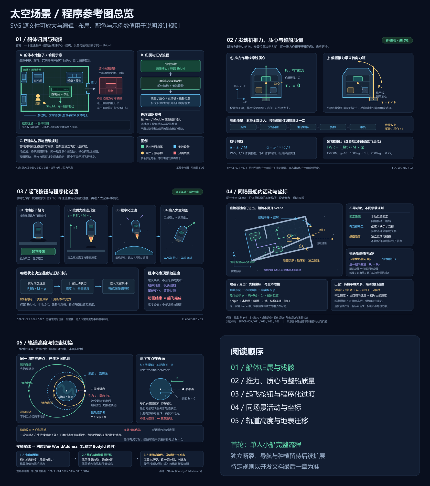
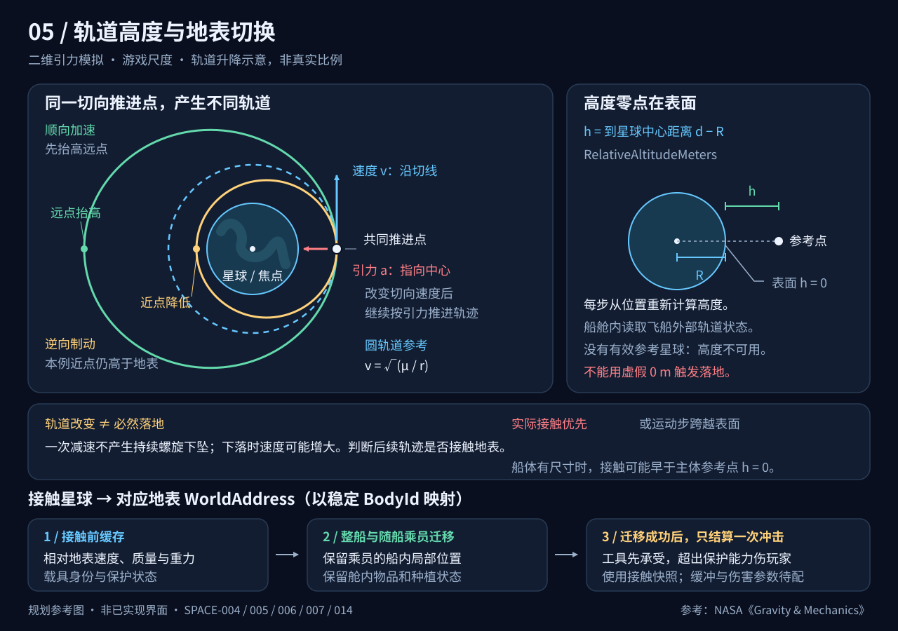
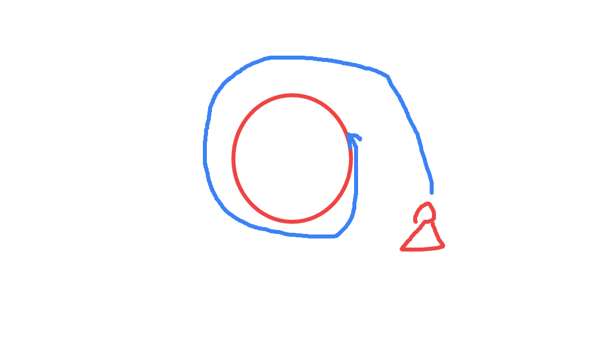
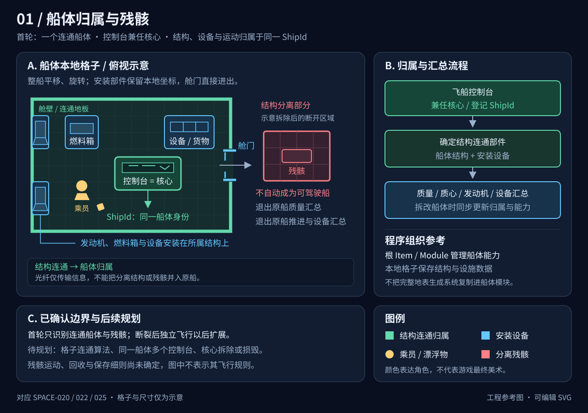
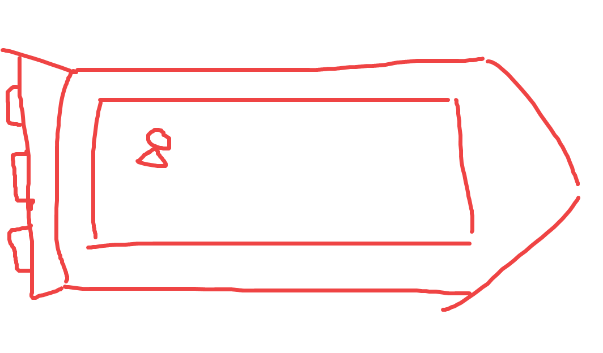
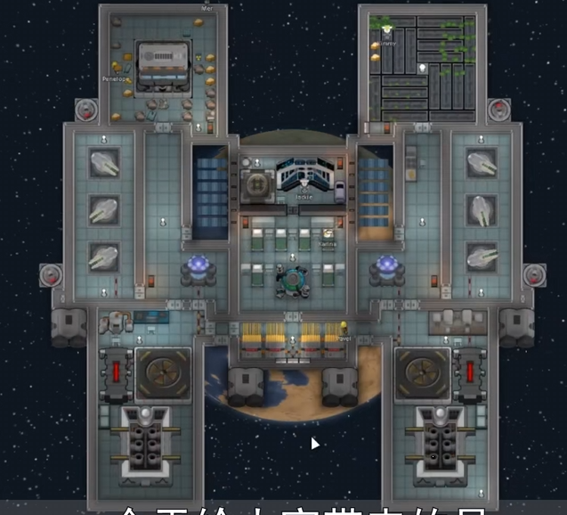
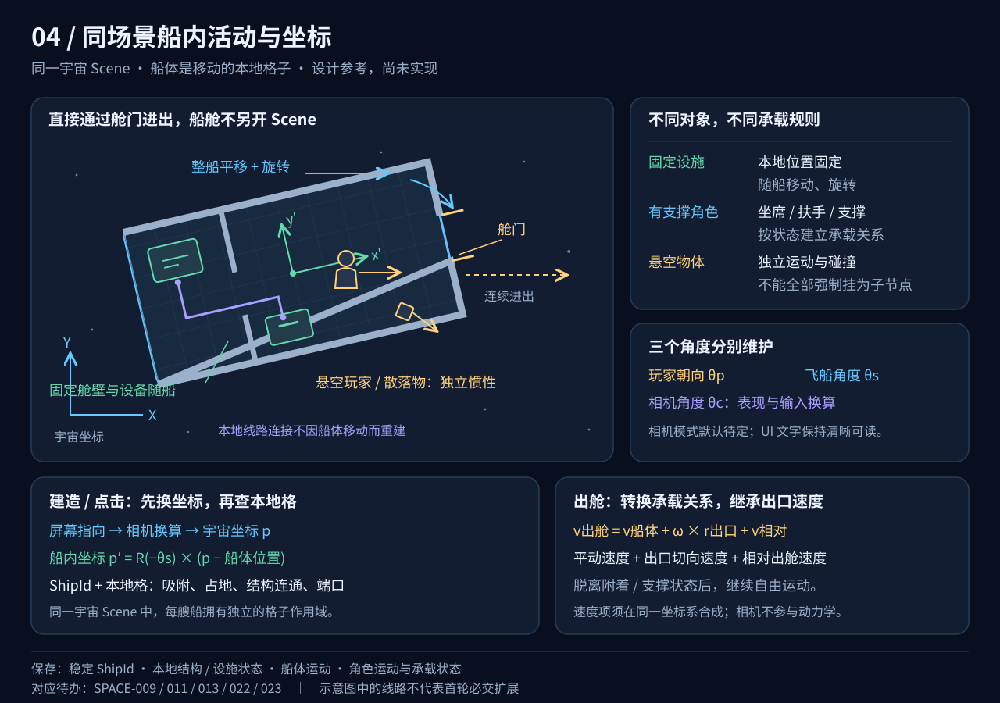
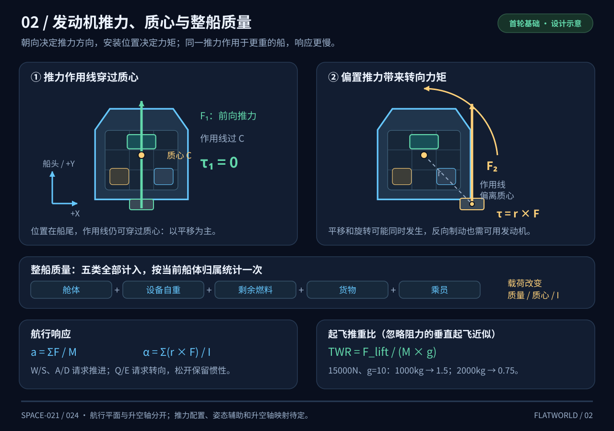
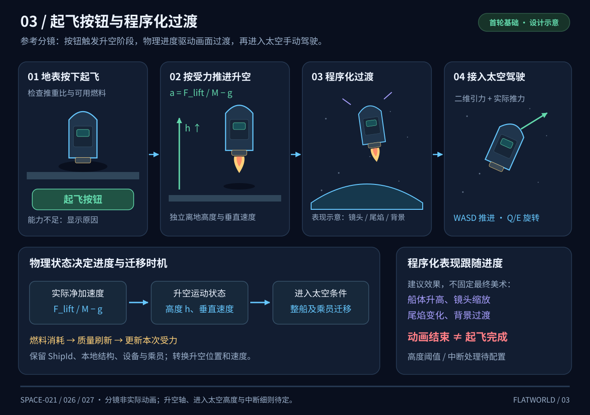

# FlatWorld 太空场景开发待办

## 1. 系统定位

太空场景提供失重漂浮、玩家自行搭建火箭或飞船、星体引力轨道和接触星体后进入地表的玩法。飞船作为可移动、可旋转的整体，舱体内可以摆放物品、种田和安装重力模拟工作方块。

本文记录已确认需求与待开发内容。所有复选框均为开发待办，不表示玩法已经实现；实际游戏操作由用户验收。

已确认的关键规则：

- 太空采用**游戏尺度与飞行时长**；升空实际速度转换为沿星球切线的初始速度，进入太空不保证形成稳定轨道，速度不足仍可能坠回地表。
- 采用**二维引力与推力模拟**，轨迹由位置、速度和受力决定。
- 需要通用的**程序化恒星系生成能力**；首轮只生成太阳系，玩家初始位于地球。各星球及月球使用各自配置的地形、地块、物品和矿物生成参数，不共用一份地球地表配置。
- 首轮太阳系所有行星和恒星均采用游戏化可降落设计；气态巨行星环境气压极高，太阳使用“核聚变中”地块，具有极高温度、极强减速和极高伤害。
- 玩家手动搭建火箭或飞船，不预设固定船型；统一使用**引擎**概念，首轮只实现消耗航空燃料的化学燃料引擎。
- **飞船地板**通过上下左右四邻接建立船体，普通地表地板不能形成船体；地板上的墙体和设备归属于该船。
- **飞船控制台同时就是飞船核心**，同船支持多个控制台同时操纵；各控制台登记同一船体身份。
- 两艘船结构相接后，只有双方控制台**互相勾选连接确认**才作为一个运动整体；接触或补地板不自动合并。
- 太空中，引擎按安装朝向和位置施力；地表起飞阶段使用所有可用引擎的综合推力，不产生平面前后左右移动。
- **舱体、设备、燃料、货物和乘员全部计入整船质量**，随实际载荷变化更新。
- **航空燃料是接近氢气 : 氧气 = 2 : 1 的混合气**，通过管道向气罐或气罐方块输入不同气体形成；同船引擎共享实际合格储备，不另生成一种液体燃料。
- 控制台必须供电；有电的控制台仍可驾驶，全部控制台断电后失去操纵能力，但不清零飞船惯性和引力运动。
- 控制台提供**起飞按钮**，按推力、质量、燃料、升空距离和速度推进发射；整船贴图沿表现 Y 轴上升，黑屏加载后沿星球切线飞行，速度大小继承实际升空速度，不自动补足圆轨道速度。
- 进入太空后玩家可自主加速、减速和转向；轨迹随引力、实际推力和惯性变化，不强制保持或重新调整成圆轨道。
- 发射中的“取消”改为**停机**，只停止引擎推力；停机、燃料不足或全部控制台断电后仍按惯性和重力继续运动，能够满足进入太空条件就继续进入太空，否则带当前速度进入下落与倒计时选址阶段，实际落地后结算冲击、结构损毁、掉落和燃料爆炸。
- 停机后及下落选址期间，有效控制台供电、真实燃料与可用引擎满足条件时允许重新点火救船；按实际推力减速或重新升空，保留原高度和速度，不因点击点火直接免除落地风险。
- 船体断裂后分别重算各连通部分；具备有效控制台连接、供电、燃料和引擎的部分首轮即可继续驾驶。不具备核心归属的部分成为残骸，继承断开时的运动，通过攻击拆取原材料或工作方块掉落物。
- 首轮交付**单人造船、起飞进入太空、飞往其他星球、返回地表、结构损毁与爆炸、船内活动和保存**；前置依赖是管道、气体运输、宇航服气压防护及供气基础。
- 宇宙、飞船与玩家在**同一场景、同一画面**，整船可以移动和旋转，玩家直接通过舱门进出。
- **镜头始终对齐玩家的世界朝向**；玩家旋转时，镜头同步旋转，驾驶、进出舱和起飞过渡都遵循这一规则。
- 飞船以 Item/Module 管理整体能力，舱体使用随船的本地格子；不再建立独立船舱 Scene。
- 失重时用 **Shift + 方向键**借附近结构冲刺，靠近舱壁长按 Shift 抓住，松开恢复漂浮；舱外推进由宇航服消耗实际气体提供。
- 非驾驶失重状态下，**Q/E 旋转玩家 Z 轴**并同步镜头；人工重力状态禁止玩家自由滚转，具体固定朝向基准待确认。
- 非驾驶状态以玩家为操纵对象，步行、借力冲刺和宇航服推进均按**屏幕方向**；驾驶状态以飞船为操纵对象，船体推力仍按船体轴向。冲刺和宇航服推进属于玩家能力，不替代飞船引擎。
- 生物落到星球地面后恢复直接移动，移动速度受当地重力影响而加速或减速；飞船重力模拟系统是安装在船上的工作方块，有效工作时舱内优先模拟地球重力，包括已落地的飞船，出舱后使用当地重力，不改变外部轨道引力。
- 宇航服的**推进气罐与供氧气罐分开**，分别保存与消费各自气体，推进不能扣呼吸用的氧气。
- 安装好的设施自动固定，散落物在失重船舱内漂浮；种植使用专用建筑**培育仓**。
- 飞船只设一种控制台；W/S 前后推进、A/D 侧向推进与 Q/E 旋转均保留惯性，需要反向输入制动。
- 自动导航模块为独立建筑，通过新物品**光纤**连接飞船控制台后，能够替玩家操纵飞船前往点击的坐标点。
- 退出控制台后自动导航继续；使用手动操纵时取消自动导航。
- 导航到达后持续定点悬停；光纤断线则停止自动操纵，重连后由玩家重新启动。
- 接触星球时，**宇航工具先承受冲击，超过保护能力的部分伤害玩家**。
- 飞船落地时，**舱内玩家留在船舱，外部飞船进入对应星球地表，玩家可自行出舱**。
- 飞船及独自降落的玩家复用下落选址与冲击流程，倒计时随预计剩余下落时间更新，实际触地立即结束；玩家独自降落阶段不计算宇航服推进。落点限制在接触位置附近，未选或无人船附近随机；按落点中心地块决定整船陆海平台状态，海面浮船禁驾，再次起飞复用现有条件。
- 承载地板被毁后，失去支撑的工作方块转为掉落物，建筑按配置转为本体掉落物或原材料；玩家解除承载并保留原速度继续漂移。
- 玩家返回地表后，无人太空船仍继续运行、消耗实际资源，并可能撞上星球；暂停菜单和退出游戏停止模拟，不补算离线时间。
- 宇航服提供温度、气压保护和气体推进；太空主要环境危险是失温与失压。墙体边界闭合且内部地板完整才算密闭，破口跟随外界环境；太空补舱后仍是真空，需要重新供气，隔离舱门正常开关不泄压。
- 供气停机保留密闭舱内已有气体；墙体只按**外部环境气压**判断耐受上下限，越界持续掉血，偏离范围越远掉血越快，归零摧毁墙体并刷新密闭状态。
- 船体、墙壁与地板分别配置温度耐受上下限，读取外部环境温度；超出范围持续掉血，偏离越远损伤越快，生命归零沿同一结构摧毁流程处理。

### 1.1 程序参考图索引

以下 SVG 保留为早期程序参考图，不作为最终资源或参数。图中的单控制台、起飞推力和首轮范围已有变更；**开发以本文正文为准**，多控制台连接、分裂驾驶、发射停机、惯性升空、下落选址、耐压破舱与恒星登陆等规则尚未完整同步到图中。

| 参考图 | 主要说明 | 对应章节 |
| --- | --- | --- |
| [01 船体归属与残骸](image/太空场景开发待办/01_船体归属与残骸.svg) | 控制台兼任核心、结构连通与 ShipId、残骸退出汇总。 | 6.1 |
| [02 发动机推力与整船质量](image/太空场景开发待办/02_发动机推力与整船质量.svg) | 发动机朝向、力矩、质心、五类质量与推重比。 | 7.3、7.5 |
| [03 起飞按钮与程序化过渡](image/太空场景开发待办/03_起飞按钮与程序化过渡.svg) | 起飞检查、升空状态、动画表现与太空迁移。 | 7.6 |
| [04 同场景船内活动与坐标](image/太空场景开发待办/04_同场景船内活动与坐标.svg) | 本地格子、承载关系、镜头始终对齐玩家与出舱速度。 | 7.1、7.4 |
| [05 轨道高度与地表切换](image/太空场景开发待办/05_轨道高度与地表切换.svg) | 顺逆向推进、表面高度零点、接触迁移与冲击。 | 3、4 |



### 1.2 前置系统与开发顺序

```text
电力与统一容器端口
    → 通用管道、液体与气体运输、储罐和气罐
    → 气压生存、宇航服防护与供气基础
    → 航空燃料、化学引擎、移动船体
    → 起飞进入太空、跨星球航行、返回地表与损毁爆炸
```

- 管道、气体运输及气压规则沿用[化工阶段物品与机制规划](../05_工业机械与能源/化工阶段物品与机制规划.md)第 4、7、8、14 节。当前已存在统一流体运输、气压危险与宇航服实际耗氧供氧基础代码；船体作用域、推进气罐和船内环境仍需接入，代码存在不代表游戏内验收完成。
- 航空燃料复用氢气、氧气及气罐实际混合库存；新增的是可用燃料的配比判定与消费能力，容积、温度、质量和转移沿用化工规则。
- 宇航服气压保护复用化工规划的独立安全气压范围与装备修正；温度危险复用现有温度系统，不重新实现另一套失温伤害。
- 氧气罐配置沿用化工第 7.6 节；太空阶段增加独立推进气罐入口，呼吸与推进分别扣量，不能把被动耐压当作推进燃料。
- 船内供气设备与安全气压接入作为太空前置能力完成，气体实际来源和消耗不能仅靠一个设备存在标记代替。
- 控制台供电复用[电力系统规划](../05_工业机械与能源/电力系统规划.md)，飞船本地电网不能因玩家返回地表而停止关键供电结算。
- 化工第 9.5 节规划的是气罐压力爆炸；航空燃料受毁爆炸属于太空阶段扩展。两者复用范围伤害和唯一事件队列，各自按实际库存计算强度。
- 太空场景开发排在上述前置系统之后；不通过免费的燃料、气体、供电或环境免伤绕过依赖。

## 2. 太空背景与失重移动

### 2.1 背景表现

- 太空背景为黑色，背景中有少量星星点点。
- 星点作为背景装饰，不参与碰撞、引力或玩家交互。
- 星点密度、亮度和尺寸后续配置。

### 2.2 玩家在外部太空的移动

- 摇杆保留输入能力。
- 玩家悬空且没有推进装置时，单纯推动摇杆不会产生平移推力。
- 松开摇杆不会自动刹车，也不会清零已有速度；引力和有效推力仍可改变速度。
- 宇航服气体推进、飞船化学引擎或接触物体产生的反作用力可以改变速度。
- 起飞进入太空时，按第 7.6 节保留实际升空速度的大小并将方向转换为星球切向；出舱时继承出口处由飞船平动与旋转产生的速度，并叠加角色相对出舱速度。
- 太空运动接管平移后，地表行走逻辑不能继续直接写位置或覆盖速度。
- Shift 冲刺必须有周围 3×3 格内的有效舱壁、扶手或可借力结构，包含当前格；完全悬空时不能凭按键获得免费冲刺。
- 在失重状态下 Q/E 控制玩家 Z 轴转动；进入驾驶后同一输入改为控制飞船，不能同时让玩家自由滚转。

### 2.3 失重与引力

失重表现为漂浮和缺少地面支撑；处于星球附近时，玩家与飞船仍然受到星球引力。轨道上的失重来自共同自由落体，不能因为进入失重状态就关闭轨道引力。[参考：NASA 自由落体说明](https://www1.grc.nasa.gov/beginners-guide-to-aeronautics/free-falling-objects/)

真空中无推力、无阻力时保留惯性，不添加用于模拟地表停步的减速效果。

#### 地表直接移动与重力对速度的影响

- 生物真正接触并获得星球地面支撑后，退出失重漂浮，恢复按输入方向直接移动；在舱外使用当地重力对应的移动速度规则，在有有效人工重力的舱内按地球重力规则处理。
- 当地重力通过配置的速度修正影响生物直接移动的快慢，具体曲线与上下限待配置；不能把太空自由漂浮控制继续套在地面行走上。
- 下落冲击与接触速度先正常结算，获得支撑后再由地表移动接管；切换控制模式不能成为消除落地伤害的入口。
- 船内人工重力来源为第 6.2 节的重力模拟工作方块，提供地球重力对应的内部移动条件；星球表面重力、船内人工重力与外部轨道受力分别管理。

### 2.4 宇航服与太空环境

- 宇航服通过配置提供耐寒、耐热与气压耐受，不按物品名称给予全部环境免疫。
- 舱外太空按真空气压查询；未穿有效防护或保护不足时，接入现有温度危险与前置气压危险缓冲、周期伤害和死亡流程。
- 宇航服推进使用独立于供氧罐的推进气罐，消耗其中实际气体；推进罐耗尽只停止推力，供氧继续读取自己的气罐，推进气种待配置。
- 供氧、气体推进、被动温度保护和被动气压保护是不同能力；一种资源耗尽不能自动撤掉不依赖该资源的能力。
- 密闭区域要求墙体边界闭合、内部地板完整；区域内地板缺失或有效边界形成破口后，该区域不再密闭。实际工作的供气设备按真实气体来源输入舱气，开放平台或破口区域在太空按真空处理。
- 舱门首轮保留高级自动气体隔离门规则，正常开关仍形成有效隔离，不触发泄压；墙体、地板或边界破损不能用门的特殊规则免除失压。
- 密闭判定负责区域资格，供气设备负责真实气体输入和消耗，环境查询负责有效气压与呼吸条件；首轮不要求逐格模拟气流，但必须判断空间是否完整包围。
- 建造、拆除或破损后重新判定受影响区域；未完整包围的区域读取当地外部环境，在太空按真空处理，在星球地表按该星球气压处理。
- 破口区域跟随外界环境，破损前的舱气不能继续作为可恢复库存；实际逸散或释放的气体按现有库存入口只处理一次。修好墙体和地板只恢复密闭资格，不还原旧舱气；太空中补好后仍为真空，必须重新输入真实气体建立舱压。
- 供气设备停机只停止输入，仍密闭区域保留已有气体，不因为停供而变成真空；后续压力变化由实际气体消耗、输入、泄漏及温度和容积状态决定，不另设无来源的停供倒计时清空。

#### 墙体耐压与破舱

- 墙体配置外部气压的耐受下限和上限，统一使用 kPa；只读取飞船所在星球或太空的外部环境气压 `P_外部`，游戏内太空真空按 `0` 处理。舱内气压不参与墙体耐压计算，供气不能改变墙体的这项环境耐受结果。
- `P_外部 < 耐压下限` 或 `P_外部 > 耐压上限` 时，墙体持续掉血；上下限以内（含边界）不产生该项伤害。
- 越界距离 `d = max(耐压下限 - P_外部, P_外部 - 耐压上限, 0)`；距离越大，掉血速度越快。首轮采用可配置的线性规则 `每秒伤害 = 材料伤害系数 × d`，系数为正，按实际模拟时间扣血，具体系数待配置。
- 示例：木墙耐受范围为 `20～80`，真空 `0` 的越界距离为 `20`，示例木星环境 `300` 的越界距离为 `220`；同一木墙在后者掉血更快。这里的数值用于解释规则，不作为最终木墙或木星配置。
- 血量归零通过现有结构摧毁入口销毁墙体、处理掉落并重新判断受影响区域；形成破口后按外界环境处理，不能因供气设备仍在工作而继续标记为密闭安全区。
- 墙体耐压能力只负责比较外部环境气压与自身耐受范围并调用公开伤害接口；舱气库存负责真实气体状态，供气设备负责输入，密闭判定负责边界。船内隔墙也使用船体外部环境气压，不另算相邻舱室压差。

#### 船体结构的温度耐受

- 船体、墙壁和地板按材料及部件配置各自的耐温下限、耐温上限与温度伤害系数，温度统一用 ℃；不同材料不共用一份默认耐温范围。
- 首轮读取部件所在外部环境的温度 `T_外部`，沿用环境温度查询及船体本地坐标到世界坐标的转换，不新增逐块热传导模拟或用生物体温代替外部温度。
- 温度越界距离 `d_T = max(耐温下限 - T_外部, T_外部 - 耐温上限, 0)`；范围内含边界不产生该项伤害，范围外按 `每秒温度伤害 = 材料温度伤害系数 × d_T` 持续掉血，偏离越远掉血越快，具体范围与正值系数待配置。
- 温度与压力各自读取配置、计算越界损伤并通过公开伤害接口作用于同一结构生命值；两种危险同时存在时分别结算，归零后的摧毁、分裂、破舱与掉落只处理一次。
- 该规则用于船体结构耐受，不改动生物现有低温、过热与缺氧的独立伤害规则。船体能承受高温不直接确定舱内温度或乘员防护，舱内隔热、温控与危险地块直接伤害的承受顺序仍待明确。

## 3. 星球引力、轨道与高度

### 3.1 轨道计算方式

采用二维引力模拟，首轮支持从出发星球飞往其他星球，再使用同一套接触、落地与冲击逻辑进入目标地表。每个运动主体在一个模拟步使用一个主导星体，完整多星体引力叠加另行扩展。

太空采用适合游戏的距离尺度与飞行时长，不要求复现真实天体的尺寸和绕行时间。星球半径、引力参数、推力与表现比例统一配置，具体数值后续调整；缩小轨道时不能直接照搬真实地球的引力参数。

```text
r = 运动主体相对于参考星球中心的位置向量（m）
d = |r|
R = 参考星球的物理表面半径（m）
g_surface = 参考星球表面重力加速度（m/s²）
μ = g_surface × R²

引力加速度 a_gravity = -μ × r / d³
推力加速度 a_thrust = 推力向量 / 运动主体质量
圆轨道参考速度 v_circular = sqrt(μ / d)
```

公式按球对称星体外部的点质量近似使用。运动计算统一使用米、秒、千克；画面中的星球贴图尺寸和缩放由独立的表现映射处理。[参考：NASA 圆轨道速度推导](https://cdaweb.gsfc.nasa.gov/pub/documents/archived_websites/pwg.gsfc.nasa.gov/stargaze/Lkepl3rd.htm)

- 主导星体的选择、引力作用范围和切换边界属于首轮开发内容，具体数值待配置。
- 星球公转、自转与运动主体使用同一模拟时间，不能把移动中的星球当作固定世界原点。
- 局部参考系与宇宙参考系之间统一转换位置和速度，保持出舱、捕获和离开引力区域时的运动连续。
- 用固定模拟步长推进速度和位置；具体步长、积分方式和高速接触处理在实现时确定。
- 首轮必须完成参考星体切换，避免飞往其他星球时仍使用出发星球的高度或引力；具体算法在实现时确定。
- 起飞进入太空按第 7.6 节将升空速度转为切向速度，不自动补足圆轨道速度；初始飞行、正常飞行与跨星体切换均不自动吸附轨道或凭空清零速度。

#### 恒星系生成与星球配置

- 通用生成流程读取恒星系模板与各星体地表配置；首轮仅启用太阳系模板，后续通过配置扩展其他恒星系，不在通用生成器内逐个硬编码星球玩法。
- 恒星系配置负责星体层级、稳定标识、公转自转及物理与表现参数；恒星、行星与卫星的地表配置负责自身生成、环境和资源内容，两个职责分开。
- 地表生成参数包含地形与地块组合、结构分布、物品和矿物分布，并关联星球大气、温度与气压配置；具体字段接入现有地图与环境定义。
- 生成后的星体以稳定 `BodyId` 关联自身地表 `WorldAddress.PlanetId` 与生成配置；保存生成身份和种子，重新进入同一星球时恢复同一世界，不因切场景改用地球配置或重新生成库存。
- 玩家新建世界的初始所在星球为地球，地球使用对应地表配置。
- 月球地表以环形山和月壤为明确内容；火星包含多样地块、物品与矿物，具体目录与分布参数后续配置。
- 首轮所有行星均可降落。气态巨行星采用游戏化地表生成配置，环境气压极高，接入现有气压危险和装备保护，不因为可降落而取消环境风险。
- 现实中的木星没有固体表面；本项目的可降落设计属于明确的游戏化规则，不作为现实天文描述。[参考：NASA 木星说明](https://science.nasa.gov/jupiter/jupiter-facts/)
- 太阳系其他卫星的首轮清单、各星球具体内容与航行时长仍待配置；不预设用户尚未指定的分钟数。

#### 恒星登陆与“核聚变中”地块

- 恒星也提供地表地址与生成配置，太阳首轮可触发同一套降落入口，不能因星体类型为恒星直接拒绝登陆。
- 新增“核聚变中”地块，提供极高环境温度、极强移动减速和极高伤害；地块危险分别调用现有温度、移动速度修正和公开伤害能力，不在角色核心中堆叠太阳专用判断。
- 普通材料飞船降落太阳时会因无法承受环境而爆炸，普通防护玩家死亡；复用实际结构损毁、爆炸与死亡入口，资源和掉落只结算一次。
- 大后期超强材料能够抵抗太阳温度并支持玩家在太阳表面移动；通过材料及装备的耐受配置表达，不把“太阳登陆必死”写成无法覆盖的硬规则。强减速和其他伤害的具体防护参数待配置。
- 太阳可行走地表与“核聚变中”名称属于游戏化设定。现实太阳没有固体表面，核聚变发生在核心；本项目不按现实结构限制该地块玩法。[参考：NASA 太阳说明](https://science.nasa.gov/sun/facts/)

### 3.2 引力捕获与绕行

- 玩家或其搭载的飞船进入星球引力区域后，根据相对于该星球的位置和速度计算运动。
- 达到圆轨道参考速度时，还需要速度接近切向、径向速度接近零，才接近圆轨道。
- 仅有速度大小达到某个阈值，不能直接把玩家吸附到固定圆周。
- 在单主星近似下，可用比轨道能量 `ε = |v_relative|² / 2 - μ / d` 判断是否处于引力束缚状态：`ε < 0` 为束缚状态；是否能持续绕行还要检查角动量和轨道是否穿过星球表面。[参考：OpenStax 轨道与能量](https://openstax.org/books/university-physics-volume-1/pages/13-4-satellite-orbits-and-energy)
- 未受束缚的掠过也会受到引力；从掠过变为捕获需要改变相对轨道能量，不能通过自动清零速度完成捕获。
- 第 7.6 节仅将升空速度转换为切向初始速度；进入太空与形成可持续轨道分开判断，转换后立即按正常引力、推力和惯性推进。
- 切向速度不足以让轨迹避开星球表面时，飞船会下坠并可能落回地表；玩家可在接触前用实际引擎推力改变轨迹。是否撞上星球按实际轨迹与接触判断，不只比较总速度和圆轨道参考值。

### 3.3 减速、下降与加速抬升

玩家希望能够通过减速降低轨道，通过加速抬升轨道并避免接触星球。按已确认的物理模拟方式，具体效果同时取决于推进方向和推进时机：

- 玩家可自主操纵加速、减速和转向，轨道形状由运动状态决定；即使初始状态接近圆轨道，加速后也不强制恢复圆轨道。
- 在圆轨道上逆向制动，会降低轨道的一部分高度，使轨迹可能接近地表。
- 持续螺旋下坠需要持续制动或阻力；无阻力时不会因为绕行一段时间而自动减速。
- 下落过程中，引力可能让速度增大；高度下降不能仅通过“总速度正在减小”来判断。
- 在圆轨道上顺向加速，首先抬高轨道远点；不能保证一次加速就抬高整个轨道。
- 避免接触星球需要调整推力，使后续轨迹不会穿过地表；轨道最近点高度是需要关注的条件。

上述轨道升降说明依据轨道力学整理；图中的下降路径只表达“轨道逐步接近星球”的玩法目标，不作为每次制动都会形成螺旋的物理结论。[参考：NASA 引力与轨道力学](https://science.nasa.gov/learn/basics-of-space-flight/chapter3-4/)





### 3.4 相对高度字段

需要一个字段记录玩家相对于捕获星球的高度。以下为**拟新增字段**，具体存放位置在实现时确定：

| 字段 | 用途 |
| --- | --- |
| `OrbitReferenceBodyId` | 当前用于计算引力和相对高度的星体标识。 |
| `CapturedPlanetBodyId` | 当前形成引力束缚关系的星体标识；未被捕获时可为空。 |
| `RelativeAltitudeMeters` | 玩家或其所在飞船相对于参考星球表面的高度，单位 m。 |
| `SpaceVelocityMetersPerSecond` | 运动主体在宇宙参考系中的速度向量，用于参考系切换和速度继承。 |

```text
RelativeAltitudeMeters = 到参考星球中心的物理距离 - 参考星球物理表面半径
```

- 高度每个模拟步根据当前位置重新计算，不由速度大小单独反推。
- 星球中心不是高度零点，**星球表面才是 0m**。
- 玩家在船舱内时，其相对星球高度从外部飞船的轨道状态读取。
- 玩家离船后切换到自身的外部运动状态。
- 没有有效参考星球时，高度标记为不可用，不能用虚假的 `0m` 触发落地。

## 4. 接触星球与地表切换

### 4.1 触发与目标星球

- 玩家直接接触星球表面时，立即发起进入该星球地表的切换。
- 高度低于 `0m` 同样触发切换；第一次到达 `0m` 的接触也要处理，避免继续飞入星球。
- 运动步跨越表面时检测经过的路径，避免高速穿透后漏掉切换。
- 身体或船体有实际尺寸时，实际接触判定可以先于主体参考点高度归零。
- 切换目标以实际接触星球的稳定标识为准，不固定传回地球。
- 需要建立 `BodyId` 与地表 `WorldAddress.PlanetId` 的明确映射，不能依赖显示名称碰巧一致。
- 首轮对地球、其他可到达行星及卫星和太阳使用同一个落地入口，目标星体只提供自己的标识、世界数据、环境和落点规则，不为每个星体另写一套降落流程。
- 飞船进入地表下落与倒计时选址阶段，允许在目标星体接触位置附近选定具体落点，借此避开建筑或海面；选择不替换目标星体，不跨越整颗星球，也不清除实际高度和速度。

### 4.2 玩家与飞船的处理

- 玩家独自在外部太空接触星球时，也进入目标地表的下落选址流程；复用接触附近选址、触地结束与冲击结算，保持实际速度，独自降落阶段不计算宇航服推进。
- 飞船接触星球时，以稳定船体身份迁移整艘船及其随船乘员到该星球地表，不把舱体视为另一个常驻 Scene。
- 迁移后保留乘员相对于舱体的位置，玩家继续留在船内，落地后可以自行通过舱门走到地表。
- 宇宙高度低于零不能把船舱内的玩家强行移出船舱。
- 迁移本身不清空、重新生成或改换内部状态；落地冲击按第 5.3 节损坏实际结构和设备，只处理实际被摧毁的内容。
- 舱内位置在迁移时保留；承载地板被冲击摧毁后释放玩家承载，保留当时速度继续运动，随后由当前地表或太空的支撑、碰撞与环境规则接管。
- 生物获得地表支撑后恢复直接移动；有效重力模拟方块覆盖的舱内按地球重力修正速度，出舱后按目标星球重力处理。仍在下落或失去支撑的生物继续由对应运动规则处理。

#### 降落选址与陆海平台

- 过渡期间显示地表落点、降落主体占地预览和倒计时；飞船及独自降落的玩家边下落边选址，运动与模拟时间持续推进，不暂停重力等待选择。
- 选择范围限制在太空接触位置映射到地表的附近；发射停机回落时以原发射点附近为范围，具体半径与选址起始高度待配置。
- 玩家未选定或无人船降落时，在同一附近范围内随机确定落点；随机结果随降落事件保存，不因重复加载重新抽取，具体候选点筛选规则待配置。
- 已选位置只决定地表落点，不中止下落或清零速度；倒计时按当前高度、速度与有效受力预测的剩余下落时间刷新，不设置保证选址时长的冻结阶段。
- 实际触地立即结束选址并锁定已有选择；没选或无人船使用附近随机结果，按当时真实速度结算冲击，不等待尚未归零的预测倒计时。倒计时归零本身也不能代替实际接触判定提前结算。
- 选址期间允许满足供电、燃料与引擎条件的飞船重新点火，按实际推力改变下落状态并刷新预计时间；真正满足升空或进入太空条件时退出对应降落阶段，不因点火请求直接清零速度、重置高度或生成落地伤害。
- 已有建筑不是自动禁止降落的条件；落地冲击可以伤害并砸坏覆盖区域内的建筑，按各对象生命值和伤害入口结算，不直接删除整片建筑。
- 飞船落在海面时浮于海面，作为海上平台承载船体与乘员；不能按普通地面落点逻辑直接沉没或丢失船体。
- 海面浮船不能驾驶航行，控制台不能让海上平台按太空船规则平移或转向；再次起飞仍复用有效控制台、供电、引擎、实际燃料和推重比等现有条件。
- 陆地落点采用平台状态，海面落点采用海上平台状态，环境转换保留平台与船体内容。
- 整船类型由选址预览中的落点中心所在实际地块决定：中心在陆地就是平台，中心在海面就是海上平台；跨陆海的大船仍按同一中心判断，不按各格数量或载荷质心投票。
- 需要支持陆地和海面放置的两用平台能力；优先评估扩展现有平台与飞船地板，是否新增独立平台物品、名称和配方在实现时确定。
- 中心判断只决定整船平台状态，占地内的碰撞、建筑损伤与海面冲击仍按实际落点处理，海面落地不自动免伤。

### 4.3 切换前缓存与切换后结算

切换前缓存进入地表时的实际速度、目标星体、下落状态、质量、载具身份与保护状态。带着该状态继续下落，真正接触地面时生成最终冲击快照；进入地表过渡的速度不能直接当成最终撞地速度。

- 接触速度使用相对于目标地表的速度，考虑星球自身的运动；是否计入自转带来的表面速度在实现时明确。
- 不能切换场景后再读取已经重置的刚体速度，否则会丢失落地冲击。
- 下落选址期间以保留的高度和速度继续积分当地重力及有效运动因素；只把最终触地速度送入冲击计算，不能再额外叠加同一段下落的重力加速。
- 太空中的星体接触边界用于触发地表过渡，不等于过渡内的最终触地；两种高度的映射与选址起始高度待配置，不能把太空高度 `0m` 直接当作已完成地表落地。
- 每次接触事件只允许迁移和结算一次，避免连续数帧重复伤害。
- 切换失败时保留源状态，不能提前丢失玩家、飞船或船舱归属。
- 舱内玩家的冲击结算必须通过同一次飞船接触事件送到船舱，不能把其本地漂浮速度当作飞船落地速度。
- 发射停机后确认惯性不足以满足进入太空条件时，保留当前高度和速度，在原地表进入下落与倒计时选址流程，不为落地先生成太空船；尚能惯性升空成功时不能提前选址或结算冲击。
- 无人船接触星球同样触发迁移、冲击和损毁，不要求玩家或地表视图已加载。

## 5. 冲击力与宇航工具保护

### 5.1 冲击计算需要补足的条件

速度、质量和重力加速度不足以唯一算出冲击力，还需要**停止时间或缓冲距离**。首轮建议配置缓冲时间，使用平均冲击力，避免把不同单位的数值直接相加。[参考：OpenStax 动量与冲量](https://openstax.org/books/physics/pages/8-1-linear-momentum-force-and-impulse)

```text
m = 被结算主体的质量（kg）
Δv = 接触过程中的速度变化向量（m/s）
Δt = 缓冲或停止时间（s，必须大于 0）
g = 目标星球接触位置的重力加速度向量（m/s²）

平均净力向量 = m × Δv / Δt
仅考虑接触力与重力时：
平均接触力向量 = m × Δv / Δt - m × g

垂直撞击并停止的简化情况：
平均接触力大小 ≈ m × (撞击法向速度 / Δt + 表面重力加速度)
```

- 玩家受伤结算使用玩家质量；飞船本体的撞击结算使用飞船质量，不能混用。
- 斜向撞击需要区分法向碰撞与切向滑动；不能把上面的垂直撞击近似直接套到所有轨迹。
- 已经包含下落过程的接触速度，不再额外叠加同一段下落产生的速度。
- 现有玩法重量与 kg 的换算需要明确后再接入计算。
- 冲击力到生命值伤害的换算、裸身停止时间和工具缓冲参数待配置。

### 5.2 已确认的保护顺序

- 没有搭载或使用有效宇航保护工具的玩家，直接承受该次冲击对应的伤害。
- 有效宇航工具先承受冲击，并按自身缓冲能力、承受上限和耐久提供保护。
- 超过保护能力的部分继续作用于玩家，不因搭载任意宇航工具就获得完全免伤。
- 飞船内部玩家也遵循工具保护与剩余冲击伤害的规则。
- 保护能力通过明确的模块或配置声明，不按物品名称猜测。

### 5.3 逐块结构损毁、材料掉落与爆炸

- 首轮落地冲击作用于飞船的每一块结构；按该次冲击快照、部件配置与缓冲能力分别提交伤害，不只伤害驾驶玩家或一个船体根血条。
- 结构或设备生命归零时摧毁对应部分，按对象回收配置掉落原材料或对应工作方块本体；材料回收比例由配方与配置决定，不同时重复返还本体和同一份建造材料。
- 每块结构只处理一次该次冲击；多碰撞体、迁移重试、读档和死亡回调不能重复掉落材料。
- 燃料箱等带易燃易爆内容的设备被摧毁时，按破坏快照中的实际航空燃料触发爆炸，空箱不获得满箱强度。
- 航空燃料爆炸消费实际氢氧库存，燃爆预算受可反应的两种气体余量限制；爆炸后的掉落不能再次携带同一份燃料。气罐压力爆炸沿用化工第 9.5 节，压力与燃烧分别计算预算，不重复释放或消费库存。
- 爆炸同时包含范围伤害、冲击表现、闪光、粒子和音效；首轮同步实现或接入公共爆炸能力，不仅播放无伤害特效。
- 范围伤害可以继续摧毁附近结构和燃料设备，产生有限连锁；统一按唯一事件队列结算，一次事件对同一目标只命中一次。
- 损毁后刷新船体连通、控制台、质量、燃料与可用引擎；尚存结构保留原状态，不自动重建整船。
- 承载地板被毁后，失去安装支撑的工作方块转为掉落物；建筑按配置转为本体掉落物或原材料。设备中真实库存的随物保存、散落或释放规则按对象配置处理，不复制内容。
- 乘员失去承载后保留当时位置与速度，在太空继续漂移，不因地板消失清零速度或传送到另一块地板。
- 残骸靠近后通过攻击拆解，按被拆对象的回收配置取得原材料或对应工作方块掉落物；同一部分只结算一次掉落。
- 冲击伤害曲线、燃爆范围、材料回收率和各对象的具体掉落配置仍待配置。

## 6. 飞船舱体、设施与控制

### 6.1 自行搭建与直接进出

- 玩家可以自行铺设船体结构、舱内地板、舱壁与舱门，安装引擎并布置设备，建造不同形状的火箭或飞船。
- 船体以专用飞船地板为基础，只接受上下左右四邻接，角接触不算连通；普通地表地板不能成为船体基础。
- 飞船地板上支持普通墙体、飞船墙体及其他合法设备，放置后都登记到所属船体；密闭区域要求有效墙体边界闭合与内部地板完整。墙体配置密闭资格和外部气压耐受，船体、墙壁、地板配置各自耐温范围与伤害系数。
- 飞船控制台兼任核心与结构归属锚点，同船可有多个控制台；安装在同一有效船体上的控制台登记共同身份，不复制船体结构。
- 飞船整体由稳定的 ShipId 标识，控制台登记该身份，以 Item 作为管理入口，Module 提供结构、运动、控制、重力模拟等可组合能力。
- 船体结构与已安装部件以船内本地坐标保存，航行时作为同一个整体移动和旋转。
- 船体拆改和受损后重新计算四邻接连通；每个分离部分独立汇总控制台连接、供电、实际燃料和引擎，满足飞船基础要求的部分首轮即可继续驾驶，不限定只能原船的一部分可驾驶。
- 分离部分分别维护可追踪的船体身份和实际库存归属，具体稳定身份分配在实现时确定；同一设备、燃料和乘员不能仍由原船重复汇总。
- 失去有效核心归属的部分标记为不可驾驶残骸；已有核心但暂时缺燃料、引擎或供电的船体按缺失能力停用对应操纵，不因资源耗尽删除身份或内容。
- 所有分离部分继承断开点的平动、旋转切向速度和角速度，继续受引力及碰撞影响，并分别保存。
- 残骸靠近后可通过攻击拆取原材料或对应工作方块掉落物；补装控制台、引擎或燃料后的修复交互仍待规划，不能把已符合要求的分裂部分一律当成不可驾驶残骸。
- 光纤只建立信息连接，不能把结构分离的船体或残骸并入同一艘船。
- 宇宙与船舱同画面显示，玩家直接通过舱门进入或离开飞船，不再通过按钮切换到另一个船舱 Scene。
- 右键船体面板可用于查看船体信息；驾驶仍通过已确认的飞船控制台进行。
- 舱体内可以放置物品、布置空间；种田使用专用建筑“培育仓”。
- 不同飞船各自保存结构、设备和内容，地表起飞、太空航行与落地不重建这些数据。

#### 船体连接与多个控制台

- 两个独立 ShipId 的船体接触或通过飞船地板连通时，先登记可连接候选，不自动合并身份、库存或操纵。
- 控制台界面提供对方船体的连接复选框；双方控制台互相确认同一对船体，且有效结构仍连接时，才建立一体关系。
- 一体关系下作为同一个运动整体汇总质量、推力和承载；结构、设备与线路不能因多个控制台重复统计。
- 同一整体的多个控制台支持同时发出操纵请求，为后续联机保留多人控制入口；同方向请求合并，相反请求抵消，统一分配实际引擎输出，避免每个控制台各积分一次。
- 合并后输出不超过实际引擎能力；某个控制台退出或断电只撤销自己的请求，不取消其他控制台仍有效的操纵。
- 光纤和普通接近不构成船体连接；有效结构断开后，分离部分各自判断可驾驶资格，不能继续共享已脱离的质量、燃料或引擎。原成员身份的恢复在实现时确定，主动取消连接的操作规则仍待确认。
- 连接时保留可追踪的原始船体身份及双方确认状态，最终采用合并 ShipId 还是整体身份加成员关系在实现时确定，不能提前丢弃来源。
- 地表连接纳入首轮；太空接近、对接与分离的速度条件及接口留待规划，为后续太空站对接保留扩展入口。

自由搭建移动基地的玩法可参考 [RimWorld - Odyssey](https://store.steampowered.com/app/3022790/RimWorld__Odyssey/) 与 [Save Our Ship 2 作者说明](https://steamcommunity.com/sharedfiles/filedetails/?id=1909914131)。参考其部件组合和船内生活玩法；本项目的同场景移动、旋转与二维引力需要自行实现。







### 6.2 船内重力模拟工作方块

- 没有有效重力模拟工作方块时，太空船舱保持失重，已经落地并获得地面支撑的船舱使用当地重力；有效工作方块覆盖的舱内优先使用模拟的地球重力。
- 玩家可抓扶手、借舱壁的反作用力或使用宇航服推进器改变船舱内的速度。
- 悬空且没有上述作用时，摇杆不会凭空产生平移推力。
- 飞船外部的整体轨道速度与舱内局部漂浮速度分开计算，不能因宇宙航行速度很高而让玩家在船舱内高速撞墙。
- 飞船平动加速对舱内未固定物体产生的相对漂移需要纳入内部运动规则。
- 飞船旋转时，同样需要正确处理舱体与未固定角色、散落物之间的相对运动，不能简单把所有对象设为船体的 Transform 子节点。
- 重力模拟系统是安装在飞船上的工作方块；有效工作时在内部模拟地球重力，提供常规直接移动与对应移动速度条件，飞船落地后仍生效，不与当地重力叠加。
- 玩家出舱后按当地环境和支撑状态使用星球重力或太空漂浮规则；例如月球上舱内使用模拟的地球重力，出舱后使用月球重力。
- 工作方块只提供船内人工重力，内部移动模块读取其结果；不改变外部轨道引力或凭空推动飞船。耗电、覆盖范围、多个方块的重叠与停机转换规则待配置。
- 安装好的设施固定在舱体上，失重不会令设施或培育仓内的作物脱离。

#### 首轮失重借力与抓墙

- Shift 在有重力、可步行状态保持疾跑含义；失重状态改为借力冲刺与抓取。
- 玩家周围 3×3 格包含自身格，有有效舱壁、扶手、控制台等可借力结构时，按 Shift + 方向键沿输入方向施加一次冲刺。
- 冲刺后保留惯性；接近另一侧舱壁可再次借力改变方向，实现连续左右蹬跳，不能持续按住就每帧重复获得冲刺。
- 靠近舱壁长按 Shift 且没有方向冲刺请求时，抓住舱壁并保持相对该位置静止；墙体随船移动时玩家随抓取点承载。
- 松开 Shift 解除抓取，恢复独立受力与漂浮；尚未远离可抓取范围时，再次按住可以抓回。
- 抓墙的静止是相对舱壁静止，不把玩家的宇宙速度清零；释放时继承抓取点的平动与旋转速度。
- 完全悬空且附近没有有效结构时，Shift 不凭空提供冲刺；宇航服气体推进单独检查装备、气源与余量。
- 冲刺速度、抓取距离、重复借力冷却和漂浮碰墙响应待配置。

### 6.3 设施固定与散落物

- 建造完成的设施自动固定在舱体上，不要求玩家另装固定部件。
- 失重状态下，散落物保持漂浮，并根据局部运动状态受到碰撞或借力影响。
- 船内培育仓和其中的种植状态归属于该 ShipId，不能随飞船航行位置或活动星球变化而重建。

### 6.4 专用种植建筑：培育仓

#### 定位与放置

- 名称为**培育仓**，用于种植各种农作物。
- 支持全部农作物；果树和普通树木另行规划。
- 可以在飞船内部和星球地表建造。
- 在失重船舱内作为固定设施使用，种植不依赖船舱先升级人工重力。
- 复用作物定义、种子对应关系、生长阶段和收获规则，避免为每一种仓内作物另写一套成长逻辑。

#### 种植与交互

- 打开培育仓面板，放入种子进行种植。
- 每台培育仓提供多个独立种植槽，可以混种不同农作物；具体槽数待配置。
- 每个槽独立记录作物类型、生长进度和成熟状态。
- 作物成熟后，通过面板领取产物。
- 面板呈现种植槽状态、生长进度、水量与供电状态，具体布局在实现时确定。

#### 供电、供水与肥料

- 生长期间持续耗电，并需要补水。
- 支持通过**管道**或**水桶**向培育仓添加水。
- 两种补水方式写入同一份水量状态，补水与种植消耗使用一致的单位与容量规则。
- 肥料提供生长增益，不作为作物能够生长的强制条件。
- 断电或缺水时，暂停成长并保留当前进度；恢复供应后继续成长。
- 停机期间不推进成长，恢复时也不补算停机期间的生长。
- 供水来源、水种类、容量、耗电与耗水数值以及肥料增益后续配置。

封闭式太空种植设施的光照、根区供水与环境管理可参考 [NASA Advanced Plant Habitat](https://science.nasa.gov/mission/advanced-plant-habitat/)。参考用于完善设计，具体游戏参数按本项目尺度配置。

### 6.5 飞船控制台

飞船只设一种**飞船控制台**，同时承担飞船核心、船体归属确认和手动驾驶；自动导航由独立模块建筑扩展。

- 与控制台交互后，视角切换到太空视角，输入转为操纵对应飞船。
- 驾驶视角切换只改变镜头与输入目标，玩家实体仍位于同场景的船舱内。
- 驾驶时玩家固定在控制台前，承载随控制台移动与旋转；退出驾驶后仍出现在该控制台位置，再恢复船内活动。
- 驾驶视角可以调整镜头构图与缩放，镜头朝向仍始终对齐玩家世界朝向。
- 操纵方向以飞船自身朝向为基准。
- 飞船位于地表时，控制台提供起飞按钮，按第 7.6 节进入升空阶段，并显示整船质量、有效起飞推力、推重比及可用燃料。

| 输入 | 操纵内容 |
| --- | --- |
| W / S | 前后推进；提供加速度，不直接设定飞船速度。 |
| A / D | 左右侧向推进；提供加速度，松开后保留横向惯性，通过反向侧推制动。 |
| Q / E | 左右旋转；提供转向作用，松开后保留旋转惯性，通过反向输入制动。 |

- W/S 与 A/D 的输入含义是对应引擎施力，实际加速度由推力和质量决定。
- Q/E 控制转向推进产生的力矩，实际角加速度由力矩和飞船转动惯量决定，不直接设置朝向或固定角速度。
- 所有操纵使用当前船体已安装、可用的引擎，按第 7.5 节计算实际推力与力矩；布局不足时对应操纵能力下降，不能凭空补出推进或转向能力。
- 松开操纵键时撤去对应操纵作用，不通过摩擦力自动消除已有平移速度或旋转速度。
- 玩家将飞船加速后，可以脱离控制台，让飞船继续按已有运动状态航行；星球引力仍会改变其轨迹。
- 脱离控制台时释放持续的手动操纵输入，保留飞船运动状态，镜头恢复常规位置跟随与缩放，朝向继续对齐玩家；自动导航不因退出控制台而停止。
- 同时支持 **Esc** 和驾驶界面的**退出按钮**离开控制台。
- 驾驶状态下 Esc 优先退出驾驶，避免一次按键同时触发退出与暂停菜单；E 只承担已分配的旋转操纵。
- 控制台接入船内电网；只有当前有效供电的控制台能发出操纵与起飞请求，多个有电控制台可以同时操纵同一整体。
- 某个控制台断电时仅撤销该控制台的持续请求；其余有电控制台仍可驾驶。全部控制台断电后撤销整体主动操纵，保留惯性与星球引力。
- 断电不能自动刹车、锁住船体位置或把角速度清零；自动导航对失电的响应沿同一最终操纵入口处理。
- 控制台的额定功率、最低有效供电比例和来电后的恢复方式待配置。

上述惯性与推进规则按外力改变运动的原则设计。[参考：NASA 牛顿运动定律](https://www1.grc.nasa.gov/beginners-guide-to-aeronautics/newtons-laws-of-motion/)

### 6.6 自动导航模块建筑

#### 安装与控制台关联

- **自动导航模块**是可建造的独立建筑，安装在飞船内部。
- 模块通过**光纤连接**飞船控制台，不要求紧邻控制台；是否关联以有效的信息线路为准。
- 模块与控制台必须属于同一艘飞船的本地格子作用域，不能仅因位于同一宇宙 Scene 就跨船连接。
- 信息线路连通后，为关联控制台提供自动导航能力。
- 模块、控制台或光纤建造、移动、拆除时刷新关联，不能仅凭曾经连接过就永久获得导航能力。
- 建筑占地、信息端口位置以及同一线路连接多个模块或控制台时的选择规则待配置。

```text
自动导航模块建筑 → 光纤信息线路 → 飞船控制台 → 所属飞船推进与转向
```

#### 目标与自动驾驶

- 玩家在飞船视角下点击坐标点指定目标，自动导航模块代替玩家控制飞船前往目标。
- 自动导航的首次实现支持坐标点导航；选择星球自动入轨或自动降落另行规划。
- 导航负责速度和方向控制，不要求玩家持续操作 W/S、A/D 或 Q/E。
- 接近目标时主动反向推进制动，在允许的位置和速度误差内停在目标附近；误差阈值待配置。
- 到达后继续用引擎抵消引力并修正漂移，保持在目标附近，直到玩家取消导航；悬停仍需要足够的推进能力和资源。
- 自动驾驶通过同一套推进与转向能力执行，仍受星球引力、推力和惯性约束，不能直接改位置或瞬间清零速度。
- 手动驾驶与自动导航共用一个最终操纵入口，避免两套控制同时叠加推力。
- 玩家退出控制台后，模块继续自动导航。
- 玩家使用手动操纵时，取消自动导航并接管飞船；仅重新打开驾驶视角不自动取消导航。
- 光纤断开或模块失去有效连接时，停止自动操纵并提示断线；保留飞船当前运动状态，后续仍受惯性和引力影响。
- 光纤重新连通后恢复导航可用状态，不自动恢复操纵，需要玩家重新启动导航。
- 推进资源不足、目标无法到达或无法维持悬停时的中断和反馈规则待规划。

### 6.7 新物品：光纤与信息连接

- 新增物品**光纤**，作为传输信息的连接线使用。
- 铺设逻辑和操作方式参考电线，包括格子铺设、连续连接、转角及拆除。
- 信息线路首次实现用于连接自动导航模块与飞船控制台，传递导航操纵指令；预留其他信息设备接入的扩展入口。
- 光纤负责信息连接，电线负责供电；光纤连通不能替代设备所需的供电或飞船推进资源。
- 首轮建议使用独立的信息线路覆盖层和连通关系，允许与电线及建筑共用格子；铺设与连接形状更新可复用电线的通用能力。
- 设备通过配置的信息端口接入光纤线路，不能仅因相邻或处于同一电网就视为信息连通。
- 光纤状态属于所在的地表或飞船作用域；船内线路以 ShipId 和本地格坐标保存，不随船体移动或旋转而重建。
- 铺设、拆除与恢复线路后及时更新连通状态；控制台能够显示模块已连接或未连接。
- 光纤配方、贴图、端口细则、最大距离、传输延迟和多设备控制规则待规划。

铺设与独立覆盖层的项目参考见 [电力系统规划](../05_工业机械与能源/电力系统规划.md)。上述信息线路是待开发能力，不代表现有电线已经能够传输导航信息。

### 6.8 氢氧混合航空燃料与化学引擎供给

#### 制备与识别

- 向独立气罐或气罐方块输入实际氢气和氧气，在罐内形成混合库存；组合气罐按整个共享气腔的实际组分判断。
- 氢气 : 氧气接近 **2 : 1** 时，该份混合库存可用作航空燃料；“接近”的比例容差与允许杂质比例由燃料配置决定，不要求浮点值完全相等。
- 比例沿化工统一口径使用气相物质的量 `mol`，界面用同一参考温压下的标准气量表示；不是氢氧质量比，也不比较两个罐的几何容积。
- 例如罐内 200 标准 L 氢气和 100 标准 L 氧气满足目标配比；空罐、纯氢、纯氧或大量杂质不自动成为合格燃料，液相库存不参与气相配比或可用燃料计算。
- 保留氢气、氧气各自的稳定 `FluidId`、真实余量与热量；“航空燃料”是混合库存的用途判定，不把两种气体覆盖成第三种物质，也不在混合时自动燃烧或生成水。
- 普通管格仍遵守气相一种物质的规则，氢气和氧气通过各自管线或不同气包批次输入接收罐，混合发生在支持多组分的气罐内。
- 加气、排气、相变、引擎消费或读档后，按当前气相组分重新判定资格；不能只保存一个永不失效的“燃料罐”标签。

#### 船体供给与扣量

- 原规划中的燃料箱作为船体燃料供给入口，使用适配气罐或气罐方块组承载实际混合气；专用箱体或插槽不得另复制一份燃料库存。
- 同船引擎共享所属有效燃料源，补气通过前置管道；首轮不另要求每台引擎铺设罐到引擎的输送管。
- 引擎按反应配方同时申请并扣除氢气、氧气，目标消费比例为 2 : 1；两种来源、可用量和本轮输出一起提交，缺少任一组分不能只扣另一种或凭空提供推力。
- 这是引擎的配方消费能力，普通储罐输出仍沿化工第 9.4 节随机选单种气包；不能把混合燃料资格当作普通管口免费筛选或直接输出多气体的权限。
- 多个独立罐分别判断是否合格；只有已形成同一共享气腔的气罐方块合并组分判断，不能把互不混合的纯氢罐和纯氧罐加总后冒充已配好的燃料。
- 多台引擎统一分配各燃料源的实际预算，供给限于当前船体或双方确认的一体关系作用域；同一库存不能被多引擎或多个方块重复扣量。
- 消费后刷新组分、可用燃料、压力和整船质量；按两种气体各自真实质量汇总，不把 2 : 1 气量当成 2 : 1 重量。
- 库存耗尽、配比失效或必要气体不足时停止对应推力，保留飞船已有速度和旋转，继续受到星球引力影响；界面说明停机原因。
- 罐体脱离船体后，其自重和气体内容退出原船汇总，也不能继续为原船引擎供给。
- 保存罐体身份、安装位置、实际气液组分及供给关联，恢复后重算可用燃料；船体平移与旋转不重建气体库存。
- 罐体摧毁时通过第 5.3 节结算压力与燃爆事件；正常移除、连接合并与保存不能重复消费或复制燃料。
- 配比容差、允许杂质、引擎耗量、罐体容量、多个源的供给顺序及燃烧排气表现待配置。

## 7. 同场景移动船体与推重比

### 7.1 同场景与本地格子

当前方案为宇宙、移动船体、舱内角色与设备共用一个 Scene。玩家可以在同画面直接进出舱体，不再采用独立船舱世界与外部宇宙双 Scene 的方案。

这里的“单世界”指船舱与宇宙不切场景；星球接触后切换地表的需求仍按第 4 节保留。一个 Scene 内仍需要区分宇宙坐标与每艘飞船的本地格子，不能让随船设施占用固定的宇宙世界格。

| 方案 | 优点 | 主要工作 |
| --- | --- | --- |
| 独立船舱 Scene | 船内地图保持固定，方便独立环境模拟。 | 管理并行场景、玩家迁移与内外同步；不符合当前直接进出的目标。 |
| 同 Scene 的移动船体（当前选择） | 船体、角色和外部空间连续显示，直接进出舱。 | 增加随船本地格子、移动碰撞、设施作用域及乘员运动。 |


- 飞船整体保存稳定身份、宇宙位置、船体角度、线速度和角速度。
- 本地格子保存结构、舱门、设备、电线、管道与光纤；船体平移或旋转时，本地连接关系保持不变。
- 保存密闭区的真实舱气、各结构生命值及材料耐压耐温配置关联，修复或读档不还原已逸散气体；未完成降落保存目标星体、下落高度与速度、倒计时、已选落点或随机结果，恢复后继续同一次事件，不重复抽点或结算。
- 船内管道的上下左右出相优先级按船体本地格子和端口朝向计算，不能因整船转身改变液相与气相的选择规则。
- 建造与交互先把指向位置转成船体本地坐标，再进行吸附、占地、连通与端口判断。
- 地表与多艘飞船使用不同的格子作用域，同一设备只能在一个作用域登记一份权威状态。
- 舱内生产、种植与线路业务复用现有定义及领域逻辑，通过作用域扩展适配移动船体；不为每格恢复完整 Item/Module 或逐格 Update。
- 根 Item/Module 管理生命周期与组合能力，船体格子及设施状态保持数据驱动，不把整个星球生成系统塞进船体模块。
- 飞船运动通过一个整体刚体或等效统一运动求解推进，已安装部件不各自拥有独立飞行动力学。
- 舱壁和阻挡设备参与碰撞；地板提供支撑区域，不能把整个可走船内面积做成实心阻挡。
- 玩家、散落物等未固定物体保留独立运动；坐席、扶手、地板支撑与失重状态分别处理承载关系。
- 飞船持续航行与自动导航不因玩家离开控制台、镜头转动或显示卸载而停止；固定步长只推进一次。
- 玩家回到地表或另一星球后，留在太空的船体仍持续推进引力、惯性、有效引擎耗料、关键供电、供气和管道供给，无人碰撞仍按第 4、5 节处理。
- 化工的普通地表管网可按其规划休眠；运行中的太空船必须维持关键网络活动，不能因玩家场景切换或视图卸载套用普通休眠冻结。
- 暂停菜单和退出游戏停止世界模拟；继续游戏从保存状态恢复，不补算暂停或离线期间的航行、耗料、供电与伤害。

Unity 2D 支持 Collider 归属于父级 Rigidbody2D，以及在引擎位置施力产生平移和力矩，可作为整体船体的物理基础。[参考：Collider2D.attachedRigidbody](https://docs.unity3d.com/2022.3/Documentation/ScriptReference/Collider2D-attachedRigidbody.html)、[Rigidbody2D.AddForceAtPosition](https://docs.unity3d.com/2022.3/Documentation/ScriptReference/Rigidbody2D.AddForceAtPosition.html)

### 7.2 当前源码约束与扩展入口

- `Map : Item` 已经提供地图实体入口，但现有地图能力不能直接当成可移动船体使用。
- `Mod_Building.GetPlacementCell` 按世界位置取整数格，`BuildingOccupancyRegistry` 使用静态世界格字典；需要支持带 ShipId 的本地占地作用域。
- `MachineWorld.EnsureScope` 以活动 Scene 名称建立当前图，`CellOf` 按固定世界位置取格；需要让同场景内不同船体拥有各自的设备和线路作用域，并复用同一套业务实现。
- `ChunkCollisionRenderer` 当前明确要求静态 Rigidbody2D；移动船体需要自己的碰撞表现适配，不能直接搬用地表静态碰撞根。
- `ItemPhysicsProjection2D.EnsureMovable` 默认冻结刚体旋转，质量来自该 Item 的 Stack；飞船需要专门的整体质量、质心和转动惯量权威，避免通用投影每帧覆盖船体计算结果。
- `Mod_Mover` 当前提交主动步行与外部速度；船内支撑移动、失重运动及出舱速度继承需要正式接入，不能由船体和玩家各自重复积分。
- `Mod_Cam` 当前提供 Cinemachine 跟随与缩放；始终对齐玩家世界朝向的镜头旋转，以及旋转后的输入换算需补充。
- `Mod_Fly` 当前通过飞行计时与表现上升发起太空切换，不是基于整船推力、质量的起飞求解。

这些入口表明 Item/Module 可以保留，但同场景移动船体仍是跨建造、机器、物理、玩家和存档的扩展；不能仅把建筑挂到一个父物体下旋转，就视为逻辑已经完整。

### 7.3 推重比与起飞能力

推重比用于说明当前飞船的有效推力能否克服起飞位置的重力，不能只展示引擎自身的推重比。[参考：NASA 推重比说明](https://www1.grc.nasa.gov/beginners-guide-to-aeronautics/thrust-to-weight-ratio/)

```text
M = 舱体质量 + 设备质量 + 当前燃料质量 + 当前货物质量 + 当前乘员质量（kg）
F_lift = 发射阶段所有有效化学引擎的综合可用推力（N）
g = 起飞位置的星球重力加速度（m/s²）

起飞推重比 TWR = F_lift / (M × g)
忽略阻力、垂直起飞时的净加速度 a = F_lift / M - g
```

- 在上述起飞条件下，TWR 小于 1 无法主动向上加速；等于 1 理想情况下只能平衡重力；大于 1 才有向上净加速度。
- 同时展示当前质量、有效推力、星球重力、推重比与最大可用起飞能力，帮助玩家看出增加舱体、载荷或引擎后的变化。
- 发射阶段将所有有效化学引擎按当前实际输出汇总为升空推力，暂不按俯视平面安装朝向抵消；太空阶段才按各引擎真实方向汇总向量和力矩。
- 示例按游戏单位配置：质量 1000kg、有效推力 15000N、重力 10m/s² 时，TWR 为 1.5；质量增加到 2000kg 后变为 0.75，同样的引擎无法垂直起飞。
- 舱体、设备、燃料、货物和乘员全部计入；建造拆除、补充或消耗燃料、装卸货物及乘员上下船后更新总质量。
- 设备自重与设备内部存储内容分开汇总，同一份燃料、货物或乘员只计入一次；物品重量与 kg 的换算待配置。
- 质量分布同时用于计算质心与转动惯量；载荷增减或位置变化后刷新，引擎力矩使用更新后的质心。
- 推重比大于 1 只允许开始发射，不保证燃料与持续加速足以成功；还要满足游戏配置的升空距离与进入太空的速度条件，成功后按第 7.6 节转换为切向飞行。能进入太空不等于能持续绕行。
- 太空中不把 TWR 大于 1 作为一切移动的门槛；接近零引力时主要显示推力产生的加速度，避免除以零。
- 引擎布局按第 7.5 节影响太空平移、转向及平衡；发射阶段不通过俯视引擎朝向改变船体平面位置。
- 俯视地表的离地高度属于另一方向，不能把平面上的 W/S 位移直接当作升空。已确认通过控制台起飞按钮进入独立升空阶段，进入宇宙后再交给二维轨道逻辑，具体规则见第 7.6 节。

### 7.4 玩家、飞船与相机旋转

- 玩家世界朝向与飞船角度分别维护；相机朝向始终由玩家世界朝向派生。
- 玩家旋转时，镜头同步旋转。统一朝向基准后，使用 `θ_camera = θ_player_world`；贴图与镜头的初始朝向基准在实现时统一。
- 玩家世界朝向包括承载关系带来的旋转，不能把船内局部角度直接当成世界朝向。
- 首版退出驾驶后的失重状态由 Q/E 控制玩家 Z 轴，镜头同步该角度；鼠标继续负责指向和交互，不再同时驱动玩家滚转。
- 驾驶时玩家承载在控制台前，Q/E 只发出船体转向请求；退出后输入目标切回玩家，旧的船体持续输入立即撤销。
- 人工重力状态关闭玩家自由 Z 轴滚转，保持约定的向下基准；基准采用世界方向还是船内方向待确认。
- 驾驶、进出舱及起飞过渡都保持玩家与镜头对齐；镜头的位置和缩放可按当前交互状态调整。
- 驾驶时 W/S、A/D 按飞船自身轴向推进；镜头旋转不能改变引擎的实际推力方向。
- 船内步行、失重推进、鼠标点击与建造预览需要统一处理当前镜头和船体坐标换算，避免看到的目标与实际落点不一致。
- 抓扶手、坐席或获得有效地板支撑时可建立承载关系；悬空失重的角色保留独立惯性，不仅因站在舱内就强制随船旋转。
- 出舱继承飞船在出口位置的速度，包含整体平动与旋转引起的切向速度，并叠加角色相对出舱速度。
- 相机角度属于表现与输入状态，不参与星球引力或轨道速度的计算。
- 非驾驶状态以玩家为操纵对象，步行、借力冲刺和宇航服推进按屏幕方向，经相机方向转换到实际运动坐标；驾驶状态以飞船为操纵对象，继续使用船体轴向推进。
- 冲刺、抓墙和宇航服推进属于玩家能力，是否生效由玩家状态、借力结构与实际气源决定，不给飞船补充免费的推力。

屏幕点击先通过当前相机转换为世界位置，再转入所属船体的本地坐标进行建造与交互判断；方向输入使用方向变换，不能混入位置平移。[参考：Camera.ScreenToWorldPoint](https://docs.unity3d.com/2022.3/Documentation/ScriptReference/Camera.ScreenToWorldPoint.html)、[Transform.InverseTransformPoint](https://docs.unity3d.com/2022.3/Documentation/ScriptReference/Transform.InverseTransformPoint.html)



### 7.5 化学引擎朝向、位置与操纵响应

发动机与推进器统一为引擎能力。首轮仅实现消耗航空燃料的化学引擎，电推与其他非化学引擎留作后续扩展。太空中按安装朝向和施力位置产生推力；控制台收集可用能力，汇总整船合力与力矩。

```text
F_i = 第 i 台引擎的当前输出推力向量（N）
r_i = 引擎施力点相对于整船质心的位置向量（m）
I = 整船绕质心的转动惯量（kg·m²）

整船合力 F_total = Σ F_i
二维总力矩 τ_total = Σ (r_i.x × F_i.y - r_i.y × F_i.x)
推力加速度 a_thrust = F_total / M
角加速度 α = τ_total / I（rad/s²）
```

上述位置与推力统一到同一坐标系计算；有效船体的质量和转动惯量必须大于零。位于质心以外的施力点能否产生力矩，还取决于推力作用线是否穿过质心。[参考：Unity Rigidbody2D.AddForceAtPosition](https://docs.unity3d.com/2022.3/Documentation/ScriptReference/Rigidbody2D.AddForceAtPosition.html)

- 保存每台引擎的船体本地位置、安装朝向、推力配置和运行状态，随整船旋转转换实际施力方向。
- 分别汇总前后、左右方向的可用推进能力，以及正反方向的可用转向力矩，用于操纵和驾驶信息显示。
- W/S、A/D 与 Q/E 请求推进或转向，最终运动以实际引擎合力、力矩和星球引力为准。
- 缺少某方向推进能力时，对应输入无法直接提供该方向的推力；缺少有效转向力矩时，Q/E 无法直接产生角加速度。
- 同样的推力作用于更重的船体时，加速度降低；相同力矩作用于转动惯量更大的船体时，转向响应降低。
- 偏置安装可能使平移推进同时带来旋转；反向操纵能否制动取决于可用反向推力或力矩。
- 引擎改变加速度，速度由持续施力时间、已有惯性和外力共同决定，不把引擎数量直接换算成固定飞行速度。
- 引擎通过第 6.8 节的同船燃料箱供给；各引擎的输出分配、消耗数值和姿态辅助程度待规划，辅助控制仍只能使用实际可用的引擎能力。



### 7.6 发射动画、黑屏迁移与太空速度衔接

```text
地表控制台起飞按钮
    → 检查控制台供电、质量、综合推力、重力与航空燃料
    → 记录升空高度、速度和时间，按实际输出消耗燃料
    → 整船贴图沿表现 Y 轴上升，地表物理位置不做前后左右飞行
    → 满足升空距离与进入太空的速度条件，完成过渡表现
    → 黑屏加载太空，迁移整船及乘员
    → 升空实际速度转为星球切向速度，叠加星球平动速度
    → 按引力、实际推力和惯性飞行，速度不足仍可能回落地表

点击停机 / 燃料不足 / 全部控制台断电 / 停止推力
    → 撤去对应推力，保留升空速度并继续计算重力
    → 达到进入太空的高度与速度条件：继续进入太空
    → 惯性不足以满足进入条件：带当前高度与速度进入下落选址
    → 边下落边倒计时，在原发射点附近选址；未选或无人船随机落点
    → 持续计算速度，实际触地
    → 结算落地冲击、逐块损毁、按对象配置掉落本体或原材料及燃爆
```

- 起飞从地表静止状态开始，控制台必须供电，综合推重比必须大于 1，且有有效航空燃料；不满足时反馈具体原因。
- 上述静止起飞检查用于从平台发起新一次起飞；空中重新点火直接恢复实际可用推力，保持当前运动状态，不重置为地表静止起飞。
- 升空阶段记录独立的高度、速度和累计时间，按当前综合推力、总质量和重力推进；它们不是地表 Rigidbody2D 的物理 Y 轴状态。
- 燃料消耗和载荷变化继续影响质量及推重比，飞船起飞能力不能在按下按钮时锁定成固定结果。
- 程序化过渡移动玩家自造整船的贴图表现，沿表现 Y 轴上升；设备和乘员表现随整船，不移动地表逻辑格或允许 WASD 在发射阶段平面飞行。
- 镜头按升空进度调整构图与缩放，朝向始终对齐玩家；尾焰、升空距离和时间表现参数后续配置。
- 动画负责表现，物理状态负责决定进度和进入太空的时机，不能仅凭动画时长结束就完成起飞。
- 进入太空的成功条件同时检查升空距离和速度；这里的速度门槛是游戏参数，不要求真实星球逃逸速度，也不等同于圆轨道参考速度。允许飞船进入太空后仍不足以持续绕行。
- 发射中的“取消”按钮改为“停机”，只撤去引擎推力，不直接返回地面或触发落地冲击；升空中燃料不足、全部控制台断电或停止推力走同一套后续运动规则。
- 停推力后保留当前速度，继续按重力推进升空高度和速度；速度足以克服剩余上升过程的重力影响并满足进入条件时，仍可进入太空，不能因点击停机提前转入降落。
- 停机后或下落选址期间，只要有效控制台有电、可用引擎和实际燃料满足条件，就允许重新点火；按实际输出耗料并继续计算推力、质量与重力，能否减速、重新升空或进入太空由真实运动决定。
- 判断惯性不足以满足进入太空条件时，保留当前高度和速度，进入第 4 节的下落与倒计时选址流程；若此时仍有上升速度，先按真实运动减速到最高点再下落，不凭空把速度改成向下。
- 发射回落的选址限制在原发射点附近，未选或无人船随机落点；下落期间持续计算速度，实际触地才生成冲击快照并处理损毁，不跳过下落选址直接结算。
- 预测能否惯性进入太空、升空标量与地表下落状态的映射在实现时确定；两阶段保持高度与速度连续，质量、缓冲和保护按实际状态计算，停机不能成为免费安全着陆。
- 成功时先完成升空表现，再淡出到黑屏；黑屏内加载太空与迁移数据，准备完成后淡入。加载失败时保留源状态，不能丢失整船。
- 迁移时保留稳定身份、本地结构、设备、燃料和乘员；太空初始相对速度的大小继承实际升空速度，只将方向转换为沿星球切线，不自动增减速度以保证圆轨道。
- 以出发星球为初始参考星体，按选定进入高度和默认顺逆方向取得单位切向量 `tangent`；设置 `v_relative = v_launch × tangent`，再叠加星球平动速度取得宇宙参考系速度。该方向转换简化升空操作，不提供额外速度或推力。
- `v_circular = sqrt(μ / d)` 仅作为当前位置的圆轨道参考值。进入太空后，若实际切向速度不足、后续轨迹与星球表面相交，仍会坠回该星球并走正常返回地表和冲击流程。
- 玩家可在进入太空后自主加速、减速或转向，消耗实际燃料并由可用引擎产生推力；能否避开地表、继续绕行或飞向其他星球，由实际运动决定。
- 从太空初始状态起就正常计算引力、引擎推力和惯性；不锁定圆周，也不在玩家加速后自动修正成圆轨道。轨迹可以变为椭圆、掠过、离开当前星球或回落，按当前运动状态判断。

到达太空高度与具备绕行所需的横向速度是两回事，圆轨道参考速度还随高度变化，参考 [NASA 起飞与入轨说明](https://www1.grc.nasa.gov/beginners-guide-to-aeronautics/flight-to-orbit/)；本文只把垂直升空速度的方向转为切向，不要求复现实际火箭转弯操作，也不保证进入太空后自动形成圆轨道。



## 8. 开发待办清单

### 8.1 已确认的首轮交付：单人跨星球往返

首轮在既有管道、气体、气压防护基础上补齐船体供气等接入，程序化生成太阳系，玩家初始位于地球，形成搭建、起飞进入太空、跨星球航行、船内活动、选址降落、损毁爆炸和保存的单人流程。不限制玩家造火箭还是飞船，具体工期另行确定，实际游戏操作由用户验收。

| 步骤 | 首轮内容 | 对应待办 |
| --- | --- | --- |
| 0. 前置系统与太阳系 | 复用统一流体、气罐、气压防护、电力与温度基础，补齐船内供气；通用流程生成太阳系，各星体绑定自身地表与环境配置，初始星球为地球。 | 第 1.2 节、SPACE-032、033、034、037、040 |
| 1. 搭建并确认船体 | 飞船地板四邻接形成船体，支持多控制台与独立船体双向连接；分裂后符合控制台、供电、燃料、引擎条件的部分继续驾驶，其余按能力或残骸处理，攻击拆解回收。 | SPACE-009、020、022、025、028 |
| 2. 配气、供电与质量 | 管道向气罐或气罐方块输入氢气和氧气，接近 2 : 1 的混合气作为航空燃料，化学引擎消费实际储备，计算质量、质心和推重比；有效控制台必须有电。 | SPACE-021、024、026、029 |
| 3. 发射与进入太空 | 实际推力、质量和燃料决定升空；停机后按惯性判断进入太空或下落，允许满足资源条件时重新点火救船，保持高度与速度；黑屏迁移后实际升空速度转为切向，不保证稳定轨道。 | SPACE-008、027、030、035 |
| 4. 太空驾驶与跨星球 | WASD 推进、Q/E 转船并保留惯性，切换参考星体，飞往其他行星、月球与太阳；气态巨行星气压极高，太阳地块极热、强减速且高伤害；无人船及必要网络持续运行。 | SPACE-001、004、005、006、013、017、023、024、031、033、034、040 |
| 5. 船内活动与环境 | 非驾驶按屏幕方向控制玩家冲刺与推进；闭合墙体与完整地板才密闭，停供保留气体，破口跟随外界，补舱不恢复旧气；墙体耐压及船体、墙壁、地板耐温越界掉血并摧毁。 | SPACE-002、003、009、010、011、013、022、023、032、037、039、041 |
| 6. 返回与降落损毁 | 飞船及独自玩家复用下落选址与冲击，独自降落不计算宇航服推进，飞船允许点火救船；触地结束，未选或无人船附近随机。落点中心决定陆海平台状态，海面浮船禁驾并复用起飞条件。 | SPACE-007、008、014、030、035、036、038 |
| 7. 保存与继续游戏 | 保存星系种子、船体成员、库存与网络、运动与乘员、真实舱气和结构损伤、材料耐压耐温配置关联、密闭区及陆海状态；恢复未完成下落、选址或随机结果、迁移与爆炸事件。 | SPACE-015、025、028、030、031、032、033、035、036、037、039、041 |

步骤引用完整待办中与首轮有关的基础部分。培育仓、船内重力模拟工作方块、光纤与自动导航、太空站对接及实际联机仍列入后续扩展；首轮包含地表重力对生物移速的影响、墙体耐压、船体结构耐温、独自玩家下落与恒星危险地表。太阳可登陆不表示首轮提供能抵抗太阳的后期材料。已有人工重力状态接入时遵循本文的玩家旋转约束。

### 8.2 完整待办

条目编号用于持续追踪；首轮范围按第 8.1 节执行，剩余条目的优先级与工期另行确定。自动导航依赖飞船运动、控制台和光纤连通能力；完成条件由后续实际游戏操作确认。

- [ ] **SPACE-001：黑色星空背景**。太空画面显示黑底与少量星点。
- [ ] **SPACE-002：外部失重与惯性移动**。无推进的摇杆输入不产生平移；停止输入不会清零已有速度。
- [ ] **SPACE-003：宇航服气体推进与化学引擎**。宇航服推进与供氧分罐，分别消费实际库存；化学引擎消费合格氢氧混合燃料，进出载具时正确继承速度。
- [ ] **SPACE-004：二维星球引力与跨星球轨道**。首轮支持多个可到达星球、主导星体选择和参考系切换，可形成束缚轨道或掠过，正常航行不按单一速度阈值吸附。
- [ ] **SPACE-005：相对星球高度**。维护 `RelativeAltitudeMeters`，在船内时读取外部飞船高度。
- [ ] **SPACE-006：制动下降与加速抬升**。推力方向和时机影响轨道高度，可以通过正确操作避开地表。
- [ ] **SPACE-007：接触星球进入地表**。接触或高度越过表面后进入对应地表迁移；随船及独自玩家均进入下落选址，独自降落不计算宇航服推进，保持实际速度，只迁移和结算一次。
- [ ] **SPACE-008：落地冲击与工具保护**。正常降落与发射停机回落共用实际触地冲击入口，下落选址期间继续计算速度；工具先承受，剩余伤害玩家，同时逐块损伤船体结构。
- [ ] **SPACE-009：船体信息与舱门交互**。右键查看船体信息，玩家同画面经舱门直接进出。
- [ ] **SPACE-010：飞船本地结构与设施**。同场景摆放固定设施、通过培育仓种田，内容随所属船体保存和迁移。
- [ ] **SPACE-011：失重船舱冲刺与抓墙**。周围 3×3 格借力，Shift + 方向键冲刺，近墙长按抓住，松开漂浮；释放承载时正确继承速度。
- [ ] **SPACE-012：船内重力模拟工作方块**。有效工作时舱内优先模拟地球重力，飞船落地后仍生效，不与当地重力叠加；出舱后用当地环境规则。不改变外部轨道受力，具体供能与覆盖参数待配置。
- [ ] **SPACE-013：同场景航行与舱内活动**。角色在船内活动时，整船轨道、设备和导航持续运行。
- [ ] **SPACE-014：飞船整体落地迁移**。船体及随船乘员进入目标地表，保留舱内局部位置，落地不强制下船。
- [ ] **SPACE-015：状态保存与生命周期**。保存星系身份、各星体地表配置与种子、船体成员、控制台、残骸、结构与设备、真实库存和关键网络、乘员及运动、舱气与结构损伤、材料耐压耐温配置关联、密闭区及陆海状态；恢复未完成下落的高度、速度、倒计时、选择或随机结果，以及迁移与爆炸事件，不还原已逸散气体。暂停和离线不补算；扩展后保存重力工作方块与导航状态。
- [ ] **SPACE-016：培育仓建筑**。船内和地表均可建造；多槽混种农作物，面板播种与领取产物，耗电补水、肥料增益及断供暂停均按第 6.4 节处理。
- [ ] **SPACE-017：飞船控制台**。玩家固定在控制台前，镜头拉远驾驶，通过 WASD、Q/E 推进与旋转；松开输入保留惯性，Esc 或退出按钮释放承载，支持同船多个控制台。
- [ ] **SPACE-018：自动导航模块建筑**。通过光纤关联控制台，点击坐标点后自动推进、转向、制动并持续悬停；退出继续运行，手动操纵取消导航，断线停控且重连不自动恢复。
- [ ] **SPACE-019：光纤物品与信息线路**。支持类似电线的铺设、连接与拆除；线路独立于电网，能建立和解除模块与控制台的信息连接。
- [ ] **SPACE-020：玩家自由搭建船体**。专用飞船地板四邻接形成船体，其上合法墙体、舱门、设备与引擎归船；普通地表地板不构成船体，不限定火箭或飞船形状。
- [ ] **SPACE-021：整船质量与推重比**。舱体、设备、燃料、货物和乘员全部计入，随载荷变化更新质量与分布，结合有效推力显示推重比并影响起飞能力。
- [ ] **SPACE-022：移动格子、碰撞与承载**。船体任意平移或旋转后，船内建造、线路、碰撞、支撑和出舱速度仍保持正确。
- [ ] **SPACE-023：玩家与相机旋转**。失重非驾驶时 Q/E 转玩家并同步镜头，玩家移动、冲刺和推进按屏幕方向；驾驶时转船并按船体轴向推进，人工重力限制玩家自由滚转，交互与建造落点保持一致。
- [ ] **SPACE-024：化学引擎布局与力矩**。首轮统一化学引擎，发射使用综合推力；太空中按安装朝向和位置产生合力、力矩，使用整船质心与转动惯量求解操纵。
- [ ] **SPACE-025：船体连通、分裂驾驶与残骸**。四邻接重算归属；具备有效控制台连接、供电、燃料和引擎的分离部分继续驾驶，无核心部分作为残骸；分别继承断开运动并保存，攻击拆取原材料或工作方块掉落物，不重复汇总库存。
- [ ] **SPACE-026：氢氧混合航空燃料**。通过管道向气罐或气罐方块混合氢氧，按气量接近 2 : 1 判定燃料；引擎按配方统一扣两种实际库存并更新质量，配比失效或不足时停推力，余量随船保存。
- [ ] **SPACE-027：发射停机、回落与太空速度衔接**。停机只停止推力，仍按惯性判断进入太空或下落选址；允许满足供电、燃料与引擎条件时重新点火救船，保持高度与速度，实际触地才结算。成功迁移后保留实际速度大小并转为切向，不锁定圆轨道。
- [ ] **SPACE-028：船体双向连接确认**。独立船体有效接触后双方控制台互选才形成整体，保留成员身份和确认状态，共享运动与能力汇总，不因接近或光纤自动合并。
- [ ] **SPACE-029：控制台供电与多台操纵**。有电控制台同方向请求合并、相反抵消，输出不超实际能力；一台断电撤销其请求，全部断电失去主动操纵，既有惯性和引力继续。
- [ ] **SPACE-030：结构损毁与公共爆炸**。逐块冲击伤害，可砸坏落点已有建筑；按对象配置掉本体或原材料，地板毁坏使失去支撑的设备转掉落物、乘员解除承载并保留速度；燃料消费实际库存后爆炸，复用唯一事件队列，伤害、效果和掉落不重复。
- [ ] **SPACE-031：无人船持续模拟**。玩家进入地表后太空船仍航行、消费实际资源及保持必要网络活动，无人撞星球也结算迁移和损毁；仅暂停或退出游戏冻结。
- [ ] **SPACE-032：气压环境与船内供气**。复用既有流体、宇航服温压保护与耗氧基础，增加实际气体推进和船内供气；密闭区保留真实舱气，停供只停止输入，太空开放区为真空，隔离门正常开关不泄压。
- [ ] **SPACE-033：程序化恒星系生成**。通用生成流程读取恒星系模板与恒星、行星及卫星地表配置，首轮生成太阳系，玩家初始位于地球；稳定星体身份、地表地址、配置与种子随世界保存。
- [ ] **SPACE-034：星球地表与环境配置**。各星球独立配置地形、地块、物品、矿物与环境；月球有环形山和月壤，火星有多样地块和资源，气态巨行星使用游戏化可降落地表与极高气压。
- [ ] **SPACE-035：下落与倒计时选址**。飞船及独自玩家边下落边在接触附近选址，独自降落不计算宇航服推进；倒计时随预计时间刷新，触地立即结束，未选或无人船附近随机并保存。发射回落复用该流程，飞船支持重新点火救船，保持实际速度并结算；半径及起始高度待配置。
- [ ] **SPACE-036：陆海两用平台**。按落点中心地块决定整船陆地平台或海上平台状态，跨陆海仍按中心判断；海面浮船禁驾，再次起飞复用现有条件，具体物品方案待定。
- [ ] **SPACE-037：密闭区域与破损失压**。墙体边界闭合且内部地板完整才密闭；破口区域跟随外界，修复不恢复旧舱气，太空补舱后仍真空并须重新供气，隔离门正常开关不泄压。
- [ ] **SPACE-038：地表重力与生物直接移动**。获得地面支撑后恢复直接移动，舱外速度受当地重力修正，有效人工重力舱内按地球重力处理；下落与冲击状态先正常结算，具体速度曲线待配置。
- [ ] **SPACE-039：墙体外部气压耐受与破舱**。只按外部环境气压比较耐受上下限，越界距离越大掉血越快，首轮使用可配置线性伤害系数；归零破坏后刷新密闭与环境，墙体、供气与舱气库存职责分开。
- [ ] **SPACE-040：恒星登陆与危险地块**。太阳使用“核聚变中”地块，极热、强减速、高伤害；普通船爆炸、普通防护玩家死亡，后期材料通过配置抵抗并支持表面移动，复用公开温度、移动和伤害能力。
- [ ] **SPACE-041：船体结构温度耐受**。船体、墙壁、地板各自配置耐温上下限及伤害系数，读取外部环境温度，偏离范围越远掉血越快；温度与压力独立结算，归零复用结构摧毁、分裂、破舱和掉落入口，不改变生物温度伤害规则。

后续新增事项沿用 `SPACE-042` 等编号，记录目标、开发内容、完成条件和依赖；已完成项勾选后保留。

## 9. 当前开发入口

以下为本次读取到的源码入口，不代表上面的新玩法已经实现。

| 入口 | 当前源码内容或后续接入职责 |
| --- | --- |
| [SpaceMgr.cs](../../Assets/5_Scripts/5-3_GamePlay/World/Space/SpaceMgr.cs) | 运行时星球管理、预制体实例化与星球更新；当前 Save 回写第一个运行时星球。 |
| [PlanetData.cs](../../Assets/5_Scripts/5-3_GamePlay/World/Space/PlanetData.cs) | 星体标识、公转、自转与轨迹；后续需要明确物理半径、引力参数及表现映射。 |
| [Mod_Fly.cs](../../Assets/5_Scripts/5-3_GamePlay/World/Space/Mod_Fly.cs) | 火箭驾驶、起飞表现与太空迁移入口。 |
| [GameManager.cs](../../Assets/5_Scripts/5-3_GamePlay/Core/Lifecycle/GameManager.cs) | 当前太空迁移与单场景加载流程。 |
| [WorldAddress.cs](../../Assets/5_Scripts/5-3_GamePlay/World/Dimension/WorldAddress.cs) | 星球与维度地址；船体身份及本地格子作用域需要另外明确。 |
| [DimensionManager.cs](../../Assets/5_Scripts/5-3_GamePlay/World/Dimension/DimensionManager.cs) | 当前维度切换和地表目标世界管理。 |
| [WorldRuntimeHost.cs](../../Assets/5_Scripts/5-3_GamePlay/World/WorldModel/WorldRuntimeHost.cs) | 世界运行态与 Unity 生命周期之间的推进入口。 |
| [ItemData.cs](../../Assets/5_Scripts/5-1_Data/ItemData/ItemData.cs) | 物品身份与当前非序列化物理反馈；外部轨道保存需要明确自己的权威状态。 |
| [Map.cs](../../Assets/5_Scripts/5-3_GamePlay/World/Map/Base/Map.cs) | 当前地图实体继承 Item，可参考管理入口；不代表已经支持移动地图。 |
| [BuildingOccupancyRegistry.cs](../../Assets/5_Scripts/5-3_GamePlay/World/Building/BuildingOccupancyRegistry.cs) | 当前固定世界格占地；移动船体需要本地作用域。 |
| [MachineWorld.cs](../../Assets/5_Scripts/5-3_GamePlay/World/Machines/MachineWorld.cs) | 当前以活动 Scene 建立设施与网络作用域。 |
| [ChunkCollisionRenderer.cs](../../Assets/5_Scripts/5-3_GamePlay/World/WorldModel/Presentation/ChunkCollisionRenderer.cs) | 地表静态碰撞投影；移动船体不能直接复用其静态根。 |
| [ItemPhysicsProjection2D.cs](../../Assets/5_Scripts/5-3_GamePlay/Physics2D/WrappedWorld/ItemPhysicsProjection2D.cs) | 当前质量映射、旋转约束与物理回写，需要避免覆盖船体聚合状态。 |
| [Mod_Cam.cs](../../Assets/5_Scripts/5-3_GamePlay/Entities/Move/Mod_Cam.cs) | 当前跟随与缩放，镜头始终对齐玩家朝向及状态构图的扩展入口。 |

## 10. 后续待规划

- 游戏尺度下的星球物理半径、表面重力、飞行时长与画面尺寸的具体参数。
- 太阳系其他卫星的首轮清单、各星体具体地形与资源表，以及主导星体范围与切换边界数值；首轮太阳系生成、地球初始星球、所有行星与恒星可降落及气态巨行星极高气压已确定，完整多星体引力叠加后续扩展。
- 物品重量与 kg 的换算、各部件自重和载荷配置，以及质心和转动惯量的计算精度。
- 控制台拆除或损毁后的归属更新与分裂船体稳定身份分配；分离部分符合控制台连接、供电、燃料和引擎条件即可驾驶，同时操纵的同向合并、反向抵消规则已确定。
- 主动取消双向连接的操作规则、结构重连时是否重新确认，以及太空对接的接口、相对速度和分离规则；结构断开后分离部分独立判断能力、不继续共享已脱离库存已确定。
- 化学引擎输出分配、航空燃料消耗曲线及姿态辅助；电推与非化学引擎后续扩展。
- 氢氧混合燃料的配比容差、允许杂质、罐体容量、引擎消费与多个源的供给顺序；燃料来源已确定为气罐内实际氢氧混合。
- 升空高度、进入太空的速度门槛、动画时间、默认顺逆切向方向和太空初始高度；保留实际升空速度大小、速度不足仍可能回落、不自动补速或锁定圆轨道的规则已确定。
- 停机后惯性升空成功条件的预测、升空状态到地表下落状态的映射；停机仅撤去推力，允许满足资源条件时重新点火救船，保持高度与速度连续已确定。
- 残骸各对象的具体回收配置、库存随掉落的保存与释放、残骸撞星球处理及后续修复交互；靠近后攻击拆取原材料或工作方块掉落物已确定。
- 冲击缓冲时间、工具保护上限、耐久消耗以及伤害换算。
- 降落选址的附近范围半径、选址起始高度、剩余下落时间预测与船体高速接触处理；边下落边选址、倒计时随预计剩余时间更新、触地立即结束、未选及无人船附近随机已确定。
- 陆海两用平台是否新增独立物品及其名称、配方、美术；按落点中心判断整船陆海状态、海面浮船禁驾及再次起飞复用现有条件已确定。
- 船舱尺寸、出入口位置、Shift 冲刺参数、抓取距离和漂浮碰撞；重力模拟工作方块的耗电、覆盖范围、多个方块重叠与停机转换，以及生物移动速度曲线待配置。有效人工重力舱内优先使用地球重力、落地后仍生效，出舱后使用当地重力已确定。
- 培育仓占地、种植槽数、种子与产物容量、耗电耗水和肥料增益；树木种植另行规划。
- 控制台和玩家旋转的移动端输入；导航目标参考系、到达误差，自动导航前往星球与自动降落后续扩展。
- 初始朝向基准、人工重力下固定朝向采用世界轴还是船体轴；非驾驶步行、Shift 冲刺与宇航服推进按屏幕方向，驾驶按船体轴向已确定。
- 自动导航模块占地、信息端口、多个控制台与模块的关联规则、资源要求、资源不足或目标无法到达的处理，以及目标和运行状态的保存规则。
- 光纤配方、美术、最大连接距离与传输规则。
- 船内供气设备、气种、资源消耗和可呼吸组分；密闭算法与有效边界配置在实现时确定。闭合墙体和完整地板才密闭、停供保留舱气、破口跟随外界、补舱不恢复旧气及隔离门开关不泄压已确定；宇航服推进气种与耗量待配置，独自降落阶段不计算该推进。
- 各墙体材料的外部气压耐受上下限与线性伤害系数；只比较外部气压、偏离范围越远掉血越快、归零破坏并刷新密闭已确定。
- 各船体、墙壁与地板材料的耐温上下限及温度伤害系数；读取外部环境温度、偏离范围越远损伤越快已确定。完好船舱的隔热与温控、危险地块直接伤害如何作用于船体和乘员仍待明确。
- “核聚变中”地块的温度、减速与伤害参数，太阳普通船爆炸的材料耐受配置，以及大后期材料和装备的保护条件；恒星可登陆与普通防护无法存活已确定。
- 结构伤害、燃料爆炸、材料回收率与各对象本体或原材料掉落配置；地板损毁后设备掉落、乘员解除承载并保留速度已确定。
- 更新早期参考图中的单控制台、起飞推力、发射停机、下落选址和首轮范围，使其与当前正文一致。
