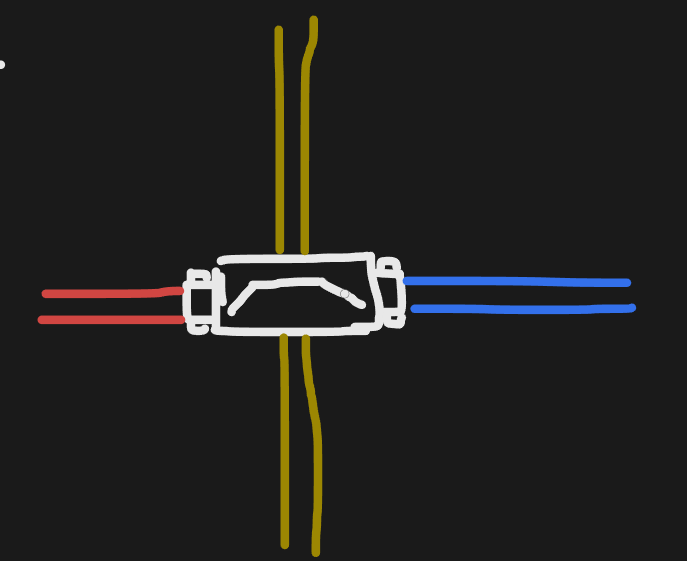

# FlatWorld 机械动力系统规划

## 1. 系统定位

机械动力系统用于把环境动力或人工动力，通过传动部件输送到各类用力器，形成从手工加工向机械化生产发展的玩法链。

当前文档先记录首批计划内容，具体动力数值、负载、配方、材料成本、传动规则与实现细节后续补充。

---

## 2. 动力源

首批动力源：

- 手摇轮
- 水车
- 风车
- 大水车
- 大风车

---

## 3. 机械传动

### 3.1 基础传动部件

- 木制传动轴
- 木制齿轮
- 变速箱
- 离合器

### 3.2 铜制变体

- 铜制传动轴
- 铜制齿轮
- 铜制变速箱

### 3.3 铁制变体

- 铁制传动轴
- 铁制齿轮
- 铁制变速箱

### 3.4 跨轴器

跨轴器用于让一条机械传动线路从另一条 Layer0 线路上方跨过，并保持两条线路互不连接。

#### 数据与视觉占用

- 跨轴器的权威数据只占用 **Layer1 的一个机械格**。
- 跨轴器主体视觉以该中心格为基准。
- 两侧连接端可各向外伸出约 **0.5 格**，形成约 0.5 + 1 + 0.5 格的视觉长度。
- 两侧伸出的部分只用于视觉表现和连接相邻机械端口，**不额外占用数据格**。
- Layer0 同位置仍可存在普通传动轴、齿轮或其它合法机械线路；跨轴器与其不会自动连接。

#### Sprite 表现

- Sprite 整体表现为一个 **架高的桥式传动外壳**，主体位于 Layer1 中心格。
- 主体外形应明显高于 / 包住下方 Layer0 线路，让玩家仅通过画面就能理解“这条动力从上方跨过去”。
- 主体中央保留明显的 **跨越空间 / 下穿通道**，使同格 Layer0 传动轴仍能从视觉上连续穿过，不能把底层线路完全遮死。
- 跨轴器两端绘制清晰的 **机械接口 / 轴承座**，分别对应 A、B 两个连接端。
- 左右方向放置时，两端接口向左右各伸出约 0.5 格，与相邻 Layer0 的传动轴或齿轮视觉贴合；上下方向放置时按相同规则旋转 90°。
- 两端伸出的连接部分属于跨轴器 Sprite 的表现范围，不因此增加额外数据格或建筑占格。
- Sprite 本身不表现木 / 铜 / 铁轴的组合材质；端点连接到什么材质的轴，由相邻 Layer0 机械节点自己的 Sprite 表现，避免跨轴器素材产生组合变体。
- Layer1 的跨轴器在 Sorting 上应明确显示于同格 Layer0 线路之上，但仍需露出底层线路的连续走向，强化“跨越而非连接”的视觉语义。

#### 连接方式

- 跨轴器自身存储在 Layer1。
- 跨轴器拥有两个连接端点 A / B。
- A / B 分别要求相邻 Layer0 格存在方向正确、可连接的机械端口，例如传动轴或齿轮。
- 放置时只校验 Layer0 两端是否能够正确连接，不改写 Layer0 轴体、齿轮的材质、等级或其它数据。
- 机械网络构图时，由跨轴器在 Layer1 建立一条 Layer0.A ↔ Layer0.B 的桥接连接。
- 被跨越的 Layer0 线路保持原有网络关系，不会因为跨轴器位于其上方而接入跨轴器网络。

#### 实现特质

- 跨轴器本体只有一个稳定定义，不根据木、铜、铁轴的组合生成不同物品变体。
- 木制、铜制、铁制传动轴以及齿轮都可以作为跨轴器端点，只要机械端口契约允许连接。
- 拆除跨轴器时只删除 Layer1 的跨轴器数据与桥接关系，不修改 Layer0 原有机械节点。
- 跨轴器中心格属于 Layer1，因此同一 Layer1 格不能重复放置第二个跨轴器。
- 视觉连接臂可以伸入相邻格，但碰撞、存档、网络拓扑和放置权威仍以中心的单个 Layer1 格为准。

---

## 4. 用力器

### 石磨

机械动力驱动的研磨设备。

### 机械风箱

机械动力驱动的风箱设备。

### 锯木机

机械动力驱动的木材加工设备。

### 机械锻锤

机械动力驱动的锻打设备。

当前明确用途：

- 将粗铁锻打为熟铁。

---

## 5. 当前首批内容清单

### 动力源

- [ ]  手摇轮
- [ ]  水车
- [ ]  风车
- [ ]  大水车
- [ ]  大风车

### 传动部件

- [ ]  木制传动轴
- [ ]  木制齿轮
- [ ]  变速箱
- [ ]  离合器
- [ ]  铜制传动轴
- [ ]  铜制齿轮
- [ ]  铜制变速箱
- [ ]  铁制传动轴
- [ ]  铁制齿轮
- [ ]  铁制变速箱
- [ ]  跨轴器

### 用力器

- [ ]  石磨
- [ ]  机械风箱
- [ ]  锯木机
- [ ]  机械锻锤

---

## 6. 后续待规划

- 动力与负载规则
- 动力源环境条件
- 传动连接规则
- 木 / 铜 / 铁传动部件的差异
- 变速箱规则
- 离合器规则
- 各用力器的加工规则
- 制作配方与科技阶段
- 建筑占地与朝向
- 存档与 MOD 扩展接口
