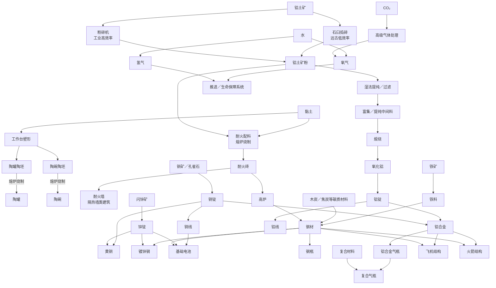

# FlatWorld 矿物与工业生产线路策划优化稿

> 来源：`矿物线路.drawio` 的现有节点与连接关系，并结合当前 FlatWorld 总体成长路线重新整理。
> 文档定位：中后期资源、冶金、化工、电气与航空航天生产链的策划基线。
> 状态：建议稿；用于后续评审和拆开发任务，不代表相关内容已经实装。
> 原则：保留原图想表达的“矿物逐渐走向高级工业和火箭”方向，同时修正不成立的材料关系，减少无用途中间产物和一次性机器。

---

## 0. 核心结论

原图的整体方向是对的：

**基础矿物 → 金属与陶瓷 → 合金与电气材料 → 高级加工 → 气体与储能 → 航空／火箭结构。**

但目前图中混合了三种不同关系：

1. **天然资源关系**：孔雀石 → 铜、闪锌矿 → 锌、铝土矿 → 铝。
2. **制造加工关系**：铁 → 钢、铜＋锌 → 黄铜、钢＋锌 → 镀锌钢。
3. **最终用途关系**：铝合金 → 飞机结构／火箭结构，锌 → 电池。

如果直接按现图实现，会出现部分线路科学关系不成立、机器只有一次用途、中间材料没有消费出口、后期科技突然跳级的问题。

建议将整个系统改造成五层成长：

```text
远古金属
→ 基础冶金
→ 早期工业
→ 电气化工业
→ 航空航天工业
```

它应当接在现有“铜／铁／青铜”阶段之后，而不是取代现有早期金属体系。

---

## 1. 原图需要修正的关键关系


| 原图关系                 | 判断                         | 优化方案                                                                   |
| -------------------------- | ------------------------------ | ---------------------------------------------------------------------------- |
| 黏土 → 铝土矿           | **错误**                     | 两者拆成完全独立的资源线；铝土矿来自世界矿点，不由黏土制造                 |
| 黏土 → 耐火砖 → 陶器   | **不合理**                   | 陶器继续走“具体陶坯 → 烧制”的生活线；耐火砖改为“黏土 + 铝土矿粉 → 熔炉烧制”，并用于耐火墙、高炉等高温工业内容 |
| 铁 → 钢铁               | 信息不足                     | 改为“铁矿 → 铁料 → 钢材”，炼钢额外需要碳质材料和高温设施               |
| 铝土矿 → 氧化铝 → 铝锭 | 方向正确                     | 保留，但加入粉碎、湿法处理／过滤、煅烧和高耗电电解阶段                     |
| 铝土矿粉 → 铝           | **错误／过度简化**           | 铝土矿粉只是预处理原料；必须继续经过提纯、过滤、煅烧得到氧化铝，再通过高耗电电解得到铝锭 |
| 刚玉 → 氧化铝           | 可作为候选支线               | 刚玉更适合定位为稀有高纯铝氧化物来源或耐磨高级材料，不作为普通铝生产主路线 |
| 铜＋锌 → 黄铜           | 正确                         | 保留，作为早期工业合金                                                     |
| 锌＋钢 → 镀锌钢         | 方向正确                     | 保留，明确为钢材表面处理，不把镀锌钢当成独立天然材料                       |
| 锌 → 电池               | 过度简化                     | 电池至少再需要导电件、电解质与外壳；锌只是其中一种关键材料                 |
| 水 → 氢气＋氧气         | 正确                         | 保留为中后期电解工业主线，并让两种气体都具备明确消费用途                   |
| CO₂ → 氧气             | 可做，但不应与水电解混为一谈 | 移至航天／异星生存阶段，作为高级气体处理技术，并保留副产物                 |
| 钢瓶／铝瓶／复合气瓶     | 目前悬空                     | 接入钢材、铝合金和复合材料，并承担气体运输／储存用途                       |
| 铝合金 → 飞机／火箭结构 | 方向正确但过于单一           | 飞机与火箭结构应消耗铝合金，同时需要钢材、紧固件或其它工业部件             |

---

## 2. 在 FlatWorld 总成长中的位置

当前项目已经把玩家长期发展大致划分为：

```text
荒野求生
→ 石器
→ 稳定基地
→ 农业与储备
→ 铜／铁／青铜金属阶段
→ 遗迹探索
→ 高级工业
→ 火箭与星球迁移
```

因此本矿物线路建议主要承担后半段：

```text
铜／铁／青铜
        ↓
钢、锌、黄铜、耐火砖／耐火墙／高炉
        ↓
电力与工业设备
        ↓
铝、工业电解、基础电池
        ↓
工业气体与高压储存
        ↓
航空结构
        ↓
火箭结构与星球迁移
```

设计目标不是让玩家“为了科技树而做材料”，而是每次解锁新材料后立刻获得一个明显的新能力。

---

## 3. 优化后的总线路



这张图只表达“技术和材料依赖”，不代表最终每个配方只需要图中的一种或两种材料。

---

## 4. 第一条主线：黏土、陶器、耐火砖与耐火墙

### 4.1 生产路线

```text
黏土
├─→ 工作台塑形
│   ├─→ 陶罐陶坯 → 熔炉烧制 → 陶罐
│   ├─→ 陶碗陶坯 → 熔炉烧制 → 陶碗
│   └─→ 后续其它具体器型陶坯 → 熔炉烧制 → 对应陶器

铝土矿
├─→ 石臼捣碎（远古时期，低效率）
└─→ 粉碎机粉碎（工业时期，高效率）
        ↓
    铝土矿粉

黏土 + 铝土矿粉
→ 熔炉烧制
→ 耐火砖
├─→ 合成／建造耐火墙
└─→ 建造高炉等高温工业设备
```

这里不再把“陶坯”作为一个可以烧成任意陶器的万能中间物品。**器型必须在工作台塑形阶段确定，熔炉只负责把对应陶坯烧成对应陶器。**

### 4.2 陶器配方结构

第一批至少加入两组完整配方：

```text
【工作台：塑形】
黏土 → 陶罐陶坯
黏土 → 陶碗陶坯

【熔炉：烧制】
陶罐陶坯 → 陶罐
陶碗陶坯 → 陶碗
```

配方规则：

- 每一种可烧制陶器都应拥有自己对应的陶坯物品和塑形配方；
- 工作台负责决定器型，只产出未烧制陶坯，不直接产出成品陶器；
- 熔炉按器型一对一烧制，陶罐陶坯只能烧成陶罐，陶碗陶坯只能烧成陶碗；
- 后续新增陶杯、陶盘、陶壶等内容时，只新增“具体陶坯 + 对应烧制配方”，不改变整条生产逻辑；
- 燃料和烧制时间由熔炉系统统一承担，不需要为不同陶器重复设计一套烧制机器。

这样玩家实际经历的是“采黏土 → 塑形 → 烧制”的完整制陶过程，同时又能通过工作台选择自己真正需要的器型。

### 4.3 耐火砖配方与定位

耐火砖不再使用模糊的“耐火材料”中间层，第一版直接把核心原料确定为：

```text
黏土 + 铝土矿粉
→ 熔炉烧制
→ 耐火砖
```

暂不在策划阶段锁死精确数量，先确定材料关系和设备关系。

耐火砖至少拥有两个明确消费出口：

- **耐火墙**：用于基地隔热、防护高温环境；
- **高炉**：作为炉体／炉衬所需的耐高温建造材料，是进入更高温冶金的重要门槛。

这样耐火砖不是“为了造一台机器才存在的一次性材料”，而是同时连接基地建设与工业升级。

### 4.4 新物品：耐火墙

> 状态：**待实现／建议新增**。耐火墙属于墙类建筑，不代表当前游戏已经具备该物品或完整热传导阻挡能力。

耐火墙的基础关系：

```text
耐火砖
→ 墙类建筑配方
→ 耐火墙
```

核心特性：**高耐热 + 隔热**。

耐火墙需要与世界温度层产生真实交互，而不是只在描述文本中写“隔热”。建议第一版采用“热阻边界”语义：

- 耐火墙占据墙体格后，对穿过该墙体的局部升温／降温影响进行明显衰减；
- 墙体本身不凭空制造固定温度，也不直接改写群系基础温度或星球全局温度；
- 火炉、火堆、制冷设备等局部冷热源位于墙的一侧时，另一侧受到的温度影响应明显低于普通开放空间；
- 墙被拆除或破坏后，对应热阻立即消失；
- 后续如果加入完整房间保温、室内热容量或热传导系统，应继续复用同一“墙体热阻／隔热系数”属性，而不是为耐火墙写特殊判断。

当前项目的逐格温度由 `TemperatureMgr` / `LocalTemperatureField` 负责采样与叠加局部冷热源，现有局部温度场是按距离衰减叠加，并**没有墙体遮挡／热阻计算**。因此耐火墙的温度交互属于后续需要新增的环境系统能力，策划上不能误写成已经实现。

建筑实现层面应沿用现有墙类建筑的格子／Blocking Tile 路线，把“隔热能力”作为可配置的环境属性接入温度系统，不为耐火墙单独绕开通用墙体架构。

### 4.5 铝土矿粉的双阶段加工

铝土矿粉在远古和工业时期使用**同一个物品**，差异只来自加工设备效率：

```text
【远古时期】
铝土矿 → 石臼 → 铝土矿粉
特点：慢、单次产量低、适合少量制造耐火砖

【工业时期】
铝土矿 → 粉碎机 → 铝土矿粉
特点：快、批量、可进入连续工业生产
```

不要额外制造“粗铝土矿粉／工业铝土矿粉”两个库存物品；玩家升级机器后得到的是**效率提升**，不是为了科技阶段而重复制造中间材料。

石臼得到铝土矿粉并不意味着玩家前期已经拥有“干净的铝”。铝土矿粉只是矿石预处理产物，真正得到铝仍必须经过后续提纯链：

```text
铝土矿粉
→ 湿法提纯／过滤
→ 富集／中间料
→ 煅烧
→ 氧化铝
→ 高耗电电解
→ 铝锭
```

因此玩家可以在远古时期借用铝土矿的耐火性质，但不能靠石臼 + 普通熔炉提前跨越到铝工业。

### 4.6 玩法定位

陶器仍属于早期生活生产线，服务：

- 陶罐：储水、烧水、制盐、液体或材料储存；
- 陶碗：食物加工、进食容器、药材调配等小容量用途；
- 后续不同器型继续承担不同容量、加工和交互用途；
- 后续化工容器的早期替代品。

耐火砖与耐火墙则承担基地环境控制和工业升级门槛：

- 耐火墙与高温区域隔热；
- 高炉建造／炉衬；
- 高温熔炉升级；
- 煅烧炉；
- 炼钢设备；
- 铝工业相关高温设备；
- 后续高温反应装置。

这样同一种自然资源可以跨越早期与工业期持续有价值，但两条线路不互相错误依赖。

### 4.7 设计原则

**第一只陶罐不能要求工业设施。**

基础工作台和早期可获得的熔炉／烧制设施就应能完成陶罐、陶碗的整条生产。耐火砖可以在远古时期通过少量铝土矿 + 石臼进入玩家视野，并逐步成为高炉等高级冶金设施的门槛；基础陶器则不能反过来被耐火砖或铝工业锁住。

---

## 5. 第二条主线：铜、锌与黄铜

### 5.1 铜

推荐：

```text
孔雀石／铜矿
→ 熔炼
→ 铜锭
├─→ 铜工具／已有早期用途
├─→ 铜线
└─→ 黄铜
```

铜线应当补进体系。

原因是原图出现了“铝线”，但没有铜线；从游戏成长角度看，铜更适合作为玩家第一次进入电气系统时的导电材料，铝线则作为后期轻量化或大规模输电材料。

### 5.2 锌

推荐：

```text
闪锌矿
→ 冶炼／精炼
→ 锌锭
├─→ 黄铜
├─→ 镀锌钢
└─→ 基础电池
```

这样锌会同时连接合金、防腐和电气三条路线，是一个很适合中期探索的“多用途矿物”。

### 5.3 黄铜

```text
铜锭 + 锌锭
→ 合金熔炼
→ 黄铜
```

建议黄铜不要只做装饰材料，可以承担：

- 阀门；
- 接头；
- 仪表部件；
- 泵体小部件；
- 气体设备部件；
- 高级制作台部件。

这些用途能自然连接后面的气体、液体和工业设备。

---

## 6. 第三条主线：铁、钢与镀锌钢

### 6.1 钢材路线

原图的“铁 → 钢铁”建议细化为：

```text
铁矿
→ 粗铁／铁料
→ 高炉高温炼制 + 碳质材料
→ 钢材
```

游戏不需要模拟完整现实炼钢工艺，但必须让“钢”表现为一次明确的工业升级，而不是把铁锭直接改名。

高炉本身应消耗耐火砖作为关键建造材料，使“找到少量铝土矿 → 制作铝土矿粉 → 烧制耐火砖”自然成为炼钢工业的前置准备，而不是要求玩家先拥有铝才能炼钢。

### 6.2 钢材用途

钢材应成为高级工业的通用骨架材料：

- 高级工具；
- 机器外壳；
- 工业管道；
- 高压钢瓶；
- 结构件；
- 航空／火箭中的高强度部件；
- 后续轨道、机械、车辆等扩展。

### 6.3 镀锌钢

```text
钢材 + 锌
→ 表面处理
→ 镀锌钢
```

镀锌钢的主要价值应当是“耐腐蚀”，而不是单纯比钢拥有更高攻击或生命值。

后续可用于：

- 室外工业建筑；
- 储水设施；
- 潮湿环境机械；
- 海边设施；
- 管路和大型储罐。

如果游戏暂时没有腐蚀系统，可以先让它作为特定高级建筑的配方材料，不急着为此新增一整套腐蚀模拟。

---

## 7. 第四条主线：铝工业

铝应该是本系统最明显的一次工业跃迁。

它不适合像铜铁一样“挖矿 → 放炉子 → 得锭”，否则高级工业缺乏层级感。

### 7.1 推荐流程

```text
铝土矿
→ 石臼（前期低效率）／粉碎机（工业高效率）
→ 铝土矿粉
→ 湿法处理／过滤
→ 富集／中间料
→ 煅烧炉
→ 氧化铝
→ 高耗电电解槽
→ 铝锭
```

第一版可以把部分化学步骤合并，避免为了现实还原加入大量只用一次的化学品。

玩家需要感受到四个核心门槛即可：

1. **矿石预处理与规模化粉碎**；
2. **湿法提纯／过滤**；
3. **高温煅烧**；
4. **大量电力电解**。

其中石臼只解决“把矿石磨成粉”的前处理问题，不能替代后续工业提纯。这样玩家前期可以使用铝土矿粉制作耐火砖，但仍然很难获得高纯度铝。

术语上也要保持清楚：**铝土矿是天然矿石；提纯后得到的是氧化铝，再经电解得到铝锭，不是“提纯得到铝矿”。**

### 7.2 刚玉定位

原图中的刚玉不建议作为普通铝锭的主要来源。

更推荐定位为稀有资源：

```text
刚玉
├─→ 高纯氧化铝
├─→ 耐磨部件
├─→ 高级研磨材料
└─→ 特殊陶瓷
```

这样刚玉有自己的稀有价值，不会和常见铝土矿争夺同一功能。

### 7.3 铝锭用途

```text
铝锭
├─→ 铝线
├─→ 铝板／轻质结构件
├─→ 铝合金
└─→ 铝制容器
```

### 7.4 铝合金

第一版可以采用游戏化简化：

```text
铝锭 + 铜锭 + 合金加工
→ 轻质铝合金
```

后续如果加入镁、锰、硅等资源，再把配方细化；第一版不建议为了“真实”一次性增加四五种新矿。

铝合金的定位是：

**轻、强、适合移动结构。**

主要消费出口：

- 飞机结构；
- 火箭结构；
- 高级气瓶；
- 轻量化机械部件；
- 后续车辆、太空设备。

---

## 8. 工业机器体系优化

原图已经出现：

- 粉碎机；
- 过滤机；
- 煅烧炉；
- 电解槽。

这个方向可以保留，但每台机器必须服务多条生产线，不能成为“为了做一个物品才造一台机器”。

### 8.1 石臼（远古低效率预处理）

石臼承担“技术上能做，但效率很低”的早期入口：

- 铝土矿 → 铝土矿粉；
- 单次处理量小；
- 加工时间长或需要更多人工操作；
- 不承担湿法提纯、电解等工业步骤。

它的作用是让玩家在没有工业机器时也能做少量耐火砖，而不是让远古玩家提前进入铝冶炼。

### 8.2 粉碎机

用途建议：

- 批量把铝土矿粉碎为同一种“铝土矿粉”；
- 高级矿物预处理；
- 石料粉末；
- 陶瓷／耐火材料原料；
- 后续废料回收。

粉碎机与石臼的核心差异是**效率、批量和自动化能力**，不是产出不同等级的铝土矿粉。

### 8.3 湿法处理机／过滤机

建议不要把它只定义成简单“过滤机”。

更好的游戏职责是：

**液固分离和矿浆处理设备。**

可以用于：

- 铝土矿处理；
- 矿浆过滤；
- 水处理；
- 后续化工生产。

名称可以在后续美术和玩法确定后选择“过滤机”或“工业处理槽”。

### 8.4 煅烧炉

用途建议：

- 氧化铝生产；
- 高级陶瓷；
- 石灰等未来工业材料；
- 特定矿物热分解。

### 8.5 电解槽

电解槽应该是**电气化工业的标志性设备**。

用途建议：

- 氧化铝 → 铝；
- 水 → 氢气＋氧气；
- 后续电镀／电解精炼；
- 高级气体处理的基础技术前置。

注意：不同电解过程可以共用“电解技术”，但不一定必须在完全相同的槽体和配方中直接互换。

### 8.6 建议补充：气体压缩／灌装设备

当氧气、氢气和气瓶正式成为物品后，需要一个统一接口：

```text
气体 + 空气瓶
→ 压缩／灌装
→ 对应高压气瓶
```

否则“氧气”和“钢瓶”会是两条互不相连的库存物品。

---

## 9. 电池线路

原图的：

```text
锌 → 电池
```

过于简单。

策划上建议第一版定义为：

```text
锌
+ 铜线／导电件
+ 电解质材料
+ 金属外壳
→ 基础电池
```

这里是游戏化的生产抽象，不把它描述成某一种现实电池的完整化学配方。

### 电池的核心作用

- 便携电源；
- 小型设备；
- 手持照明；
- 传感器；
- 飞机／车辆启动电源；
- 后续自动化装置。

### 重要设计约束

电池不能只是“做出来放仓库”。

在加入电池物品前，至少先确定一个持续消耗或反复充放电的实际用途。

如果当前电力系统暂时没有便携储能需求，则电池线路可以晚于铝工业实现。

---

## 10. 水、电解与工业气体

### 10.1 水电解

```text
水 + 电力
→ 电解槽
→ 氢气 + 氧气
```

这条线非常适合做成中后期工业系统，因为它把：

- 水资源；
- 电力；
- 气体储存；
- 航空航天；

连接在一起。

### 10.2 氧气用途

建议至少拥有以下两类用途后再正式加入：

- 高温工业／焊接类生产需求；
- 航空航天生命保障或推进系统。

后续可以扩展：

- 医疗；
- 密闭环境呼吸；
- 太空服；
- 地下或异星环境生存。

### 10.3 氢气用途

建议用于：

- 后期燃料；
- 火箭推进相关资源；
- 化工原料；
- 后续能源技术。

如果氢气没有消费出口，则不要只因为水电解“现实会产生氢气”就把它加入库存。

### 10.4 CO₂ 制氧

原图中：

```text
CO₂ → 电解槽 → 氧气
```

不建议与普通水电解作为同阶段内容。

更好的定位是：

**火箭／异星生存之后的高级气体处理技术。**

建议抽象成：

```text
CO₂ + 大量电力
→ 高级气体处理设备
→ 氧气 + 碳系副产物
```

它的主要玩法价值不是“多一种制氧配方”，而是让玩家在缺水、富 CO₂ 或封闭环境中建立新的氧气来源。

---

## 11. 气瓶线路

### 11.1 三档容器

```text
钢材
→ 钢瓶

铝合金
→ 铝合金气瓶

铝合金内胆 + 复合材料
→ 复合气瓶
```

### 11.2 不建议只做“数值越来越大”

三种气瓶建议形成不同定位：


| 气瓶       | 定位         | 优势             | 劣势               |
| ------------ | -------------- | ------------------ | -------------------- |
| 钢瓶       | 基础工业储气 | 便宜、坚固       | 重                 |
| 铝合金气瓶 | 移动设备     | 更轻             | 成本高             |
| 复合气瓶   | 航空航天     | 最轻／高容量潜力 | 制造复杂、材料昂贵 |

如果游戏物品没有重量机制，则可以把差异转化为：

- 背包体积；
- 单瓶容量；
- 耐久；
- 设备兼容等级；
- 制作成本。

不要为了不存在的“重量玩法”强行增加一个隐藏重量系统。

---

## 12. 飞机与火箭结构

原图将：

```text
铝合金 → 飞机结构
铝合金 → 火箭结构
```

作为终点，这个方向可以保留，但终端配方不能只消耗铝合金。

### 12.1 飞机结构建议

```text
铝合金
+ 钢制关键部件
+ 紧固／机械部件
→ 飞机结构组件
```

进一步再与：

- 发动机；
- 燃料系统；
- 控制系统；
- 电池／电气系统；

组成完整飞机。

### 12.2 火箭结构建议

```text
铝合金
+ 高强度钢件
+ 高级机械部件
→ 火箭结构组件
```

火箭本体还应依赖独立系统：

- 推进系统；
- 燃料／氧化剂；
- 电力；
- 控制；
- 生命保障；
- 发射设施。

**“获得铝合金”应该意味着玩家拥有制造火箭结构的材料基础，而不是直接等于解锁火箭。**

这样火箭可以成为多个工业系统最终汇流的长期目标。

---

## 13. 建议的科技阶段

### 阶段 I：远古与基础冶金

玩家掌握：

- 黏土；
- 陶罐、陶碗等基础陶器；
- 少量铝土矿；
- 石臼；
- 铝土矿粉；
- 基础耐火砖；
- 铜；
- 锡；
- 青铜；
- 铁。

核心体验：**第一次稳定加工自然资源。**

### 阶段 II：早期工业

新增：

- 钢材；
- 锌；
- 黄铜；
- 铜线；
- 耐火墙；
- 高炉；
- 耐火砖的规模化消费；
- 基础机械加工。

核心体验：**基地从手工作坊变成真正的生产基地。**

### 阶段 III：电气化工业

新增：

- 稳定发电；
- 粉碎机（替代石臼进行批量粉碎）；
- 湿法处理设备；
- 煅烧炉；
- 电解槽；
- 基础电池。

核心体验：**电力第一次成为生产门槛，而不只是照明。**

### 阶段 IV：铝与工业气体

新增：

- 铝土矿完整加工；
- 氧化铝；
- 铝；
- 铝合金；
- 氢气；
- 氧气；
- 高压气瓶。

核心体验：**玩家开始生产自然界不能直接捡到的高级工业材料。**

### 阶段 V：航空与航天

新增：

- 轻量结构；
- 复合气瓶；
- 航空结构；
- 火箭结构；
- 高级气体处理；
- 推进和生命保障相关工业。

核心体验：**此前所有资源线路开始汇流到“离开星球”这一长期目标。**

---

## 14. 世界资源分布建议

矿物的价值不能只由配方决定，也必须由“去哪里找”决定。

### 基础资源

- 黏土：河岸、湿地区域；
- 铝土矿：前期应能通过少量地表露头、浅层矿点或山地可见矿点获得，使玩家能手工制作第一批耐火砖；
- 铜矿：较常见浅层矿；
- 铁矿：常见地下矿；
- 锡矿：比铜更稀少，服务青铜探索需求。

### 中阶资源

- 闪锌矿：地下中层或特定地质区域；
- 大型铝土矿矿体：集中在特定山地／地质区域，为工业时期的批量耐火砖和完整铝工业提供规模化原料，形成主动远行目标。

### 稀有资源

- 刚玉：少量高价值矿点、深层矿洞或特殊地质结构。

### 分布原则

1. 第一份关键材料不能被自己的高级工具门槛锁死。
2. 高级材料可以要求远行，但不能只依赖极低概率随机刷新。
3. 不同矿物应尽量拥有区域特征，让玩家可以根据环境线索主动寻找。
4. 遗迹可以提供少量高级材料和技术加速，但不能成为基础矿产唯一来源。

---

## 15. 中间材料控制原则

工业系统最容易出现的问题不是材料太少，而是**无意义材料太多**。

### 建议规则

- 一个长期存在的中间材料最好至少有 **2 个消费出口**；
- 一个专用机器最好至少服务 **2 条生产线**；
- 不为了还原现实工艺，把每一种矿浆、溶液、沉淀都做成库存物品；
- 对玩法没有选择意义的化学过程可以合并为机器加工步骤；
- 有物流、储存或副产物决策价值的中间材料才值得实体化。

例如铝工业第一版没有必要加入十几种化学试剂。

玩家真正需要理解的是：

```text
矿石需要预处理
→ 需要提纯／过滤
→ 需要高温
→ 需要大量电力
→ 才能得到轻质高级金属
```

这已经足够形成有层次的生产体验。

---

## 16. 副产物设计原则

现实工业存在大量废渣、废气和副产物，但游戏中不应全部照搬。

### 第一版建议保留的副产物

- 水电解：氢气和氧气都保留，因为两者都有后续价值；
- 高级 CO₂ 处理：至少保留一个碳系副产物，避免凭空消失质量关系；
- 高级矿物处理：只有当尾矿／矿渣能用于建筑、回收或环境玩法时再实体化。

### 不建议

- 每个熔炼配方都强制产生库存垃圾；
- 玩家为了清理废料频繁手动搬运，却没有任何回收或处置策略；
- 为了“真实”增加几十种只出现一次的化学物品。

工业副产物应该产生**决策**，而不是纯粹产生背包垃圾。

---

## 17. 配方和平衡原则

暂不在策划阶段锁死每个配方的精确数量，先确定经济规则。

### 17.1 原料价值

高级材料的成本主要来自：

1. 获取距离；
2. 加工步骤；
3. 设备投资；
4. 能源；
5. 加工时间。

不要同时把五项成本全部拉满，否则工业阶段会变成纯等待和搬运。

### 17.2 能源

- 早期陶器／铁：燃料为主；
- 钢与煅烧：高温燃料或工业炉；
- 铝：明确高耗电；
- 水电解：持续耗电；
- 气体压缩：耗电；
- 航天工业：高耗电＋大量材料。

这样“建立稳定电网”会成为铝工业之前自然出现的新目标。

### 17.3 生产时间

长加工时间适合玩家批量安排生产，不适合让玩家站在机器旁等待。

工业机器应尽量支持：

- 输入缓存；
- 输出缓存；
- 连续生产；
- 玩家离开附近后仍按世界时间推进。

最终实现方式需要遵守现有制作与存档架构，本文件只定义玩法需求。

---

## 18. 玩家反馈与可理解性

玩家面对复杂资源树时，最大风险是“不知道为什么做”。

每次进入新工业阶段都应该产生一个清楚目标：


| 获得材料／设备 | 立即告诉玩家的新能力             |
| ---------------- | ---------------------------------- |
| 铝土矿粉       | 能烧制耐火砖，并成为未来铝工业的预处理原料 |
| 耐火砖         | 能制作耐火墙，并开始建设高炉等高温设备 |
| 耐火墙         | 能降低墙体两侧局部冷热影响的传递，获得真正的隔热建筑能力 |
| 钢             | 能建造更高级机械和高压容器       |
| 锌             | 能制作黄铜、镀锌件和电池         |
| 铜线           | 开始制作电气设备                 |
| 稳定电力       | 可以进入电解工业                 |
| 氧化铝         | 距离铝只差高耗电电解             |
| 铝             | 可以制作轻量结构和铝线           |
| 铝合金         | 航空／火箭结构路线正式开启       |
| 氧气／氢气     | 推进、生命保障和高级工业路线开启 |

不要让玩家获得一个新材料后，只在配方列表里看到十个陌生中间件。

---

## 19. 推荐的实现顺序

### 第一批：修正基础关系

先完成：

- 黏土 → 工作台塑形 → 陶罐陶坯／陶碗陶坯 → 熔炉烧制 → 对应陶器；
- 铝土矿 → 石臼 → 铝土矿粉；
- 黏土 + 铝土矿粉 → 熔炉烧制 → 耐火砖；
- 耐火砖 → 耐火墙；
- 耐火砖 → 高炉建造材料；
- 铜矿 → 铜；
- 闪锌矿 → 锌；
- 铜＋锌 → 黄铜；
- 铁 → 钢。

目标：让早期玩家先通过低效率手工加工获得少量耐火能力，并让耐火砖同时连接基地隔热与后续高温冶金。

### 第二批：建立电气工业

- 铜线；
- 发电相关需求；
- 基础电池；
- 粉碎机，并让其高效率产出与石臼相同的铝土矿粉；
- 工业炉／煅烧炉。

目标：让电力成为生产力，而不只是环境光源。

### 第三批：完整铝工业

- 铝土矿粉的规模化生产；
- 湿法处理；
- 提纯／过滤中间料；
- 氧化铝；
- 电解槽；
- 铝锭；
- 铝合金。

目标：形成第一条真正的多设备高级工业链。

### 第四批：工业气体

- 水电解；
- 氧气；
- 氢气；
- 钢瓶；
- 铝合金气瓶；
- 灌装／压缩。

目标：把水、电力、金属、气体四套资源系统连接起来。

### 第五批：航空航天汇流

- 飞机结构；
- 复合材料与复合气瓶；
- 火箭结构；
- 推进和生命保障材料需求；
- CO₂ 高级气体处理。

目标：让“离开星球”成为此前工业体系的最终消费出口。

---

## 20. 第一版不建议加入的内容

为了避免工业系统范围失控，第一版建议暂缓：

- 完整现实化拜耳法化学试剂体系；
- 多种现实铝合金牌号；
- 数十种电池化学体系；
- 完整腐蚀模拟；
- 完整空气组分模拟；
- 每种气体的现实压力和热力学计算；
- 大量没有玩法用途的工业废物；
- 为每一种矿物单独创建一台专用机器。

FlatWorld 需要的是**可信的工业逻辑**，不是工业化学模拟器。

---

## 21. 策划验收标准

这套矿物线路在策划上至少需要满足：

### 成长

- 玩家能说清“为什么我要从青铜／铁继续发展钢和铝”；
- 每个高级材料都能解锁至少一种明显的新能力；
- 火箭不是单独一张高级配方，而是多个工业系统的汇流终点。

### 资源

- 基础矿产存在稳定获取方式；
- 高级矿物要求探索但不是纯概率门槛；
- 同一种矿物至少在一个阶段拥有持续需求。

### 生产

- 工业机器不是一次性设备；
- 不存在大量无消费出口的中间材料；
- 玩家可以批量生产，而不是长时间站在机器前等待。
- 石臼和粉碎机产出同一种铝土矿粉，升级设备体现效率差异而不是重复物品；
- 铝土矿粉不能直接烧成铝，完整铝生产必须经过提纯、煅烧和电解。

### 建筑与温度

- 耐火墙明确属于墙类建筑，并消耗耐火砖；
- 耐火墙的隔热必须影响温度层实际采样／传播结果，而不是只提供说明文本；
- 隔热能力通过通用“热阻／隔热系数”接入墙体和温度系统，不为耐火墙硬编码专用判断；
- 当前局部温度场没有墙体遮挡能力，因此实现时必须把这部分作为新增环境系统能力验收。

### 可理解性

- 玩家能通过配方和提示理解材料的上下游；
- 不出现“黏土为什么变成铝土矿”这种无法解释的关系；
- 机器名称和功能一致，过滤、煅烧、电解各自承担清晰职责。

### 后期目标

- 铝合金、钢、铜线、电池、氧气、氢气最终都能参与高级内容；
- 飞机和火箭消耗来自多个生产分支的成果；
- CO₂ 制氧等高级技术只在其真正具备生存意义的阶段出现。

---

## 22. 最终推荐线路摘要

```text
【生活／耐火】
黏土 → 工作台塑形 → 陶罐陶坯 → 熔炉烧制 → 陶罐
                  └→ 陶碗陶坯 → 熔炉烧制 → 陶碗
                  └→ 其它具体器型陶坯 → 熔炉烧制 → 对应陶器

铝土矿 → 石臼（远古低效率） ─┐
铝土矿 → 粉碎机（工业高效率） ├→ 铝土矿粉
                               └→ + 黏土 → 熔炉烧制 → 耐火砖
                                                    ├→ 耐火墙（隔热墙类建筑）
                                                    └→ 高炉／高温工业设备

【铜锌】
孔雀石／铜矿 → 铜 → 铜线
闪锌矿 → 锌
铜 + 锌 → 黄铜

【钢铁】
铁矿 → 铁料 + 碳质材料 + 高炉 → 钢材
钢材 + 锌 → 镀锌钢

【铝】
铝土矿粉
→ 湿法处理／过滤
→ 富集／提纯中间料
→ 煅烧
→ 氧化铝
→ 高耗电电解
→ 铝
→ 铝合金／铝线／轻量结构

【电气】
铜线 + 锌 + 电解质 + 外壳
→ 基础电池

【气体】
水 + 电力
→ 氢气 + 氧气
→ 压缩／灌装
→ 钢瓶／铝合金气瓶／复合气瓶

【航空航天】
钢材 + 铝合金 + 机械／电气部件
→ 飞机结构

钢材 + 铝合金 + 电气 + 气体／推进系统
→ 火箭结构与火箭系统

【异星后期】
CO₂ + 大量电力
→ 高级气体处理
→ 氧气 + 碳系副产物
```

最终体验目标：

> **玩家不是在解锁一串互不相干的矿物，而是在亲手把一个原始生存基地逐步建设成能够制造飞机、火箭并支撑星球迁移的工业文明。**
