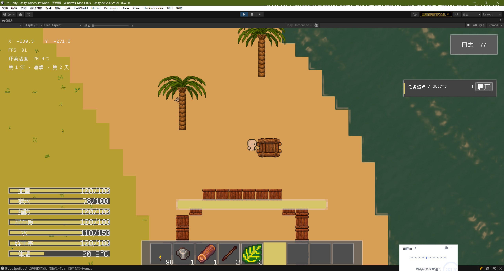
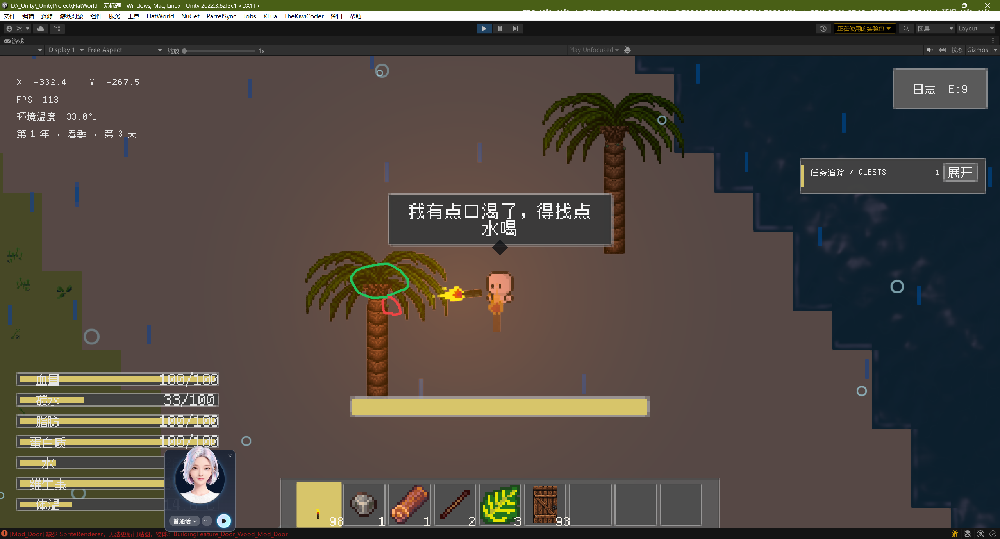

* [x]  简易木筏推动规则
  玩家推动简易木筏时，会给木筏施加一个与玩家推动方向一致的移动速度。玩家在陆地上推动木筏：
  木筏速度 = 玩家陆地移动速度 × 0.2（1/5）
  玩家在水中推动木筏：
  木筏速度 = 玩家当前在水中的移动速度
  玩家乘坐木筏划船：
  划船速度规则保持不变，仍使用原来的 1/10 速度设定。
  也就是说，推动速度不再统一按照“木筏海上速度”的比例计算，而是根据玩家当前所处环境的移动速度计算。
  然后还是要玩家能够在那个玩家在海里面也能够使用E键上这个船。这里可能会和喝水产生冲突，你给他修改成光标决定，如果光标指向的是海里，那就是长按一键喝水，如果光标指向的是莫法，那么就是点击一键上传。这个由光标决定，还有就是如果玩家光标悬浮在简易木筏上，就会出现一个白色描边，这个描边复用我的描边系统就可以了。然后还需要你添加一些特效，这个船在水里滑动会泛起波纹，就把水面泛起波纹吧。然后还有一个问题：玩家在水中被推动时会不自主播放移动动画。需参考船带动玩家移动的逻辑，但船本身不会播放移动动画。即A对象带动B对象移动的逻辑需处理。后续船入海必须受海水推动，逻辑链为C（海水）推B（船）、B带A（玩家）。建议创建游戏推动带动系统处理力传导，而非用物理系统粗暴解决。
  
* [x]  现在游戏里的木门没办法开关，我检测到报错。请修复木门无法开关的问题，先修复木门即可。
  [Mod_Door] 缺少 SpriteRenderer，无法更新门贴图，物体：BuildingFeature_Door_Wood_Mod_Door
  UnityEngine.Debug:LogError (object)
  Mod_Door:ApplyDoorState () (at Assets/5_Scripts/5-3_GamePlay/World/Building/Mod_Door.cs:154)
  Mod_Door:Load () (at Assets/5_Scripts/5-3_GamePlay/World/Building/Mod_Door.cs:65)
  Item:ModuleLoad () (at Assets/5_Scripts/5-3_GamePlay/Entities/Item/Core/Item.cs:547)
  Item:Load () (at Assets/5_Scripts/5-3_GamePlay/Entities/Item/Core/Item.cs:185)
  Mod_Building:TryCreateInstalledBuilding (UnityEngine.Vector3,Item&,string&) (at Assets/5_Scripts/5-3_GamePlay/World/Building/Mod_Building.cs:437)
  Mod_Building:Install () (at Assets/5_Scripts/5-3_GamePlay/World/Building/Mod_Building.cs:366)
  UltEvents.UltEvent:Invoke () (at ./Packages/com.kybernetik.ultevents/Runtime/Events/UltEvent0.cs:186)
  Item:Act () (at Assets/5_Scripts/5-3_GamePlay/Entities/Item/Core/Item.cs:699)
  Inventory_HotBar:OnRightClickPerformed () (at Assets/5_Scripts/5-3_GamePlay/Items/Inventory/Inventory_HotBar.cs:625)
  UltEvents.UltEvent:Invoke () (at ./Packages/com.kybernetik.ultevents/Runtime/Events/UltEvent0.cs:186)
  GameController:RightClickAction (UnityEngine.InputSystem.InputAction/CallbackContext) (at Assets/5_Scripts/5-3_GamePlay/Player/Controller/GameController.cs:356)
  UnityEngine.InputSystem.LowLevel.NativeInputRuntime/<>c__DisplayClass7_0:<set_onUpdate>b__0 (UnityEngineInternal.Input.NativeInputUpdateType,UnityEngineInternal.Input.NativeInputEventBuffer*)
  UnityEngineInternal.Input.NativeInputSystem:NotifyUpdate (UnityEngineInternal.Input.NativeInputUpdateType,intptr)
* [x]  需要你优化一下这个游戏的椰子树上结椰子的这个效果，现在的青椰子出现的地方有点太矮了。你可以参考我下面的图片，把红色的叶子放到绿色的位置上去。
  
* [x]  如果鸟进入飞行，现在的鸟进入飞行状态的速度还是有点慢，你把鸟进入飞行后的速度提升3倍
* [x]  然后添加一个飞行耐力条。鸟在飞行时会消耗飞行耐力条，归零后需落地恢复。鸟飞行耐力条默认设为100，通常可一次性飞行100秒。落地后1秒回复10点，即1秒回复1/10，归零后落地恢复10秒可恢复满。若飞行中耐力条归零，鸟会被动切换到走路状态。然后现在鸟类的谨慎范围还太小了，给它提升一点，提升为原来的两倍鸟的警惕范围。
* [x]  鸟类会对浆果一类的食物产生和种子同样的兴趣。
* [x]  物品建筑在超出玩家放置范围时，软件点击右键放置应提示“物品超出放置范围限制”，而非“物品不能放在那儿”。该物品放置范围即建筑虚拟显示范围，其半径为可控制范围的两倍；玩家光标再远一点，放置虚影会彻底消失，而非无限显示。
* [x]  体温过低的掉血频率。我现在有点太短了。掉血频率太久了就是隔很久才掉一次血，而且掉的血量还特别多。你改一下，改成每5秒掉一次血，然后5秒钟掉2滴血吧。感觉还是有点快，改成5秒钟掉2滴血，每5秒钟掉2滴血，如果体温低于危险值的话，
* [x]  现在玩家因为没有氧气而开始掉血的频率太快了。你给他修改一下，改成5秒钟掉一次血，一次血掉10滴血。

## 实现与验收记录（2026-09-20）

九项已实现。木筏通过游戏推动/承载契约合成主动速度、水流和乘员跟随，不使用物理冲量；陆地推动取玩家移速的 0.2，水中取玩家当前水中移速，原划船参数保持不变。木门修复宿主渲染器绑定，打开后仍可交互且保留建筑占格。椰子挂点上移至树冠区域。

鸟类飞行速度为 9，耐力上限 100、飞行每秒扣 1、地面每秒恢复 10，耗尽后强制降落并回满后才解除休息锁；增加世界空间耐力条、12/20 格的警惕/安全距离及种子与水果的同级觅食。放置距离为交互距离两倍，越界隐藏虚影，提交时提示“物品超出放置范围限制”。低温伤害为每 5 秒 2 HP；缺氧伤害为每 5 秒 10 HP，分别计时，解除危险时清除旧时间，不改变原高温规则。

### 验证范围

- Unity 编译通过；新增 PlayMode 回归测试 **14/14 通过，失败 0**，覆盖推动比例、连续接触、耐力耗尽与恢复、耐力存档、体温 MemoryPack 字段兼容和放置格边距离。
- 在隔离测试存档 `Todo01_Validation2` 中验证了正式手持放置木筏、E 登船、海上划行、水流被动承载、靠岸下船、陆地推动、木门反复开关，以及保存退出后重新进入世界。
- 截图检查了乘船画面、门打开贴图和越界隐藏虚影；确认画面显示指定超距提示。鸟类出生与飞行耐力状态已通过实际运行读回检查。低温与缺氧固定伤害完成代码/配置和编译检查，未另做长时间伤害挂机；不将未执行的测试计入通过项。
- 最后一轮运行控制台错误 **0**、警告 **0**。测试结束后已保存隔离存档并退出 Play Mode，未修改正式存档，未提交或推送 Git。

测试原始记录：`.codex-tmp/todo01-validation/`。回归任务 ID：`4c8e1e646cc54f04bb017f7471c326e2`。主要截图：`Assets/Screenshots/screenshot-20260920-005057.png`（海上承载）、`screenshot-20260920-005624.png`（门打开）、`screenshot-20260920-010410.png`（超距提示）。
