# 代办 0919

1. [ ] **修复高视野下地图出现黑色空白块**  
   现在视野拉高后，部分地块会来不及显示，地图上会出现黑色背景块。只要滚轮缩放一下视野，这些区域又会正常加载出来。看起来更像是地图加载/刷新逻辑有问题，而不是单纯性能不足。

   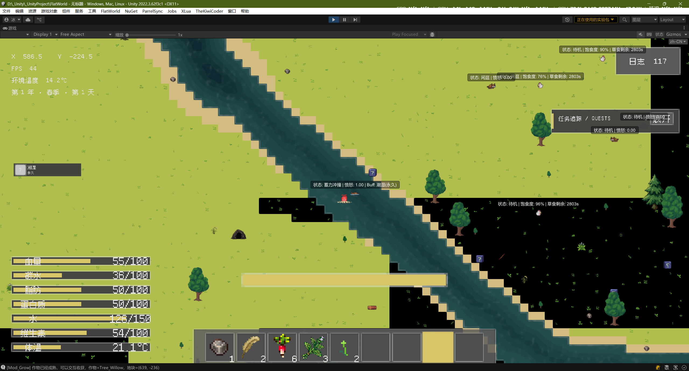

2. [ ] **水流轻微推动玩家**  
   玩家处于海洋或其他有流向的水体中时，水流应对玩家产生轻微推动效果。

   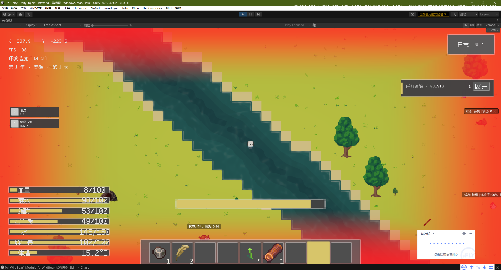

3. [ ] **新增夹板道具、配方和部位恢复功能**  
   新增“夹板”道具，由木板和绳子合成。右键使用夹板后打开部位选择 UI，按玩家现有的 5 个部位显示对应按钮。选择部位后进行 3 秒引导，引导结束时立即恢复该部位 10 点耐久，并在之后 144 秒内持续恢复另外 10 点耐久，一个夹板总计恢复 20 点。  
   同一个部位同时只能存在一个夹板恢复效果，可以使用 Buff 标记正在恢复的部位。需要补齐夹板物品、部位选择 UI 和对应 Buff。

4. [ ] **限制草药种子的种植虚影**  
   修改所有草药种子的种植逻辑：光标不在耕地上时，不显示种植作物的虚影。

   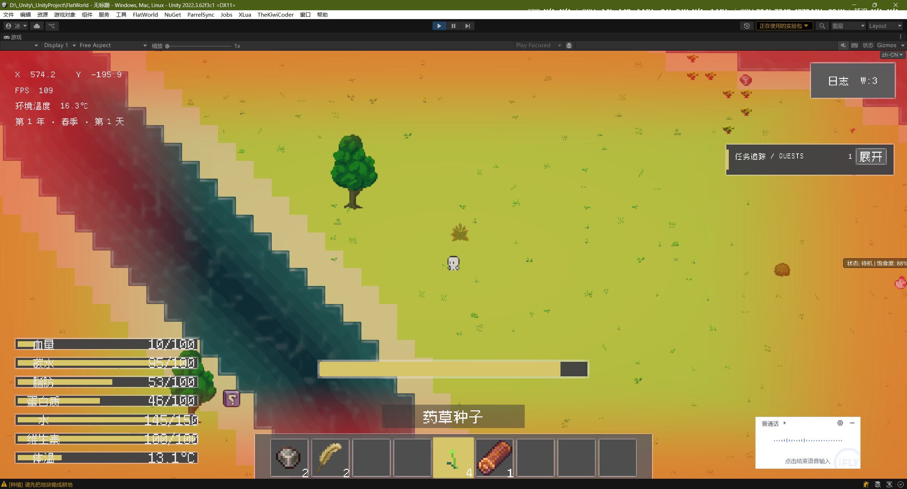

5. [ ] **让鸟类主动啄食地上的种子**  
   鸟、海鸥等鸟类在饱食度未满时，如果检测到周围有地面种子，应优先前往并啄食。所有种子都按统一 Tag 识别，并需要能够作为地面实物存在。  
   种子的基础食物恢复效果保持很低，例如普通角色食用恢复 1 点；鸟类食用种子时获得 300% 食物效果，即恢复 3 点。

6. [ ] **整体降低物品沉没速度**  
   所有物品的沉没时间统一乘以 3。例如原本 3 秒完全沉没的物品，调整为约 9 秒完全沉没。

7. [ ] **把石头投掷改成长按蓄力**  
   石头投掷改成类似弓箭的蓄力方式：按住左键蓄力，松开后投出，蓄力越久投得越远。投掷轨迹使用抛物线。  
   抛物线中间过程不对地面造成伤害，主要在最终落点附近产生伤害；同时这套投掷逻辑需要能够对海鸥等飞行怪物造成伤害。

8. [ ] **新增“大石头”物品**  
   新增游戏物品“大石头”。挖掘矿洞或地表较大的石头矿物时，有机会掉落大石头。

9. [ ] **关闭丧尸自然刷新**  
   丧尸属于后期生物，目前先关闭自然生成，不让它在正常世界中自动出现。

10. [ ] **修复 ECS 生物与武器判定的桥接问题**  
    现在 ECS 生物与武器的伤害桥接仍有问题，主要表现为武器模型位置和伤害判定位置不一致。可能没有使用武器真实的物理碰撞范围，而是在使用武器根节点位置。  
    重点检查 `Mod_Damage` 相关判定，同时优化狼的伤害接受范围。

11. [ ] **把持久化相关 Editor 扫描改为手动触发**  
    当前编辑器仍然存在明显峰值，怀疑和“屏蔽持久化”相关的 Editor 工具有关。它可能会在 Hierarchy 变化时自动进行扫描。改成手动触发恢复持久化，不再随层级变化自动扫荡。

12. [ ] **缩小手工制作面板**  
    当前手工制作面板过大，会挡住下面的快捷栏，导致制作时无法方便地从快捷栏拿取物品。调整面板尺寸，让快捷栏在制作时仍然可以正常使用。

    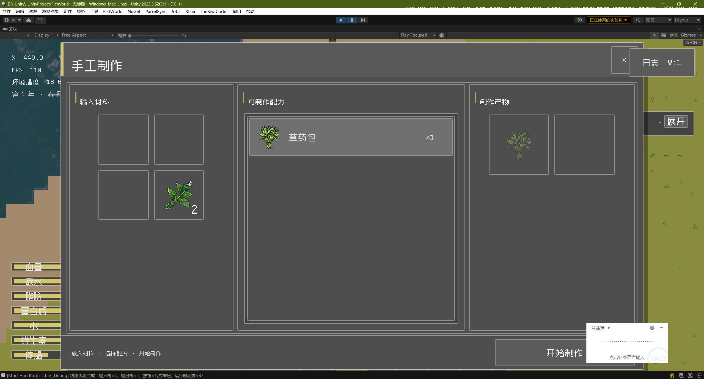

13. [ ] **修复椰子和椰子树的锚点/位置问题**  
    椰子树上的椰子目前显示位置不正确。问题看起来不是初始是否携带椰子，而是椰子与椰子树之间的锚点或位置绑定有问题，需要修复这一块。

14. [ ] **允许蘑菇孢子种在石头地上**  
    蘑菇孢子的种植规则和普通植物不同，允许直接种植在石头地块上。

    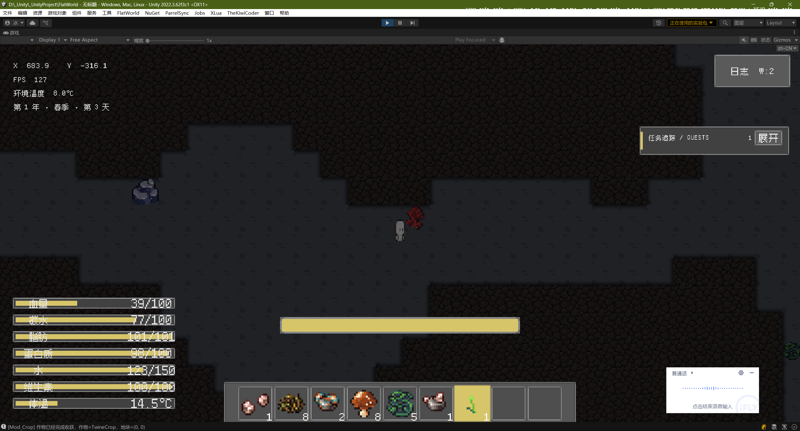

15. [ ] **降低地下蘑菇群落生成概率**  
    地下蘑菇数量偏多，将蘑菇群落的生成概率降低 50%。只减少群落出现次数，不修改单个蘑菇群落内部的蘑菇数量。

16. [ ] **调整合成界面的数量显示位置**  
    把当前红框位置的“×1”数量提示移动到左侧；右侧绿色方框位置用于显示合成该物品所需材料的数量。

    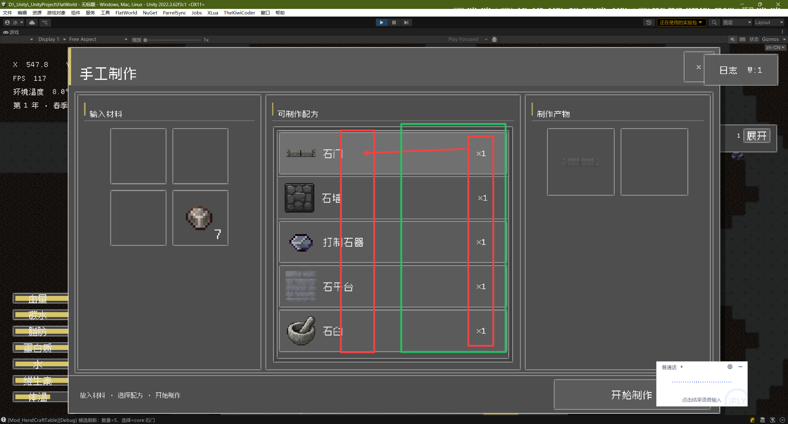

17. [ ] **给地下世界增加地下河和地下湖泊**  
    地下世界也需要自然生成地下河流和地下湖泊。

18. [ ] **让地下世界最低亮度随出口距离变化**  
    玩家距离地下出口越远，地下世界允许的最低亮度越低。距离矿洞出口 100 米及以上时，最低亮度降到 0。玩家可以通过环境亮度变化大致判断自己是否还在出口附近 100 米范围内。

19. [ ] **新增自然泥土墙**  
    新增一种自然墙体“泥土墙”。河流和湖泊周围有概率生成泥土墙；泥土墙上还可以随机生成藤蔓、杂草或花朵等自然装饰。

20. [ ] **把鸟的生命值改为 20**  
    鸟类生命值调整为 20 点。

21. [ ] **让 ECS 狼能够受到远程武器伤害**  
    现在 ECS 构成的狼似乎不会受到弓箭伤害，需要把 ECS AI 和远程武器的伤害逻辑正确接通。

22. [ ] **让成熟椰子的掉落位置更随机**  
    椰子成熟后掉落时不要整齐排列在椰子树底部，给掉落位置增加一定随机效果，让视觉上更自然。

    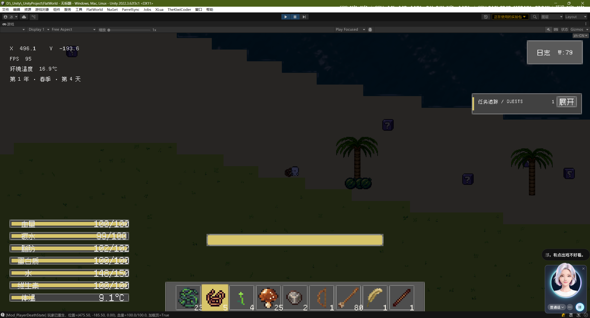

23. [ ] **让不会反击的生物受伤后主动逃跑**  
    对于不会反击的生物，受到伤害后应朝伤害来源的反方向逃跑。例如左侧受到弹弓攻击，就主动向右侧逃离。鸟类也需要有这种受伤反应，而不是继续保持原来的飞行状态。

24. [ ] **取消拾取前的物品瞬移/摆正**  
    拾取地面物品时，物品目前会先瞬移并摆正位置，再进入拾取动画。取消这一步，让拾取过渡动画直接从物品当前落地位置开始，最后进入背包。

25. [ ] **降低鸟类防御**  
    鸟类四项防御全部调整为 1 点，避免当前防御过高导致弓箭伤害过低。

26. [ ] **修复锄头类武器的手持锚点**  
    当前这个锄头类武器的锚点绑定仍有问题。参考项目里锄头、镐子等同类武器的手持方式，重新调整它的锚点。

    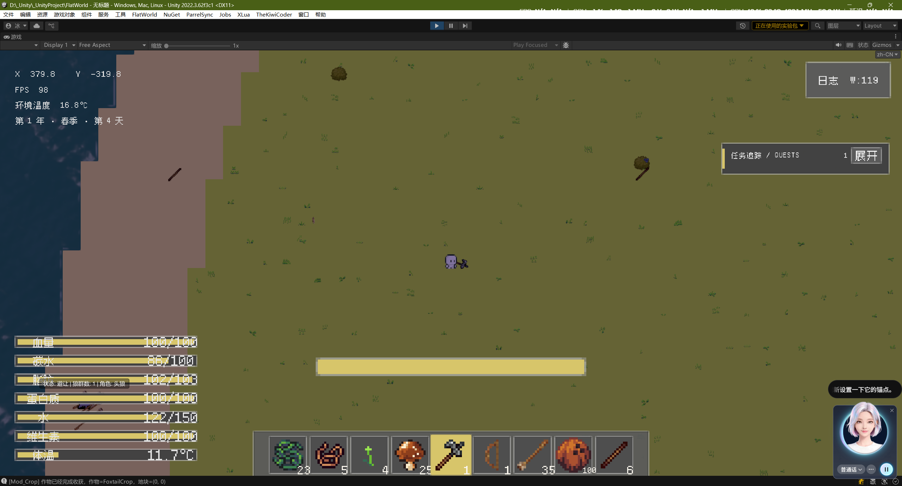

27. [ ] **实现锄头右键耕地，并补充地块浇水逻辑**  
    锄头右键需要能够把可耕作地块变成耕地。手持锄头时，如果光标对准可耕作地块，显示和陶罐取水类似的白色光标；点击右键或使用按钮后，把目标地块转换为耕地。耕地继承原地块已有的肥力和水分。  
    耕地需要保持水分，水分不足时需要玩家浇水。玩家站在某个地块上打开装水容器 UI 并倾倒水时，每倒出 1 单位水，对应地块的水分或水深增加 1。该逻辑同样允许影响普通地块、河流和海洋的水深。

28. [ ] **统一木墙贴图风格**  
    优化木墙贴图，让木墙的视觉风格和石墙以及其他墙体保持一致。

    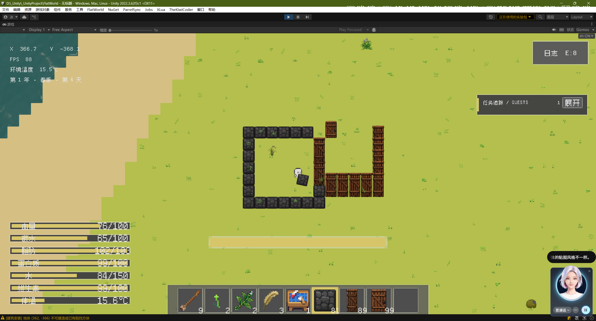

29. [ ] **建筑放置时压掉地面的草**  
    玩家放置建筑时，如果目标位置的草地层级存在草，建筑放下后直接把被建筑覆盖的草压掉/移除。

30. [ ] **建筑超出放置距离时保留红色虚影**  
    电脑端光标超出建筑放置距离后，不要让建筑虚影直接消失，而是继续显示并变成红色，用颜色提示玩家当前位置已经超出可放置距离。

31. [ ] **让矿洞入口可以被拆除并处理地下出口联动**  
    矿洞入口改为可攻击对象。矿洞入口被拆除后掉落 1～3 个大石头和若干普通石头。  
    如果地表矿洞/山洞入口被拆除，与之对应的地下出口失去交互功能。玩家尝试交互时，触发角色自言自语，提示“外面的矿洞被堵住了”。  
    如果玩家之后在原入口相同位置重新建造新的矿洞入口，新入口需要重新连通原来的地下出口。

32. [ ] **把脑震荡效果改为方向反转**  
    脑震荡 Buff 不再使用现在的正弦波扭动操作方式，改成移动方向完全反转：左变右、右变左、上变下、下变上。

33. [ ] **补全夹板专属 UI 和部位选择逻辑**  
    右键夹板后应正常打开夹板专属 UI。UI 中按照玩家现有部位数量生成对应按钮，玩家点击某个部位后，开始给该部位使用夹板。当前这部分右键打开、部位按钮和选择逻辑需要补全。

34. [ ] **让脑震荡 Buff 随时间自然恢复**  
    脑震荡不是永久效果，需要随着时间逐渐消失。即使玩家大脑耐久已经为 0，当前脑震荡仍然可以恢复；之后再次受到相应伤害时，可以重新获得脑震荡 Buff。

35. [ ] **优化石臼这类实物 UI 的射线阻挡和分辨率适配**  
    石臼这类实物 UI 只让实际可见、可交互的 UI 区域参与射线阻挡，透明或不可见区域不要阻挡射线。同时适配不同分辨率下的 UI 显示。

    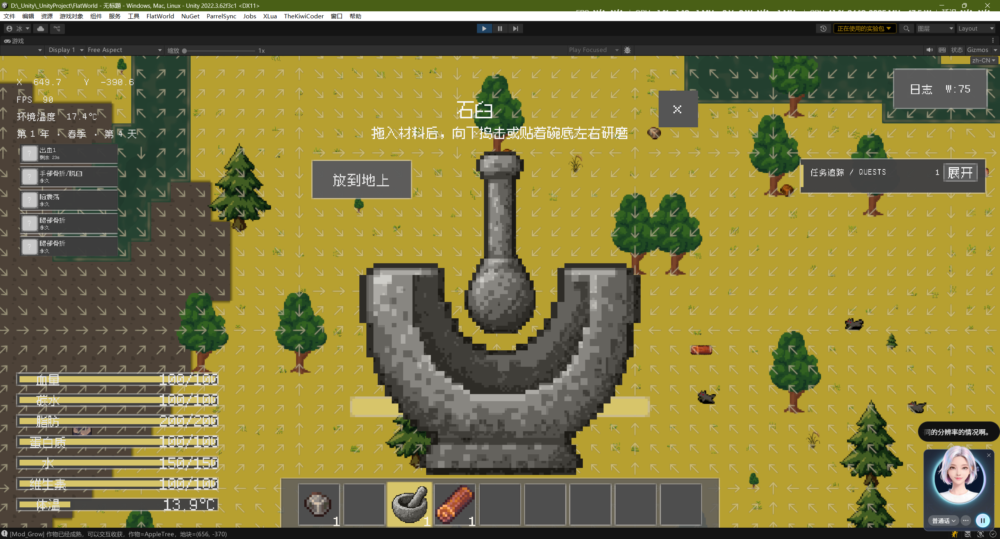

36. [ ] **实现剪刀剪草并掉落植物纤维**  
    手持剪刀时，如果光标位置存在草，显示和陶罐取水类似的白色方框。点击右键或使用按钮后，剪掉对应草地层级的草，并在剪草位置掉落 2 个植物纤维。

37. [ ] **恢复平台在水中的放置能力**  
    铁平台、铜平台和石平台需要允许放置在水体中。目前这些平台似乎无法再放到水里，需要恢复这个能力。

    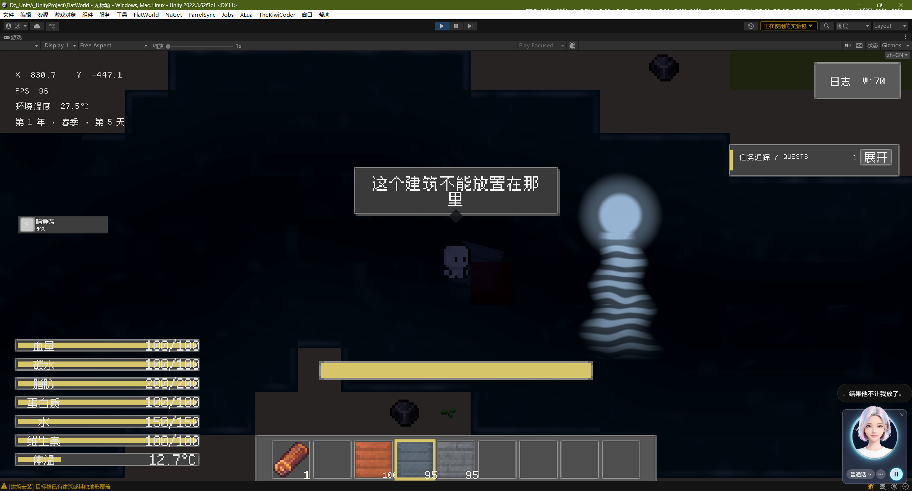

38. [ ] **修复花朵被草地层级遮挡的问题**  
    当前加载过程中可以先看到花朵，但草地层级加载完成后花朵会消失，推测是被草层遮挡。调整相关显示层级，让花朵在草地层级加载后仍然正常显示。

