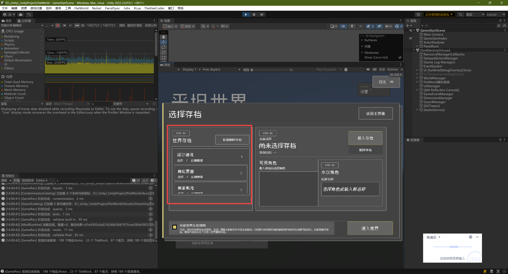
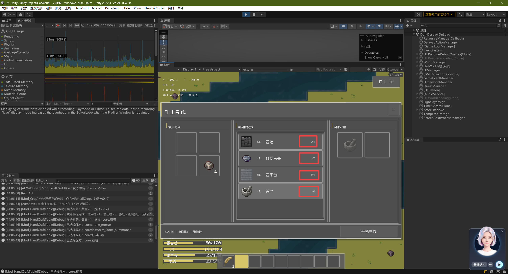
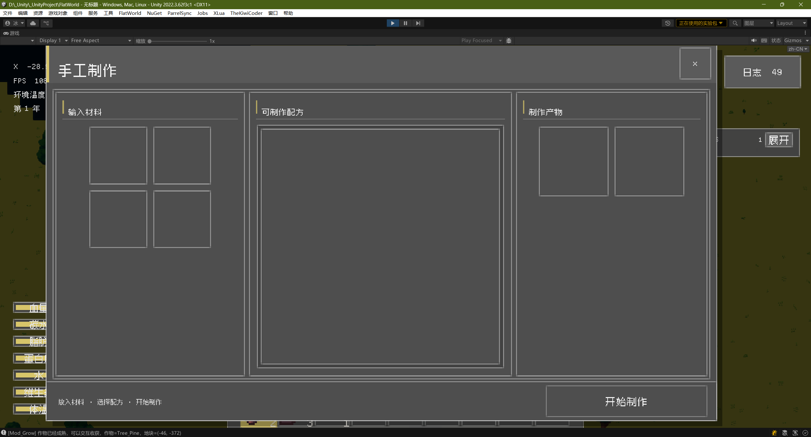
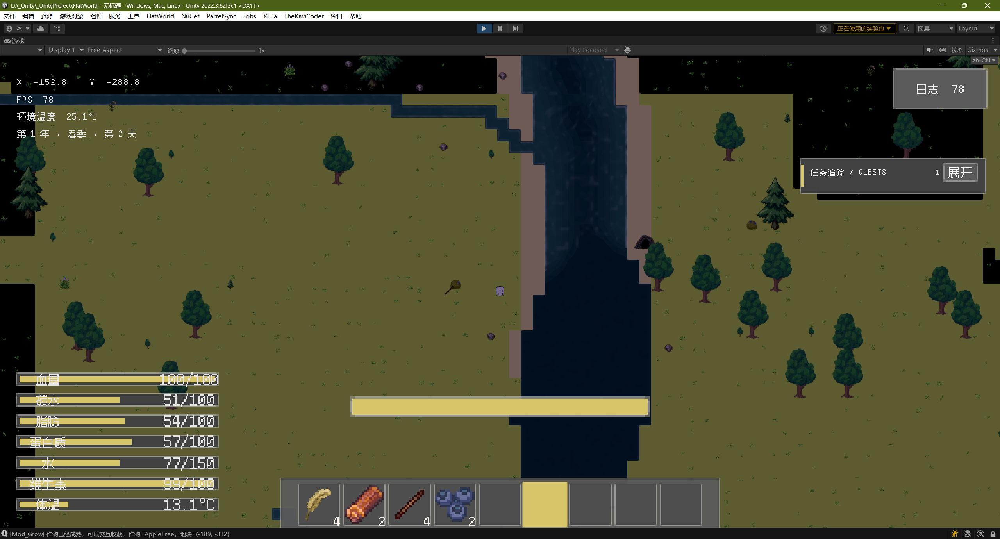

* [ ]  把游戏的把游戏的所有的滚动列表都优化一下 然后现在嗯如果用那个鼠标滚轮去滚动的话 它的滚动范围会特别大 就是鼠标滚轮滚动一格 然后这个滚动列表它会翻非常多格 嗯 需要你修复一下 然后适配一下这个就是滚动的稍微少一点嘛 就滚动一个元素差不多这个样子 然后尽量滚动的时候丝滑一点 让玩家知道是在滚动 让玩家知道是在滚动我记得是把所有的滚动列表都修补一下，你可以遍历一下我现在已有的UI预制体，然后把它们都改一下。
* [ ]  这个×1×2×3×4的，它的数量描述前面，你需要带上材料的贴图，就是告诉我是消耗了配方里的哪个材料。然后然后前面的石墙就是前左边滚动列表里条目的左侧成品。给它差1，物品名字换位置，拿第一个列表举例：石墙×1，打制石器×1。左侧为制作出物品的贴图、物品名字、物品数量；右侧为材料贴图、材料数量。
* [ ]  修改一下石臼游戏物体它的材料消耗，改一下Jason，然后改一下它的合成配方，石臼是要一个大石块加一个小石头合成，不是现在的4个小石头。
* [ ]  修改投掷石头更新频率，当前石头丢出卡顿。蓄力越久，石头飞行越快且越远。鼠标光标控制投掷方向。按此修改即可。
* [ ]  现在的游戏里好像没有那种特别大的湖，就是类似于现实生活中的洞庭湖、贝加尔湖等比较广阔有感觉的湖，湖里可能有些小岛。现在大多都是河流汇聚的小水潭，没感觉。如果要大点的湖就变咸水海了，没有特别大的淡水湖，这是游戏现在地形这块的原因。
* [ ]  现在这个手工制作面板还是有点大呀。他会把下面的快捷栏遮挡住，你把它缩小到原来的60%就差不多了。
* [ ]  还需要你优化一下物品下沉，即物品丢到水中后完全下沉的效果；当前完全沉没时是直接消失。我希望完全沉没后物品慢慢缩小，模拟离远效果（近大远小），不断缩小至完全消失。
* [ ]  现在水的浮力好像有问题，或者说是质量和体积设置的有问题。原木和木板按理应该能浮起来。原木和木板的体积、质量设置有问题，或原木太重。一个原木8kg还是太重，改成3kg的小原木，体积稍大一点至少能浮起来。参考浮力公式，让木头制品至少能浮起来。
* [ ]  这个花朵层级还是有一点问题的，花朵会出现在玩家脸上，层级有问题，优化一下花朵层级，花朵层级应该和草层级一起，遵守层级规则。
* [ ]  然后还有一些湖泊，水是静止的，又特别深，一点波纹都没有，水面看起来就是完全的黑块，这不行，还是要留一点波纹。河流流进湖泊有入口，入口要把泡沫、波纹往河流里推。湖泊可静止，但视觉效果要有往里推的感觉，至少让玩家知道是湖泊，别黑成那样以为出bug了。
* [ ]  需要为游戏添加坐骑系统，玩家可拥有交通工具如四轮车、船等。应创建物体承载玩家，持续更新并尽量不动层级窗口，强制控制玩家位置或新写接口维护外力推动玩家，即描述A对象推动B对象或B被A推动，表现物理世界力。尽量不用Unity的Box Collider碰撞系统，但可用RB组件。先做简单船，可水陆两用，玩家靠近出现高亮描边，点击交互乘坐，用摇杆推动船移动，原理同移动。公式：玩家控船，船给玩家力并自行移动，依力溯源推受关系。
