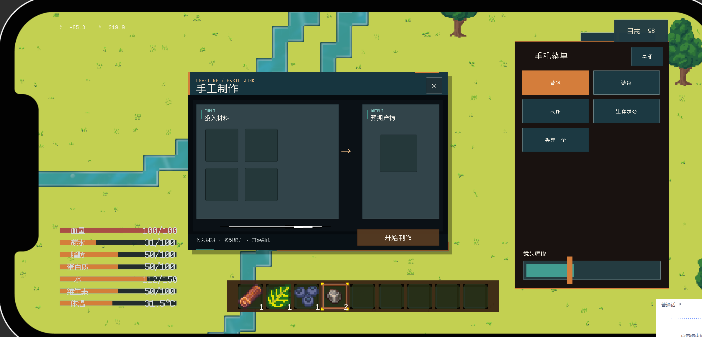
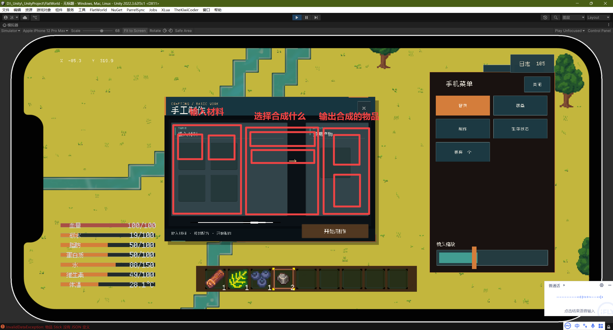

嗯游戏的合成表需要修改

首先就是左边的 嗯 取消 摆放位置的配方的概念 就是呃物品的摆放 它是现在就取消了它的位置的概念 嗯比如说怎么取消法呢 比如说现在的打制石器 它制作是需要两个石头 然后对角放的 现在我们取消这个对角的概念 然后合成一个打制石器 是只需要两个石头 这两个石头 你可以放在输入材料 4个4个这个输入框的任意位置 嗯 如果这样子做的话 就会出现很多重复的配方 嗯 比如说呃这个 石头 这个打制石器 它是两个石头合成 然后这个 嗯这个石墙 它是4个石头合成 唉他们的材料都是需要石头的 如果你说嗯 摆放位置的概念取消的话 那岂不是输出的产物 嗯 既是打制石器 又是石墙 唉 对 这也是一个很重要的问题啊 所以我这里给出的解决方案是把右边的那一个输出框 给再给中间给他添加一个列表 添加一个那个滚动列表 然后滚动列表里会有啊这个按钮元素 然后按钮元素它是里面有一个image是用来显示 玩家将要输出的 就是玩家左边输入的材料 它能用来做什么东西 比如说玩家左边放了10个石头 右边就会出现呃需要用石头来合成的物品 比如说石刀 还有这个 嗯 呃10强 就是这两个 他们这两个会组成一个下拉列表 然后玩家可以通过点击这个下拉列表 然后 制作呃玩家点击的下拉列表中按钮的这个游戏物品 比如说玩家点击了10刀的这个嗯 按钮 那么呃最终的生成产物就会提供给这个玩家10刀 然后玩家点击石强 那么就是提供石墙 啊 是之前说的那个石刀应该是打制石器啊 这里稍微纠正一下

上面这张图就是我给出的 嗯这个修改 你可以看一下这个红色的呃绘制啊 然后需要调整一下输入和输出的这个方框的数量限制 然后目前是有手工和工作台这两个合成站 就是合成 然后手工的输入材料的这个呃输入槽位的数量 你就给它设置成2 就从之前的4个槽位改成现在的两个槽位 然后右边输出物品的槽位 也从嗯两个槽位 有从一个槽位扩充成两个槽位 嗯 然后就是合成台的输入槽位的话 你就从原来的9个改成三个 然后输出槽位依旧保持两个 

然后就是需要你维护好这个合成系统他的状态清晰度然后最好是用一个这个脚本就能解决了如果是照这样子做的话一个脚本就能把这个解决完毕
