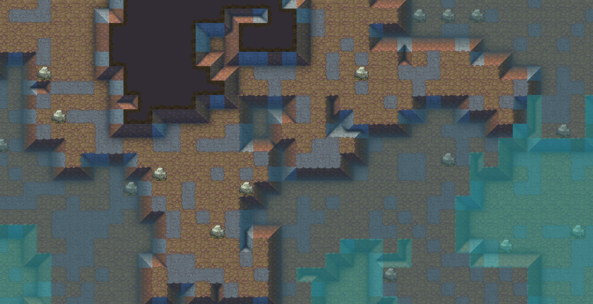
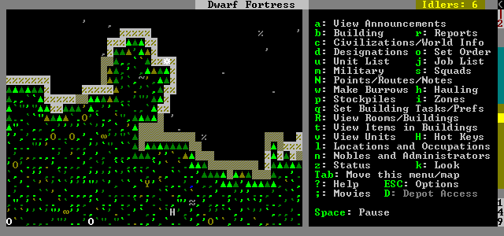
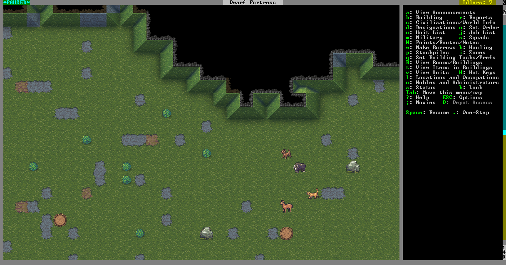
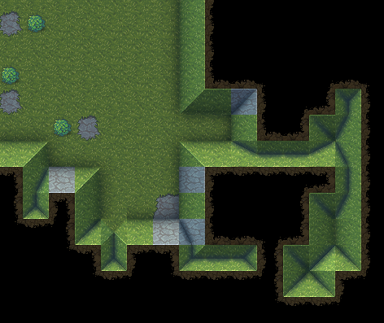

# 地块高度分层显示开发文档

状态：**已实现代码、Shader 与默认材质；本轮按用户要求不做实机测试，视觉效果未验收。**

目标：让二维地表通过“离散高度层 + 层差阴影”直观看出高低。视觉主参考 **UnReal World 的 elevation lines / 阶梯式高度线**，Dwarf Fortress 只辅助参考坡地阴影与明暗提示；**不参考真实 Z-Level 截断、剖面或上下层裁切显示**。

---

## 视觉参考

> **主参考：UnReal World 的高度线。辅助参考：Dwarf Fortress 的坡度阴影。**
> TerraFlat 不实现真实地形抬升、Z-Level 截断、剖面、上下层露出或地图裁切，只借鉴二维画面里“哪里更高 / 哪里更低”的可读性。
> UnReal World 只参考 **Zoom / local terrain map 的近景分层**，不参考 **Wilderness / overland map 的大地图阶梯边界**。

### UnReal World：主要分层参考

UnReal World 官方论坛中直接使用 **elevation lines** 描述这种地形表现。TerraFlat 主要参考它的连续高度线、阶梯转折和克制暗边，不复制其地形玩法或视野规则。

#### 湖岸与灰色地面的连续高度线


**重点看：** 角色下方灰色地面中的高度线会跨多个格子连续延伸，并随着地形产生阶梯式转折；它不是给每个 Tile 单独描边。

**TerraFlat 借鉴：** 优先让同一层的边界连成连续线，低侧暗边承担主要高度阅读。

来源：[UnReal World 官方论坛：Splashes and ripples](https://www.unrealworld.fi/forums/index.php?topic=7115.0)

#### 岩地、草地和水岸之间的层差


**重点看：** 灰色岩地内部用重复但不抢眼的暗线表示层差，接近草地和水岸时仍保持地形本身的颜色与纹理为主体。

**TerraFlat 借鉴：** 高度线不能盖过 Tile 美术；Water Shore 继续独立处理，避免双重粗边。

来源：[UnReal World 官方站](https://www.unrealworld.fi/)

### 从 UnReal World 提炼到 TerraFlat

- 高度边应沿**高度层边界连续组织**，不要对每个格子独立描边。
- 视觉主力是**暗色高度线 / 低侧暗边**，高侧亮边只做很弱的辅助。
- 阶梯感来自离散高度本身，不靠扩大描边宽度制造。
- 不做 Wilderness / overland map 那种宏观地形分层轮廓。
- Tile 颜色、纹理、Water Shore、雪地和 Light2D 仍是主体，高度效果只负责补充空间关系。

### Dwarf Fortress：坡地整体阴影参考



**只参考：** 地势变化处的暗边、受光侧亮度和大范围高低明暗差，让玩家不用真实抬高地形也能判断坡度。
**不要参考：** 图中任何 Z-Level 截断、下层露出、剖面式显示或地形被切开的表现。
来源：[Dwarf Fortress 官方 Steam 开发日志](https://store.steampowered.com/news/posts/?appids=975370&enddate=1587657748&feed=steam_community_announcements)

### Dwarf Fortress：Classic → Premium 的坡度阴影

Classic：



Premium：



**只参考：** Premium 相比 Classic 增加的坡面暗部、边缘阴影和轻微高光，用来强化“这里在升高 / 降低”的感觉。
**不要参考：** Dwarf Fortress 本身的多层地图显示规则、坡道玩法规则和 Z-Level 切换方式。
来源：[Dwarf Fortress 官方 Steam 开发日志](https://store.steampowered.com/news/posts/?appids=975370&enddate=1587657748&feed=steam_community_announcements)

### Dwarf Fortress：复杂坡面的阴影组织



**只参考：** 多个相邻高度变化时，阴影如何连续组织，让坡度关系清楚但不把每格都描成网格。
**不要参考：** 截图里的真实坡道结构、上下层连接、截断边界或剖面显示。

---

## 1. 实施前读取

1. 根目录 `AGENTS.md`
2. `flatworld-map`
3. `flatworld-effects-tools`
4. `flatworld-world-model`
5. `flatworld-gameplay-mcp`

项目事实以实施时最新源码和真实运行状态为准。

---

## 2. 核心规则

本功能只做**纯视觉表现**：

```text
ChunkTerrainBuffer.height
→ Seal 零拷贝移交为 ChunkTerrainData SurfaceElevation
→ ChunkTilemapRenderer
→ BRG InstanceData
→ Chunk-BRG-Contact-Lit.shader
→ 高度分层视觉
```

必须保持：

- 不修改真实坐标、Collider、Navigation、AI、世界生成和存档。
- 不增加逐格 GameObject。
- 不恢复视觉 TilemapRenderer。
- 不增加高度纹理。
- 不按高度层拆 Material / BRG Batch。
- Surface 启用，Cave 禁用。
- Water 保持原有水深、岸线和 Flow 表现。
- 高度结果不能反向影响玩法。

---

## 3. 当前可复用基础

- Surface 已有 `height 0~1` 数据，直接读取，不重新采样 Noise。实施时发现旧代码在 `Seal` 中释放了高度数组，现改为随正式区块保留并在 `Dispose` 时统一释放；高度不纳入玩法内容指纹，不新增存档字段。
- Ground 已使用 BRG。
- 当前 InstanceData 为 **112 字节**。
- Ground 的 `Data0` 已用于 Contact，`Data1` 可用于高度邻居数据。
- Ground 的 `Transform0.w` 可保存当前高度；Water 已有自己的用途，不复用。
- 当前 Environment / Liquid 脏区和跨 Chunk 边界刷新机制继续复用，邻区就绪与逐出均刷新边界，不新增轮询。

---

## 4. 实现方案

### 4.1 高度层

Shader 将连续高度离散成视觉层级。

首版默认：

```text
LevelCount = 20
level = min(floor(saturate(height) * LevelCount), LevelCount - 1)
```

`LevelCount` 只是视觉参数，不是世界规则。

### 4.2 BRG 数据

Ground 实例：

```text
Transform0.w = 当前格 height

Data1.x = 左邻 height
Data1.y = 右邻 height
Data1.z = 下邻 height
Data1.w = 上邻 height
```

禁用高度表现：

```text
Transform0.w = -1
```

以下情况禁用：

- 非 Surface。
- 当前格没有合法 height。
- 不属于 Ground 高度语义。

邻居以下情况统一回退为 `currentHeight`，避免假悬崖：

- 邻 Chunk 未加载。
- 邻格没有 height。
- 邻格是 Water。

保持 `InstanceStride = 112`。

### 4.3 Shader 表现

规则：

- 同层：不画高度边。
- 邻格更高：当前低侧画暗边。
- 当前格更高：画较弱的亮边。
- 高度差越大，边缘越明显。
- 高低层允许非常轻的整体明暗差。

视觉优先级：

```text
低侧暗边 > 高侧亮边
```

建议初值：

```text
_ElevationStrength            = 1.0
_ElevationLevelCount          = 20
_ElevationToneStrength        = 0.04
_ElevationShadowStrength      = 0.45
_ElevationHighlightStrength   = 0.12
_ElevationEdgeWidth           = 0.12
_ElevationDeltaForMaxStrength = 3
```

`_ElevationStrength = 0` 必须能直接关闭整个高度效果。

如果画面出现网格感，优先降低：

```text
Highlight → Tone → LevelCount → Shadow
```

不要靠扩大 EdgeWidth 解决。

---

## 5. 预计修改文件

```text
Assets/5_Scripts/5-0_WorldModel/ChunkTerrainData.cs
Assets/5_Scripts/5-3_GamePlay/World/WorldModel/Presentation/ChunkTilemapRenderer.cs
Assets/9_Shaders/Shader/Chunk-BRG-Contact-Lit.shader
Assets/Resources/Config/WorldModel/BRG/ChunkBRG-Contact-Lit.mat
Assets/5_Scripts/5-0_WorldModel/ChunkTerrainData.cs
```

`ChunkTerrainData` 只补充高度数组的运行期保留与玩法指纹排除；生成算法、真实坐标、寻路与存档格式保持原规则。生成器和运行快照中的旧高度注释同步更新。

实现重点：

1. `ChunkTilemapRenderer` 给 Ground 打包当前格和四邻 height。
2. Shader 完成离散层级、暗边、弱亮边和轻微 Tone。
3. 材质保存默认参数，并支持 `_ElevationStrength = 0` 快速关闭。
4. 复用现有 Environment / Chunk 边界刷新。

不要为了本功能扩大公共 BRG 数据结构或新建另一套 Ground Shader。

---

## 6. 必须保证的兼容性

- Water：不能出现和 Shore 重复的粗边。
- Cave：不启用 Surface 高度规则。
- Snow：仍应接近纯白，必要时降低 Tone。
- Light2D：继续走现有 Lit 流程。
- Grass / GroundCover：保持原表现。
- Back / Blocking：首版不参与高度效果。
- Chunk 边界：邻 Chunk 加载后高度边必须自动修正。

---

## 7. 开发步骤

### P1：数据

- Ground 读取当前格和四邻 height。
- 处理 Water / 缺失邻居 / Cave。
- 保持 112 字节 InstanceData。

### P2：Shader

- 实现高度离散化。
- 实现低侧暗边、弱高侧亮边、轻微 Tone。
- 保留现有 Contact Shadow。
- `Universal2D` 与 `UniversalForward` 保持一致。

### P3：运行时刷新

- 验证 Chunk 边界。
- 验证 Environment 脏格刷新。
- 验证 Chunk 卸载 / 重载后数据正确恢复。

### P4：调参

优先观察：

```text
平地 / 坡地 / 高山 / 水岸 / 雪地 / 昼夜
```

目标：

- 玩家能明显读出高低。
- 同层不会形成棋盘格。
- 高度边像台阶，不像普通描边。
- 原 Tile 美术仍是主体。

---

## 8. 最终验证

> 本轮实施例外：用户明确要求“不需要实机测试”，因此未进入 Play Mode，也未执行以下 Debug 循环。下列内容保留为后续视觉验收步骤，不能据编译或 Shader 导入检查标记通过。

最终只需要**通过 Debug 循环**。

必须使用 GamePlayMCP：

```text
进入真实 Surface 世界
→ observe / query 寻找明显高低地形
→ MCP 实际移动到目标位置
→ 触发并观察高度分层
→ 必要时截图检查视觉
→ 继续移动跨 Chunk
→ 检查 Water / 雪地等相邻表现
→ 检查 Console
```

禁止通过直接修改 Transform、height 或渲染状态伪造触发。

如果发现问题：

```text
停止输入
→ 保存复现路径
→ 修复
→ 编译
→ 重新进入世界
→ MCP 回到同类地点
→ 重放验证
```

直到 Debug 循环通过。

Profiler、Frame Debugger、额外自动化测试只在定位问题时使用，不是完成门槛。

---

## 9. 给实施 Agent

> 按本文实施地块高度分层显示。先核实当前源码中的 height、BRG 112 字节布局和可复用字段仍成立，再开始修改。只做 Surface Ground 的纯视觉伪 Z-Level，不改变玩法、世界数据和 BRG 架构。完成后必须通过 GamePlayMCP 实际移动到能触发高度分层的位置，并完成跨 Chunk 的 Debug 循环验证。
