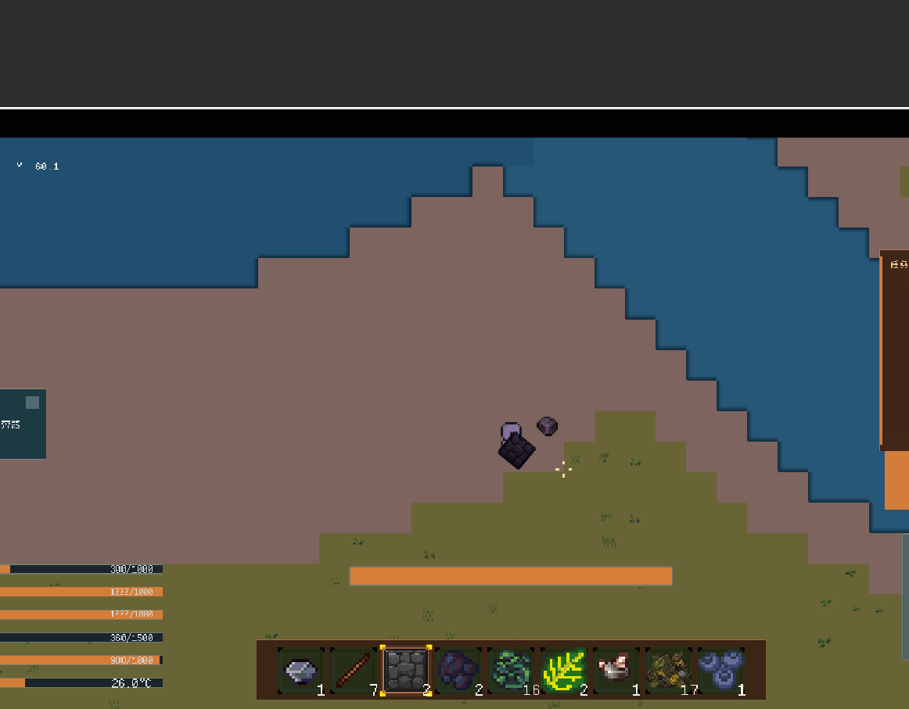
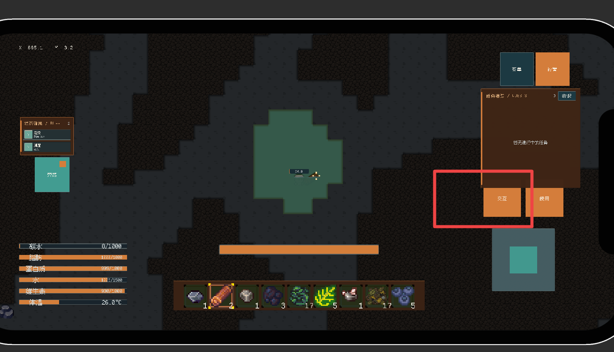
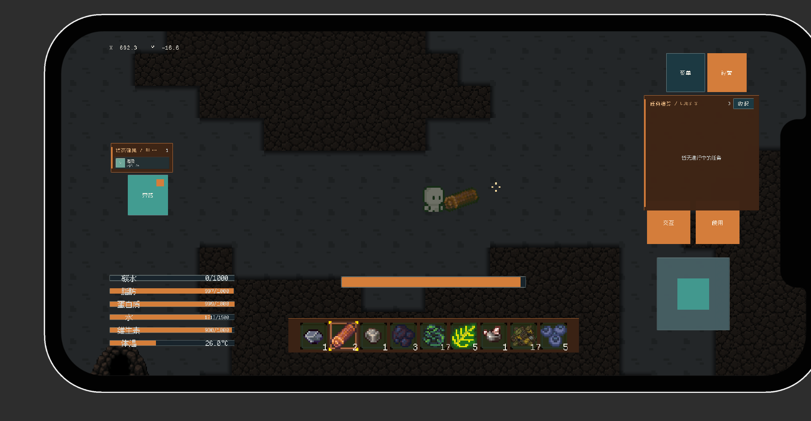
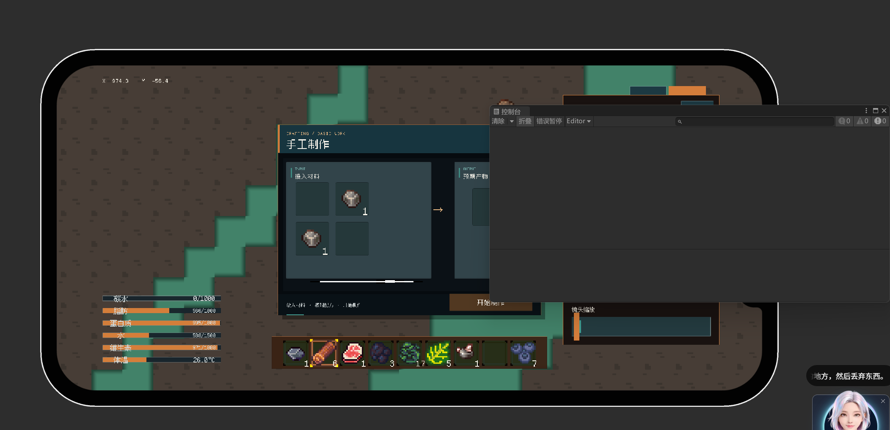

1. [ ] 给予一定容错
2. [ ] 没有触碰到UI且在中间部分时才能双指缩放 不然太容易触发了 把双指缩放操作修改为一个设置选项可以让玩家自行开启
3. [ ] 打开的背包默认位置放在打开的背包的默认位置放在屏幕的左侧，尽量不要和呃和这个合成面板产生阻挡两个面板之间。调整一下这个。呃，背包面板的边距就是背包和合成面板的边距。然后所有面板都把边距缩小一下。
4. [ ] 进入水池后将交互按钮的名字变更为喝水。
5. [ ] 感染等游戏特效，不要把武器也变成绿的。
6. [ ] 丢弃物品的时候给手上的长按。嗯，一个动画就是长按之后如果手法丢弃了把手上的那个叶子，把手上拿的东西给它逐渐变小。
7. [ ] 呃，增加一个新的buff呃速度，呃，移速加成就是速度buff的名字就叫速度1 或者 速度2 这样 然后小鸡在受到伤害之后会获得速度一这个buff。
8. [ ] 即使有UI是开着的，也可以长按空白的地方，就是没有被UI遮挡的地方，然后丢弃东西。
9. [ ] 不知道为啥就是合成不了东西，即使摆成了正确配方，控制台也不会有相关的提示和报错。可能是合成配方的检测之前就被阻塞了，你看一下是为什么？就算是配方不对，也应该有个报错呀。
9. [ ]
