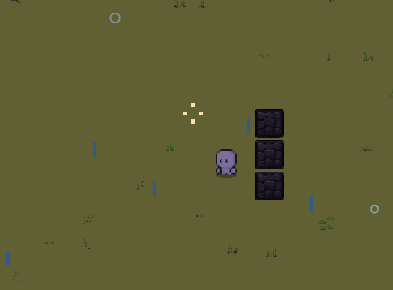
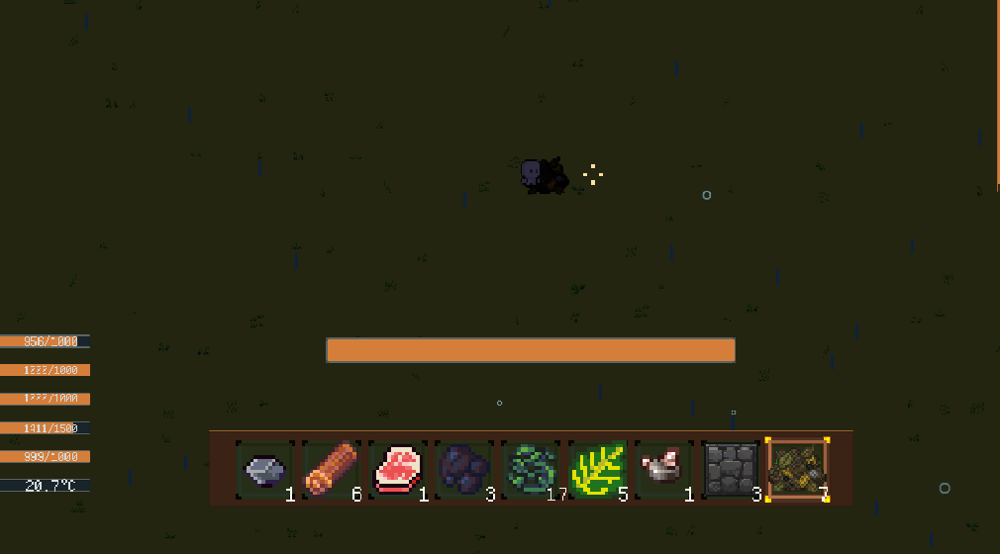

* [ ] 需要你添加一个游戏物品，名字叫做脂肪啊，然后它的作用先暂定为可以吃，呃，我记得游戏道具里面好像是有这个东西的，但是它好像被遗弃了，不过那就被遗弃的话，那就别管它了，嗯，然后脂肪你就拿它和火把，它可以他们俩可以合成火，不是它和脂肪加木棍可以合成火把。就先给他加一个这个配方，然后它的来源是可以呃通过击杀这个动物们的小鸡除外的动物，就现在好像就只有那个野猪和那个野猪和和啥来着？和狼就这两个。通过杀他们俩来拿这个脂肪，你就随机掉落1~2个就可以了，野猪就掉落2~4个。
* [ ] 你那雨滴的下落速度有点太快了。不要搞这么快。
* [ ] 海里面好像是没有那个雨滴的效果的。嗯，海里面需要雨滴的效果呀，就是雨落到海里面肯定也有雨滴嘛，对不对？可能是这个水被分层了，所以那个检测不到啊，你看一下，你往这边看一下。
* [ ] 你把这个砖块的太好给放大一点，现在他们连不起来，看着中间还有缝隙，一点都不好看。
* [ ] 你把游戏里的这个腐烂物就是植物腐烂之后的这个呃这个素材得重画一下。
* [ ] 把现在的石门也要加入到配方里面。不过要在工作台里面。呃，摆成呃，竖着的6个。然后放到左侧或者右侧都行。就是竖着的6个码。工作台不是3×3吗？让他1245。七八都得放那个石头，就给他合成这个石头门。
* [ ] 嗯，创建一个新的游戏物品绳子。嗯，我记得是这个是有这个。有这个素材的，如果你找不到素材的话，你就先自己创建一个。然后绳子主要是藤蔓合成。上下呃，竖着摆三个藤蔓就可以合成一个绳子。
* [ ] 然后现在的那个原木它攻击是没有特效的，我都之前都说很多次了，就是你攻击如果造成不了伤害的话，没事儿，但是你得有反馈呀，你得反馈给玩家，他是打到了，没打到才没有那个特效啊，你要知道。
* [ ] 我在金矿洞的时候出现很多这些报错了。你看一下是怎么回事儿？

物品 Mine_Stone 丢失了模块 生命值系统模块_1581  ID: 生命值系统模块，下面开始尝试自动修复。
UnityEngine.Debug:LogWarning (object)
Item:ModuleLoad () (at Assets/5_Scripts/5-3_GamePlay/Entities/Item/Core/Item.cs:443)
Item:Load () (at Assets/5_Scripts/5-3_GamePlay/Entities/Item/Core/Item.cs:170)
ChunkNaturalItemRenderer:SpawnPlacement (FlatWorld.WorldModel.NaturalItemPlacement) (at Assets/5_Scripts/5-3_GamePlay/World/WorldModel/Presentation/ChunkNaturalItemRenderer.cs:255)
ChunkNaturalItemRenderer:Bind (FlatWorld.WorldModel.ChunkRuntime) (at Assets/5_Scripts/5-3_GamePlay/World/WorldModel/Presentation/ChunkNaturalItemRenderer.cs:78)
ChunkView/<BindIncremental></bindincremental>d__22:MoveNext () (at Assets/5_Scripts/5-3_GamePlay/World/WorldModel/Presentation/ChunkView.cs:84)
ChunkMgr/<PresentRuntimeChunk></presentruntimechunk>d__180:MoveNext () (at Assets/5_Scripts/5-3_GamePlay/World/Chunk/Management/ChunkMgr.RuntimeWindow.cs:550)
UnityEngine.SetupCoroutine:InvokeMoveNext (System.Collections.IEnumerator,intptr)

物品 Mine_Tin 丢失了模块 生命值系统模块_8628  ID: 生命值系统模块，下面开始尝试自动修复。
UnityEngine.Debug:LogWarning (object)
Item:ModuleLoad () (at Assets/5_Scripts/5-3_GamePlay/Entities/Item/Core/Item.cs:443)
Item:Load () (at Assets/5_Scripts/5-3_GamePlay/Entities/Item/Core/Item.cs:170)
ChunkNaturalItemRenderer:SpawnPlacement (FlatWorld.WorldModel.NaturalItemPlacement) (at Assets/5_Scripts/5-3_GamePlay/World/WorldModel/Presentation/ChunkNaturalItemRenderer.cs:255)
ChunkNaturalItemRenderer:Bind (FlatWorld.WorldModel.ChunkRuntime) (at Assets/5_Scripts/5-3_GamePlay/World/WorldModel/Presentation/ChunkNaturalItemRenderer.cs:78)
ChunkView/<BindIncremental></bindincremental>d__22:MoveNext () (at Assets/5_Scripts/5-3_GamePlay/World/WorldModel/Presentation/ChunkView.cs:84)
ChunkMgr/<PresentRuntimeChunk></presentruntimechunk>d__180:MoveNext () (at Assets/5_Scripts/5-3_GamePlay/World/Chunk/Management/ChunkMgr.RuntimeWindow.cs:550)
UnityEngine.SetupCoroutine:InvokeMoveNext (System.Collections.IEnumerator,intptr)

物品 Mine_Copper 丢失了模块 生命值系统模块_8023  ID: 生命值系统模块，下面开始尝试自动修复。
UnityEngine.Debug:LogWarning (object)
Item:ModuleLoad () (at Assets/5_Scripts/5-3_GamePlay/Entities/Item/Core/Item.cs:443)
Item:Load () (at Assets/5_Scripts/5-3_GamePlay/Entities/Item/Core/Item.cs:170)
ChunkNaturalItemRenderer:SpawnPlacement (FlatWorld.WorldModel.NaturalItemPlacement) (at Assets/5_Scripts/5-3_GamePlay/World/WorldModel/Presentation/ChunkNaturalItemRenderer.cs:255)
ChunkNaturalItemRenderer:Bind (FlatWorld.WorldModel.ChunkRuntime) (at Assets/5_Scripts/5-3_GamePlay/World/WorldModel/Presentation/ChunkNaturalItemRenderer.cs:78)
ChunkView/<BindIncremental></bindincremental>d__22:MoveNext () (at Assets/5_Scripts/5-3_GamePlay/World/WorldModel/Presentation/ChunkView.cs:84)
ChunkMgr/<PresentRuntimeChunk></presentruntimechunk>d__180:MoveNext () (at Assets/5_Scripts/5-3_GamePlay/World/Chunk/Management/ChunkMgr.RuntimeWindow.cs:550)
UnityEngine.SetupCoroutine:InvokeMoveNext (System.Collections.IEnumerator,intptr)

* [ ]
