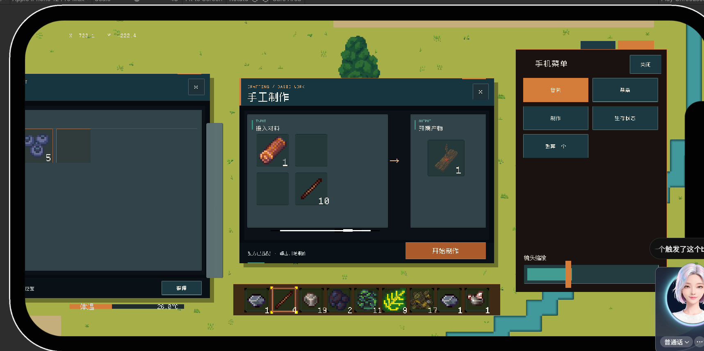
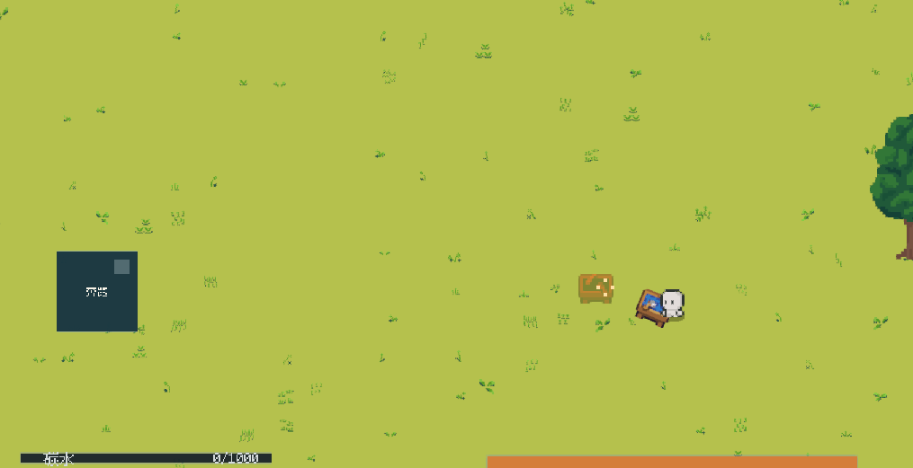
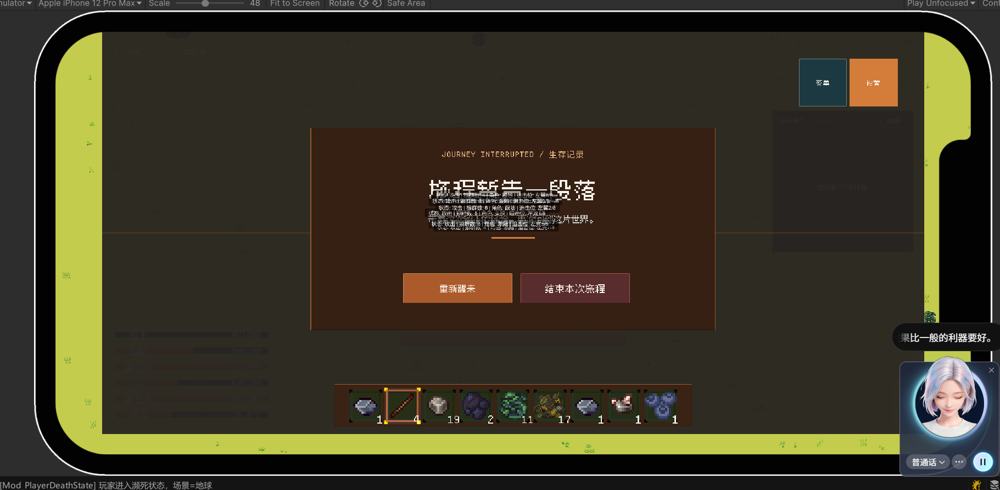
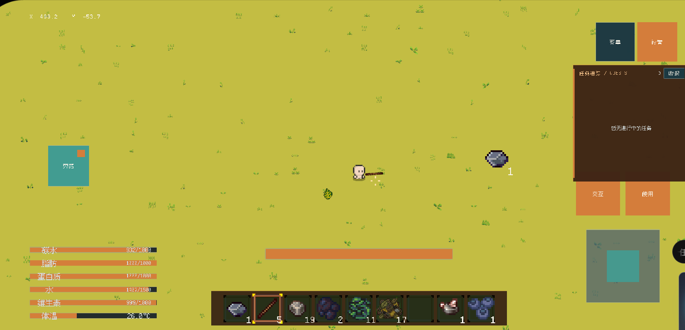
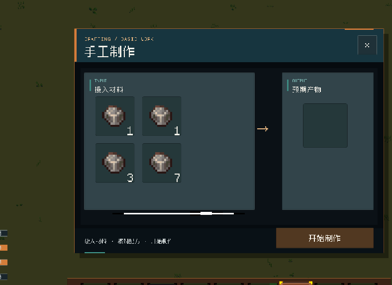

* [X] 为建筑层级中的所有建筑添加描边
* [X] 探讨:将水独立为一个层级的可能性 为什么这样做? 为了方便渲染和统一管理 这样可以尝试在水面利用Shader实现反射之类的
* [X] 藤蔓+叶子 = 编制草笼(可以放东西 额外的储物格)
* [X] 探讨: 按下Tab按键 同时打开合成 装备 背包UI 将三个主要UI缩小
* [X] 木棍的伤害不应该能打动石头啊。
* [X] 浆果改为一口一个。
* [X] 手机端添加双指快捷缩放镜头大小。
* [X] 木棍对树的伤害应该是非常小的嘞。嗯
* [X] 小鸡等动物不应该主动往河里面跑呀，它应该优先往岸上跑呀，对不对？它碰到河之后，它应该是沿着这条河逃跑的，而不是直接往河里钻。
* [X] 制作面板的抬头应该是可以拖动的和背包那样。
* [X] 制作面板的物品放进去之后退出存档，重进就没了。记得顺手检查一下其他的物品槽有没有这样的问题啊？
* [X] [Inventory_HotBar] 右键使用失败：当前未持有物品
  UnityEngine.Debug:LogWarning (object)
  Inventory_HotBar:OnRightClickPerformed () (at Assets/5_Scripts/5-3_GamePlay/Items/Inventory/Inventory_HotBar.cs:573)
  UltEvents.UltEvent:Invoke () (at ./Packages/com.kybernetik.ultevents/Runtime/Events/UltEvent0.cs:186)
  GameController:RightClickAction (UnityEngine.InputSystem.InputAction/CallbackContext) (at Assets/5_Scripts/5-3_GamePlay/Player/Controller/GameController.cs:242)
  UnityEngine.InputSystem.LowLevel.NativeInputRuntime/<>c__DisplayClass7_0:<set_onUpdate>b__0 (UnityEngineInternal.Input.NativeInputUpdateType,UnityEngineInternal.Input.NativeInputEventBuffer*)
  UnityEngineInternal.Input.NativeInputSystem:NotifyUpdate (UnityEngineInternal.Input.NativeInputUpdateType,intptr)这个报错会导致没法进行UI操作了，就是没法拖动物品和放销物品了。
* [X] 未找到名为 窗口信息 的文本组件
  UnityEngine.Debug:LogWarning (object)
  BasePanel:GetText (string) (at Assets/5_Scripts/5-5_UI/Core/BasePanel.cs:821)
  Mod_HandCraftTable:EnsurePanelCreated () (at Assets/5_Scripts/5-3_GamePlay/Items/Inventory/Mod_HandCraftTable.cs:185)
  Mod_HandCraftTable:TogglePanelByKey () (at Assets/5_Scripts/5-3_GamePlay/Items/Inventory/Mod_HandCraftTable.cs:137)
  Mod_HandCraftTable:<BindToggleInput></bindtoggleinput>b__34_0 (UnityEngine.InputSystem.InputAction/CallbackContext) (at Assets/5_Scripts/5-3_GamePlay/Items/Inventory/Mod_HandCraftTable.cs:118)
  UnityEngine.InputSystem.LowLevel.NativeInputRuntime/<>c__DisplayClass7_0:<set_onUpdate>b__0 (UnityEngineInternal.Input.NativeInputUpdateType,UnityEngineInternal.Input.NativeInputEventBuffer*)
  UnityEngineInternal.Input.NativeInputSystem:NotifyUpdate (UnityEngineInternal.Input.NativeInputUpdateType,intptr)
* [X] 物品添加未完全完成，剩余 1 个未添加。
  UnityEngine.Debug:LogWarning (object)
  Inventory_Data:TryAddItem (ItemData,bool) (at Assets/5_Scripts/5-1_Data/CoreData/Inventory_Data.cs:465)
  ItemPicker:TryAcceptNetworkPickup (ItemData) (at Assets/5_Scripts/5-3_GamePlay/Items/Inventory/ItemPicker.cs:213)
  ItemPicker:OnTriggerEnter2D (UnityEngine.Collider2D) (at Assets/5_Scripts/5-3_GamePlay/Items/Inventory/ItemPicker.cs:187)S我捡东西的时候还有这种报错呀，我在捡木棍，原木和叶子的时候，可能其中一个触发了这个bug吧。
* [X] 上一个制作完成的物品还没有。嗯，还没有拿走的时候，就不要出现这个虚影了。
* [X] 超出建筑距离就不要放，就不要出现虚影了。
* [X] 给武器增加一个攻击目标数量上限，就是给武器增加一个群攻的效果嘛，然后群攻的对象是有上限的，就优先打中几个，就给他算几个，比如说呃我砍刀的攻击数量是二，那么我一次横扫打中两个对象之后，他就不会再造成伤害了。就是评估一个武器它的群攻能力，这个呃攻击目标数量上限这个字段给武器添加一个这种特性。
* [X] 为武器添加一个减速能力，就是现在不是攻击对目标造成伤害之后会让他减速嘛，然后你把这个减速的呃，数量或者说是效果给他的数值评估移动到那个武器里面，这样子就可以通过武器的不同特性来使呃被攻击到的目标减速也不同，减速效果也不同。例如一般的钝器，它的减速效果比一般的利器要好。
* [X] 现在的死亡页面，它的这个遮挡不是很完全啊。而且这个成绩还有问题啊，右上角的菜单和设置两个按钮还在表现呢，而且这个任务栏也是在外面的。
* [X] 呃，现在玩家低血量的特效不会在手机上显现，你看一下是怎么回事儿？然后解决一下就是血量之之后周围出现会出现这个红色圈圈的。我现在是只能在这个sen场景的窗口里面看到，然后在game窗口里看不到。
* [X] 点击重新复活之后出现一个进度条，然后等待玩家周围的区块加载完毕后再让玩家移动，不然会出现bug这样子的设计，这样子弄一个进度条可以让玩家不要在加载完区块之前不要动啊。
* [X] 现在长按空白处丢弃物品的功能还是没有实现，玩家在手上拿着物品的时候，长按地图的空白处是需要能丢东西的呀，不然背包里的物品都没法丢，那还玩啥呀？玩不了的呀。不只是拖拽啊，就是手上拿着物品之后长按也是要能丢的，不只是拖拽能丢啊，两个丢弃的方法都需要两个长按的状态都需要能丢东西。
* [X] 把河流里的水也变成污水，就是喝了会感染的那种。
* [X] 捡不起物品的时候，提示一下玩家背包满了，就说我的背包满了。然后这个提示要有间隔呀，你大概间隔10分钟就提示一次吧。提示的前提是触发了呀，你不要固定间隔10分钟就出提示啊。
* [X] 你构筑一道完整一点的任务流程啊，就先是做一个捡两个石头，做石头嘛，做完石头之后，然后去收集原木做工作台，做完工作台之后就是呃做那个石镐和石斧嘛，然后去矿洞里面采矿，采矿之后做熔炉，熔炉做完之后把矿物烧制。烧制完之后融合成合成这个铜锭啊。还有铁锭，粗铁啊，不过目前应该是当前阶段应该是粗铁，然后还要在那之前还要教玩家烧制那个木炭或者是用煤炭烧啊。教完家，做完这个铜锭就差不多了。
* [ ] 再添加一个操作啊，就是UI操作，就是长按一个物品，长按的久一点，然后拖动就是拿起一半的物品就是拖动一半的物品。短一点就是直接全部拿起。短一点的全部那一些已经实现了呀，你只要实现前面那个拿起一半的物品的逻辑就可以了。
* [ ] 游戏经常出现了摆好配方之后无法识别的问题啊，你解决一下。
* [ ]
